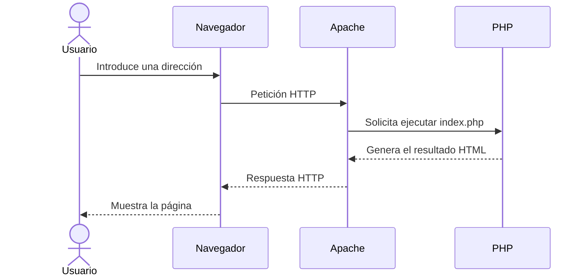
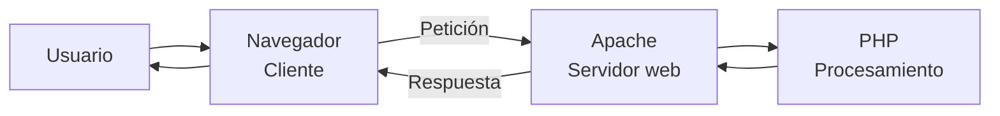
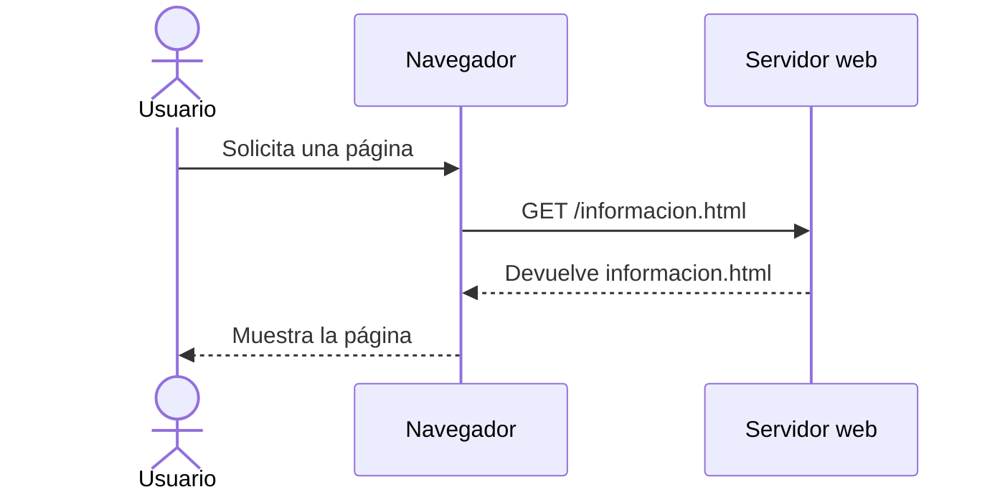
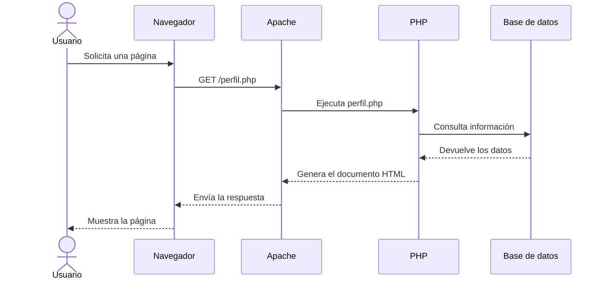
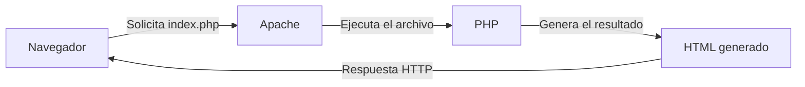
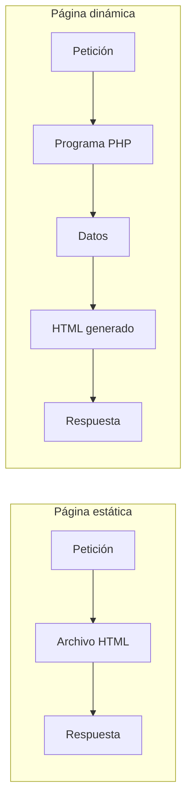

# 1. Funcionamiento de una aplicación web

Una aplicación web es un programa al que accedemos mediante un navegador. A diferencia de una aplicación instalada completamente en nuestro ordenador, una aplicación web ejecuta parte de su trabajo en otro equipo denominado **servidor**.

Moodle, una tienda en línea, una aplicación bancaria o un sistema de reservas son ejemplos de aplicaciones web.

Aunque cada aplicación puede tener una estructura diferente, su funcionamiento básico sigue un recorrido similar:

1. El usuario realiza una acción en el navegador.
2. El navegador envía una petición al servidor.
3. El servidor recibe y procesa la petición.
4. Si es necesario, la aplicación consulta o modifica información.
5. El servidor prepara una respuesta.
6. El navegador recibe la respuesta y muestra el resultado.



## 1.1. Cliente y servidor

En una aplicación web intervienen principalmente un **cliente** y un **servidor**.

### El cliente

El cliente es el programa que solicita un recurso o servicio. En una aplicación web, normalmente es el navegador: Chrome, Firefox, Edge o Safari.

El navegador se encarga de:

* Enviar peticiones al servidor.
* Recibir las respuestas.
* Interpretar HTML y CSS.
* Ejecutar código JavaScript.
* Mostrar la interfaz al usuario.

### El servidor

El servidor recibe las peticiones del cliente, las procesa y devuelve una respuesta.

En nuestro entorno utilizaremos:

* **Apache** como servidor web.
* **PHP** como lenguaje de programación ejecutado en el servidor.

Apache puede entregar directamente archivos como imágenes o documentos HTML. Cuando la respuesta debe generarse dinámicamente, interviene PHP.



## 1.2. Peticiones y respuestas HTTP

La comunicación entre el navegador y el servidor se realiza habitualmente mediante el protocolo **HTTP** o su versión segura, **HTTPS**.

Una petición puede contener:

* El recurso solicitado.
* Un método como `GET` o `POST`.
* Datos introducidos por el usuario.
* Información adicional enviada por el navegador.

El servidor procesa la petición y devuelve una respuesta que puede incluir:

* Un código de estado.
* Información sobre el contenido enviado.
* Un documento HTML.
* Datos en formato JSON.
* Un archivo o una imagen.
* Un mensaje de error.

Algunos códigos de estado habituales son:

| Código | Significado                               |
| -----: | ----------------------------------------- |
|  `200` | La petición se ha procesado correctamente |
|  `404` | El recurso solicitado no se ha encontrado |
|  `500` | Se ha producido un error en el servidor   |

!!! example "Ejemplo"
Cuando accedemos a `http://localhost:8080/index.php`, el navegador solicita el recurso `index.php`. Apache localiza el archivo y PHP ejecuta sus instrucciones. El servidor devuelve el resultado generado, no el código PHP original.

## 1.3. Páginas web estáticas

Una página web estática está formada por archivos cuyo contenido ya está escrito antes de que el usuario realice la petición.

Normalmente utiliza:

* HTML para estructurar el contenido.
* CSS para definir la presentación.
* JavaScript para añadir comportamiento en el navegador.
* Imágenes, vídeos, fuentes y otros recursos.

Cuando el navegador solicita una página estática, el servidor localiza el archivo y lo envía sin generar un contenido nuevo.



Por ejemplo, el servidor puede contener el siguiente archivo:

```html
<!DOCTYPE html>
<html lang="es">
<head>
    <meta charset="UTF-8">
    <title>Información</title>
</head>
<body>
    <h1>Bienvenido a nuestra web</h1>
    <p>Horario: de lunes a viernes.</p>
</body>
</html>
```

Todos los usuarios que soliciten este archivo recibirán inicialmente el mismo contenido. Para modificar la información será necesario editar el archivo y guardar una nueva versión.

Las páginas estáticas resultan adecuadas para contenidos que cambian poco, como:

* Una página de presentación.
* La web informativa de un evento.
* Un portfolio profesional.
* Una documentación técnica.

!!! note "Estática no significa inmóvil"
Una página estática puede contener animaciones, formularios o código JavaScript. Se denomina estática porque el servidor entrega un archivo que ya existe, no porque la página carezca de movimiento o interacción.

## 1.4. Páginas web dinámicas

Una página web dinámica genera todo o parte de su contenido cuando el servidor recibe la petición.

Para crear la respuesta puede utilizar:

* Datos enviados por el usuario.
* Información almacenada en una base de datos.
* Datos de la sesión.
* La fecha y la hora.
* Información proporcionada por otros servicios.
* Reglas definidas en el programa.

En este módulo utilizaremos PHP para ejecutar la lógica en el servidor y generar la respuesta.



Por ejemplo, el servidor puede ejecutar el siguiente código:

```php
<!DOCTYPE html>
<html lang="es">
<head>
    <meta charset="UTF-8">
    <title>Saludo dinámico</title>
</head>
<body>
    <h1>Bienvenido</h1>

    <p>La fecha actual es: <?php echo date("d/m/Y"); ?></p>
</body>
</html>
```

Cada vez que se solicita el archivo, PHP ejecuta la función `date()` y genera una respuesta con la fecha correspondiente.

El navegador no recibe el código PHP. Recibe únicamente el resultado producido por su ejecución:

```html
<p>La fecha actual es: 22/09/2026</p>
```

Moodle, una tienda en línea, una red social o una aplicación bancaria son ejemplos de aplicaciones web dinámicas.

## 1.5. Ejecución de PHP en el servidor

Una de las ideas fundamentales del módulo es que **PHP se ejecuta en el servidor**.

El recorrido es el siguiente:

1. El navegador solicita un archivo PHP.
2. Apache recibe la petición.
3. PHP ejecuta las instrucciones del archivo.
4. PHP genera un resultado, normalmente HTML.
5. Apache envía el resultado al navegador.
6. El navegador interpreta y muestra el HTML recibido.



!!! important "El navegador no ejecuta PHP"
El usuario puede consultar el HTML recibido, pero no puede ver directamente el código PHP utilizado para generarlo.

Cada elemento cumple una función diferente:

| Elemento           | Función principal                                         |
| ------------------ | --------------------------------------------------------- |
| Navegador          | Solicita recursos y muestra el resultado                  |
| Apache             | Recibe las peticiones HTTP y entrega las respuestas       |
| PHP                | Ejecuta la lógica programada en el servidor               |
| Docker             | Proporciona el entorno de ejecución durante el desarrollo |
| Visual Studio Code | Permite escribir y organizar el código                    |

## 1.6. Comparación entre páginas estáticas y dinámicas

Una página estática y una página dinámica pueden enviar exactamente el mismo HTML al navegador. La diferencia se encuentra en el proceso utilizado para generar la respuesta.

| Característica               | Página estática          | Página dinámica                  |
| ---------------------------- | ------------------------ | -------------------------------- |
| Contenido                    | Está escrito previamente | Se genera al recibir la petición |
| Procesamiento en el servidor | Normalmente no necesita  | Necesita ejecutar un programa    |
| Acceso a bases de datos      | No es habitual           | Es habitual                      |
| Personalización              | Limitada                 | Puede adaptarse a cada usuario   |
| Actualización                | Editando los archivos    | Modificando datos o reglas       |
| Ejemplo                      | Página informativa       | Moodle                           |



JavaScript también puede modificar el contenido de una página después de que haya llegado al navegador. En ese caso, el código se ejecuta en el **cliente**.

Durante este módulo nos centraremos principalmente en la generación dinámica realizada en el servidor mediante PHP.

!!! tip "Pregunta clave"
Para saber dónde se ejecuta una operación, pregúntate: ¿la realiza el navegador del usuario o el servidor?

## Preguntas de reflexión

Piensa en una aplicación web que utilices habitualmente y reflexiona sobre las siguientes preguntas:

1. ¿Qué programa actúa como cliente?
2. ¿Qué acciones del usuario provocan una petición al servidor?
3. ¿Qué información crees que procesa el servidor?
4. ¿Qué respuesta recibe finalmente el navegador?
5. ¿Consideras que la aplicación es estática o dinámica? ¿Por qué?
6. ¿Dónde se ejecutaría su código PHP?
7. ¿Qué recibe finalmente el navegador?

No es necesario conocer todavía todos los detalles técnicos. El objetivo es identificar el recorrido básico de la información y distinguir qué operaciones se realizan en el cliente y cuáles en el servidor.
