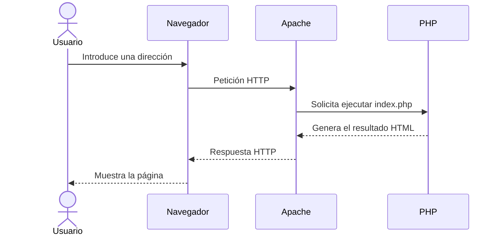

# 1. Cómo funciona una aplicación web

Una aplicación web es un programa al que accedemos mediante un navegador. A diferencia de una aplicación instalada completamente en nuestro ordenador, una aplicación web suele ejecutar parte de su trabajo en otro equipo denominado **servidor**.

Algunos ejemplos de aplicaciones web son Moodle, Gmail, una tienda en línea, una aplicación bancaria o el sistema de reservas de un hotel.

Aunque cada aplicación puede tener una estructura diferente, el funcionamiento básico es similar:

1. El usuario introduce una dirección o realiza una acción en el navegador.
2. El navegador envía una **petición** al servidor.
3. El servidor recibe y procesa la petición.
4. Si es necesario, la aplicación consulta o modifica información.
5. El servidor prepara una **respuesta**.
6. El navegador recibe la respuesta y muestra el resultado al usuario.

## 1.1. El cliente

El **cliente** es el programa que solicita un recurso o servicio. En una aplicación web, normalmente es el navegador: Chrome, Firefox, Edge o Safari.

El navegador se encarga, entre otras tareas, de:

- Enviar peticiones al servidor.
- Recibir las respuestas.
- Interpretar HTML y CSS.
- Ejecutar código JavaScript.
- Mostrar la interfaz al usuario.

## 1.2. El servidor

El **servidor** es el equipo o programa que recibe las peticiones y proporciona una respuesta. En nuestro entorno utilizaremos **Apache** como servidor web.

Apache podrá entregar directamente archivos como imágenes o documentos HTML. Cuando la respuesta deba generarse dinámicamente, intervendrá **PHP**.

## 1.3. Petición y respuesta

La comunicación entre el navegador y el servidor sigue habitualmente el protocolo HTTP o su versión segura, HTTPS.

Una petición contiene información como:

- El recurso solicitado.
- El método de la petición, por ejemplo `GET` o `POST`.
- Información adicional enviada por el navegador.

La respuesta contiene:

- Un código de estado, como `200`, `404` o `500`.
- Información sobre el contenido enviado.
- El recurso solicitado o el resultado generado por la aplicación.

!!! example "Ejemplo"
    Cuando accedemos a `http://localhost:8080/index.php`, el navegador solicita `index.php`. Apache localiza el archivo y PHP ejecuta sus instrucciones. El servidor devuelve el resultado, no el código PHP original.

## 1.4. Una idea fundamental

El código PHP se ejecuta en el servidor. El navegador recibe el resultado generado, que normalmente estará formado por HTML, CSS y JavaScript.

Esta separación será fundamental durante todo el módulo:

| Elemento | Función principal |
| --- | --- |
| Navegador | Solicita recursos y muestra el resultado |
| Apache | Recibe las peticiones HTTP y entrega las respuestas |
| PHP | Ejecuta la lógica programada en el servidor |
| Docker | Proporciona el entorno donde se ejecutan Apache y PHP |
| Visual Studio Code | Permite escribir y organizar el código |

## Actividad inicial

Elige una aplicación web que utilices habitualmente y responde:

1. ¿Qué programa actúa como cliente?
2. ¿Qué acciones del usuario provocan una petición al servidor?
3. ¿Qué información crees que procesa el servidor?
4. ¿Qué respuesta recibe finalmente el navegador?

No es necesario conocer todavía todos los detalles técnicos. El objetivo es identificar el recorrido básico de la información.
