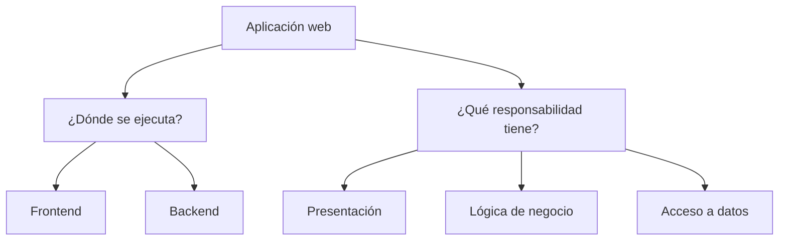
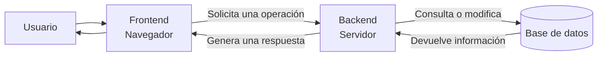
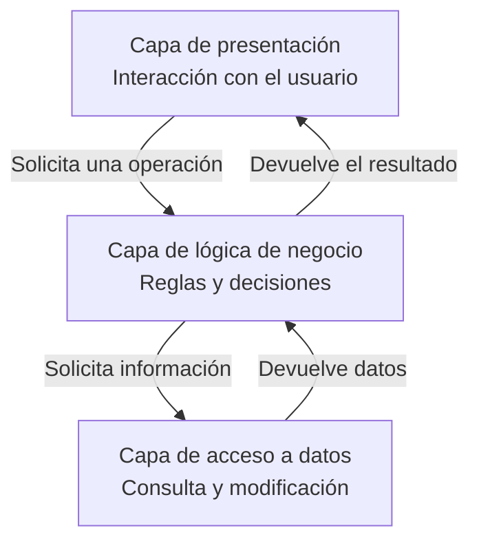
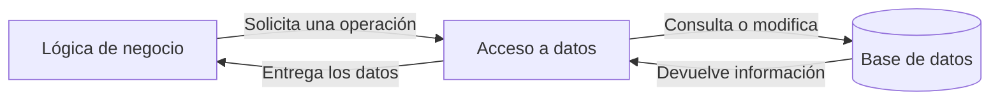
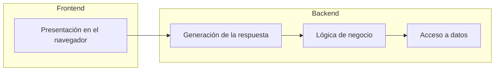
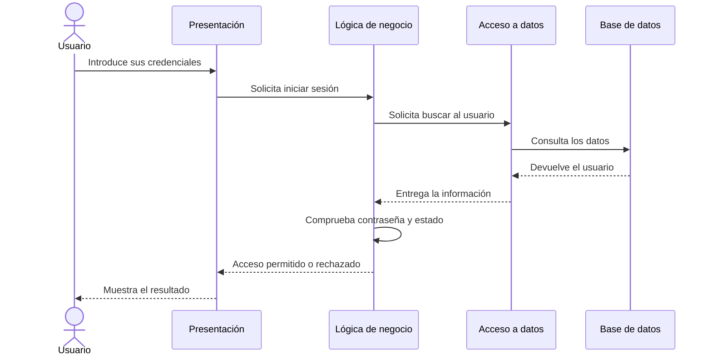

# 2. Organización de una aplicación web

Una aplicación web puede incluir muchas operaciones diferentes: mostrar una interfaz, recoger datos, comprobar permisos, aplicar reglas o consultar información almacenada.

Para comprender y organizar mejor una aplicación, podemos observarla desde dos perspectivas:

* **Dónde se ejecuta cada parte:** frontend y backend.
* **Qué responsabilidad tiene cada parte:** presentación, lógica de negocio y acceso a datos.

Estas clasificaciones están relacionadas, pero no significan exactamente lo mismo.

## 2.1. Frontend y backend

En una aplicación web podemos distinguir dos grandes ámbitos de ejecución:

* El **frontend**, que se ejecuta principalmente en el navegador.
* El **backend**, que se ejecuta en el servidor.

El usuario interactúa con el frontend, pero las operaciones importantes deben ser procesadas y comprobadas por el backend.

## 2.2. El frontend

El **frontend** es la parte de una aplicación web que se ejecuta en el navegador y con la que interactúa directamente el usuario.

Incluye elementos como:

* Textos.
* Imágenes.
* Botones.
* Formularios.
* Menús.
* Tablas.
* Mensajes.
* Elementos de navegación.

Las tecnologías fundamentales del frontend son:

| Tecnología | Función                             |
| ---------- | ----------------------------------- |
| HTML       | Define la estructura y el contenido |
| CSS        | Define la presentación y el diseño  |
| JavaScript | Añade comportamiento e interacción  |

Entre las responsabilidades habituales del frontend se encuentran:

* Mostrar información al usuario.
* Recoger las acciones realizadas.
* Adaptar la interfaz a diferentes dispositivos.
* Comprobar inicialmente los datos de un formulario.
* Enviar datos al servidor.
* Recibir y mostrar las respuestas.
* Facilitar una interacción clara y accesible.

### Ejemplo: inicio de sesión en Moodle

En el formulario de acceso a Moodle, el frontend contiene:

* El campo para el nombre de usuario.
* El campo para la contraseña.
* El botón para iniciar sesión.
* Los estilos visuales.
* Los mensajes mostrados al usuario.
* La validación inicial de los campos.

El frontend puede comprobar que los campos no estén vacíos antes de enviar el formulario.

!!! warning "La validación del frontend no es suficiente"
Las comprobaciones realizadas en el navegador pueden ser modificadas o evitadas. El servidor siempre debe volver a validar los datos recibidos.

## 2.3. El backend

El **backend** es la parte de la aplicación que se ejecuta en el servidor. El usuario utiliza sus funciones, pero no accede directamente a su código.

Durante este módulo utilizaremos principalmente **PHP** y, posteriormente, el framework **Laravel** para desarrollar el backend.

Entre las responsabilidades habituales del backend se encuentran:

* Recibir y validar los datos enviados.
* Aplicar las reglas de la aplicación.
* Identificar y autenticar usuarios.
* Comprobar permisos.
* Gestionar sesiones.
* Consultar y modificar información.
* Procesar formularios.
* Comunicarse con otros servicios.
* Generar páginas HTML.
* Proporcionar datos mediante una API.
* Aplicar medidas de seguridad.

### Ejemplo: inicio de sesión en Moodle

Cuando un usuario envía el formulario de acceso, el backend debe:

1. Recibir el nombre de usuario y la contraseña.
2. Comprobar que los datos tienen un formato válido.
3. Buscar al usuario.
4. Verificar la contraseña.
5. Comprobar si la cuenta está activa.
6. Crear una sesión si los datos son correctos.
7. Devolver una respuesta.

!!! important "Las decisiones importantes corresponden al servidor"
El navegador no debe decidir si un usuario puede acceder, modificar o eliminar información. Estas decisiones deben tomarse en el backend.

## 2.4. Arquitectura de tres capas

Además de distinguir dónde se ejecuta cada parte, podemos organizar una aplicación según la **responsabilidad** de sus componentes.

Una organización habitual utiliza tres capas lógicas:

1. Capa de presentación.
2. Capa de lógica de negocio.
3. Capa de acceso a datos.

Cada capa tiene una responsabilidad diferente y se comunica con las demás de forma organizada.

### Capa de presentación

La capa de presentación se encarga de la interacción con el usuario.

Sus responsabilidades pueden incluir:

* Mostrar formularios.
* Presentar información.
* Recoger datos.
* Mostrar mensajes.
* Organizar los elementos de la interfaz.

En Moodle, la página de inicio de sesión y los mensajes de acceso permitido o rechazado forman parte de la presentación.

### Capa de lógica de negocio

La capa de lógica de negocio contiene las reglas y decisiones propias de la aplicación.

Algunos ejemplos de reglas de negocio son:

* Un usuario no puede acceder si su cuenta está desactivada.
* Un estudiante solo puede consultar los cursos en los que está matriculado.
* Una tarea no puede entregarse después de la fecha límite, salvo que exista una ampliación.
* Solo determinados usuarios pueden modificar una calificación.
* Una contraseña debe cumplir unos requisitos mínimos.

Esta capa decide **qué se puede hacer** y **en qué condiciones**.

### Capa de acceso a datos

La capa de acceso a datos contiene el código encargado de consultar, guardar, modificar o eliminar información.

Puede realizar operaciones como:

* Buscar un usuario.
* Consultar los cursos de un estudiante.
* Guardar una entrega.
* Actualizar una calificación.
* Eliminar un registro.

!!! note "Acceso a datos y base de datos no son lo mismo"
La base de datos almacena la información. La capa de acceso a datos contiene el código que se comunica con ella.

## 2.5. Relación entre frontend, backend y las tres capas

Frontend/backend y arquitectura de tres capas son dos formas diferentes de observar una aplicación.

| Clasificación      | Pregunta que responde       | Elementos                             |
| ------------------ | --------------------------- | ------------------------------------- |
| Frontend y backend | ¿Dónde se ejecuta?          | Navegador y servidor                  |
| Tres capas         | ¿Qué responsabilidad tiene? | Presentación, lógica y acceso a datos |

De forma simplificada:

* El frontend se relaciona principalmente con la presentación.
* El backend contiene la lógica de negocio y el acceso a datos.
* Parte de la presentación también puede generarse en el servidor.

Por ejemplo, PHP puede generar en el servidor el documento HTML que después muestra el navegador. Por eso no debemos identificar automáticamente presentación con frontend ni pensar que ambas clasificaciones son equivalentes.

## 2.6. Ejemplo completo: iniciar sesión en Moodle

Podemos aplicar las dos clasificaciones al inicio de sesión en Moodle:

1. El frontend muestra el formulario.
2. El usuario introduce sus credenciales.
3. El backend recibe los datos.
4. La lógica de negocio comprueba las reglas de acceso.
5. El acceso a datos busca al usuario.
6. La base de datos devuelve la información.
7. La lógica de negocio decide si permite el acceso.
8. La presentación prepara el resultado.
9. El frontend muestra el mensaje al usuario.

Este recorrido muestra que cada parte realiza una tarea concreta:

| Parte             | Responsabilidad                        |
| ----------------- | -------------------------------------- |
| Presentación      | Mostrar el formulario y el resultado   |
| Lógica de negocio | Comprobar las reglas de acceso         |
| Acceso a datos    | Buscar la información del usuario      |
| Base de datos     | Almacenar los datos                    |
| Frontend          | Permitir la interacción con el usuario |
| Backend           | Procesar y proteger la operación       |

## 2.7. Separación de responsabilidades

Separar las responsabilidades ayuda a evitar que todo el código de la aplicación se encuentre mezclado.

Esta organización facilita:

* Comprender el funcionamiento de la aplicación.
* Localizar y corregir errores.
* Modificar una parte sin rehacer todo el sistema.
* Reutilizar componentes.
* Probar cada parte de forma independiente.
* Repartir el trabajo entre diferentes profesionales.
* Aplicar medidas de seguridad.
* Mantener y ampliar la aplicación.

!!! example "Ejemplo"
Si cambia el diseño del formulario de acceso, no debería ser necesario modificar las reglas que comprueban la contraseña ni el código que busca al usuario.

El objetivo no es crear más archivos sin motivo, sino conseguir que cada parte tenga una responsabilidad clara.

## 2.8. Desarrollo full stack

Un desarrollador **full stack** puede trabajar en diferentes partes de una aplicación web:

* Frontend.
* Backend.
* Bases de datos.
* APIs.
* Pruebas.
* Despliegue.

Esto no significa que tenga que ser experto en todas las tecnologías existentes, sino que comprende cómo se relacionan las distintas partes y puede participar en varias de ellas.

En nuestro entorno utilizaremos:

| Área                  | Tecnologías                 |
| --------------------- | --------------------------- |
| Frontend              | HTML, CSS y JavaScript      |
| Backend               | PHP y Laravel               |
| Base de datos         | MySQL                       |
| Entorno de desarrollo | Docker y Visual Studio Code |
| Servidor web          | Apache                      |

## Preguntas de reflexión

Tomando Moodle como ejemplo, reflexiona sobre las siguientes preguntas:

1. ¿Qué elementos pertenecen al frontend?
2. ¿Qué operaciones debe realizar el backend?
3. ¿Qué información puede almacenarse en la base de datos?
4. ¿Qué elementos forman parte de la presentación?
5. ¿Qué reglas podrían pertenecer a la lógica de negocio?
6. ¿Qué operaciones corresponden al acceso a datos?
7. ¿Por qué el frontend no debe decidir si un usuario tiene permiso?
8. ¿Qué ventaja aporta separar las responsabilidades?
9. ¿Frontend y presentación significan exactamente lo mismo?
10. ¿Backend y lógica de negocio significan exactamente lo mismo?

El objetivo es identificar dónde se ejecuta cada parte y qué responsabilidad tiene dentro de la aplicación.
