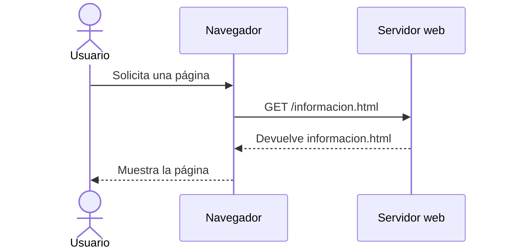
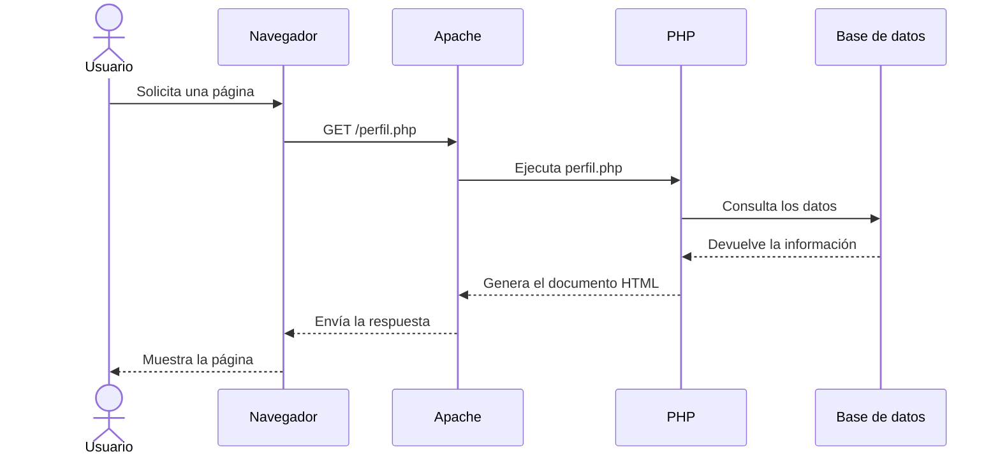
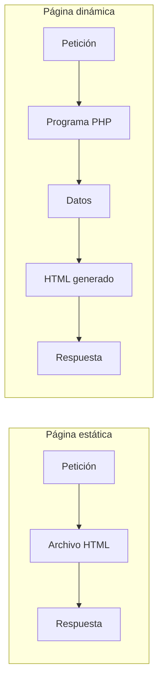

# 2. Páginas web estáticas y dinámicas

Cuando un navegador solicita una página, el servidor puede entregar un archivo que ya existe o generar el contenido en ese momento. Esta diferencia nos permite distinguir entre **páginas web estáticas** y **páginas web dinámicas**.

Aunque ambas pueden tener una apariencia similar, el proceso seguido para obtener la respuesta es diferente.

## 2.1. Páginas web estáticas

Una página web estática está formada por archivos cuyo contenido ya está escrito antes de que el usuario realice la petición.

Normalmente utiliza:

- HTML para estructurar el contenido.
- CSS para definir su presentación.
- JavaScript para añadir comportamiento en el navegador.
- Imágenes, vídeos, fuentes y otros recursos.

Cuando el navegador solicita una página estática, el servidor localiza el archivo y lo envía sin modificar su contenido.



### Ejemplo

Supongamos que el servidor contiene el siguiente archivo:

```html
<!DOCTYPE html>
<html lang="es">
<head>
    <meta charset="UTF-8">
    <title>Información</title>
</head>
<body>
    <h1>Bienvenido a nuestra web</h1>
    <p>Horario: de lunes a viernes.</p>
</body>
</html>
```

Todos los usuarios que soliciten este archivo recibirán inicialmente el mismo contenido.

Para modificar la información será necesario editar el archivo y guardar una nueva versión.

### Ventajas

- Son fáciles de crear y publicar.
- Necesitan pocos recursos del servidor.
- Se entregan rápidamente.
- Presentan una superficie de ataque reducida.
- Resultan adecuadas para contenidos que cambian poco.

### Limitaciones

- El contenido debe modificarse manualmente.
- No suelen utilizar información almacenada en una base de datos.
- Resultan poco prácticas cuando existen muchas páginas.
- No permiten personalizar fácilmente la respuesta para cada usuario.

Algunos ejemplos habituales son:

- Una página de presentación.
- Una documentación técnica.
- El sitio informativo de un evento.
- Un portfolio profesional.
- Una página con información que cambia con poca frecuencia.

!!! note "Estática no significa inmóvil"
    Una página estática puede contener animaciones, menús, formularios o código JavaScript. Se denomina estática porque el servidor entrega un archivo ya existente, no porque la página carezca de movimiento o interacción.

## 2.2. Páginas web dinámicas

Una página web dinámica genera todo o parte de su contenido cuando el servidor recibe la petición.

Para hacerlo puede utilizar:

- Datos enviados por el usuario.
- Información almacenada en una base de datos.
- Datos de la sesión.
- La fecha y la hora.
- Información proporcionada por otros servicios.
- Reglas definidas en el programa.

En nuestro módulo utilizaremos **PHP** para ejecutar la lógica en el servidor y generar la respuesta.



### Ejemplo

```php
<!DOCTYPE html>
<html lang="es">
<head>
    <meta charset="UTF-8">
    <title>Saludo dinámico</title>
</head>
<body>
    <h1>Bienvenido</h1>

    <p>La fecha actual es: <?php echo date("d/m/Y"); ?></p>
</body>
</html>
```

El archivo contiene código PHP. Cada vez que se solicita, el servidor ejecuta la función `date()` y genera una respuesta con la fecha correspondiente.

El navegador no recibe el código PHP. Recibe el resultado producido por su ejecución:

```html
<p>La fecha actual es: 21/09/2026</p>
```

!!! important "PHP se ejecuta en el servidor"
    El usuario puede consultar el HTML recibido por el navegador, pero no puede ver directamente el código PHP utilizado para generarlo.

### Ventajas

- Permiten mostrar información actualizada.
- Pueden acceder a bases de datos.
- Facilitan la personalización del contenido.
- Permiten identificar usuarios y mantener sesiones.
- Resultan adecuadas para aplicaciones con mucha información.
- Separan los datos de la forma en la que se presentan.

### Limitaciones

- Requieren programación en el servidor.
- Necesitan más recursos que una página puramente estática.
- Introducen más elementos que configurar y mantener.
- Deben aplicar medidas de seguridad al procesar datos.
- Pueden producir errores durante la ejecución.

Algunos ejemplos son:

- Moodle.
- Una tienda en línea.
- Una red social.
- Una aplicación bancaria.
- Un sistema de reservas.
- Un panel de administración.

## 2.3. Comparación

| Característica | Página estática | Página dinámica |
| --- | --- | --- |
| Contenido | Está escrito previamente | Se genera al recibir la petición |
| Procesamiento en el servidor | Normalmente no necesita | Sí necesita |
| Acceso a bases de datos | No es habitual | Es habitual |
| Personalización | Limitada | Puede adaptarse a cada usuario |
| Actualización | Editando los archivos | Modificando datos o reglas |
| Complejidad | Menor | Mayor |
| Ejemplo | Página informativa | Moodle |



## 2.4. Contenido dinámico en el cliente

JavaScript también puede modificar el contenido de una página después de que haya llegado al navegador.

Por ejemplo, JavaScript puede:

- Mostrar u ocultar elementos.
- Validar un formulario.
- Actualizar una parte de la interfaz.
- Solicitar datos a una API.
- Construir nuevos elementos HTML.

En este caso, el código se ejecuta en el **cliente**, no en el servidor.

A lo largo del módulo nos centraremos principalmente en la generación dinámica realizada en el servidor mediante PHP. Más adelante estudiaremos cómo el servidor puede proporcionar datos a otras aplicaciones mediante servicios y API REST.

!!! tip "Pregunta clave"
    Para saber dónde se ejecuta una operación, pregúntate: ¿la realiza el navegador del usuario o el servidor?

## 2.5. Una misma respuesta, dos procesos diferentes

Una página estática y una página dinámica pueden enviar exactamente el mismo HTML al navegador.

La diferencia no siempre se encuentra en el resultado visible, sino en el proceso utilizado para generarlo:

```text
Página estática:  archivo HTML ───────────────► navegador

Página dinámica: código PHP ─► genera HTML ─► navegador
```

El navegador interpreta HTML, CSS y JavaScript, pero no ejecuta PHP. PHP se ejecuta antes de enviar la respuesta.

## Actividad

Clasifica cada situación como página principalmente estática o aplicación dinámica. Justifica brevemente la respuesta.

1. La web informativa de una conferencia.
2. El perfil de un usuario en una red social.
3. La carta de un restaurante que nunca cambia.
4. La cesta de compra de una tienda en línea.
5. Una documentación creada con MkDocs.
6. La consulta de calificaciones en Moodle.

Después responde:

1. ¿Puede una página estática contener JavaScript?
2. ¿Por qué el navegador no recibe el código PHP?
3. ¿Qué ventajas aporta generar contenido dinámicamente?
4. ¿Qué elementos adicionales necesita normalmente una aplicación dinámica?