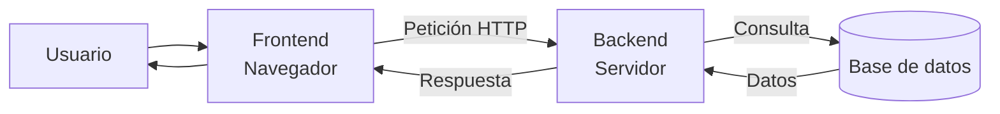
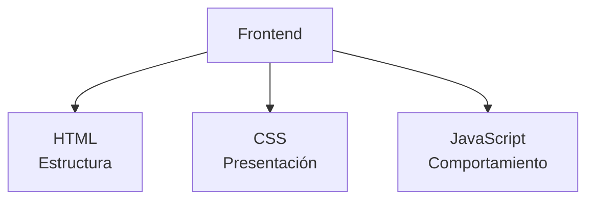
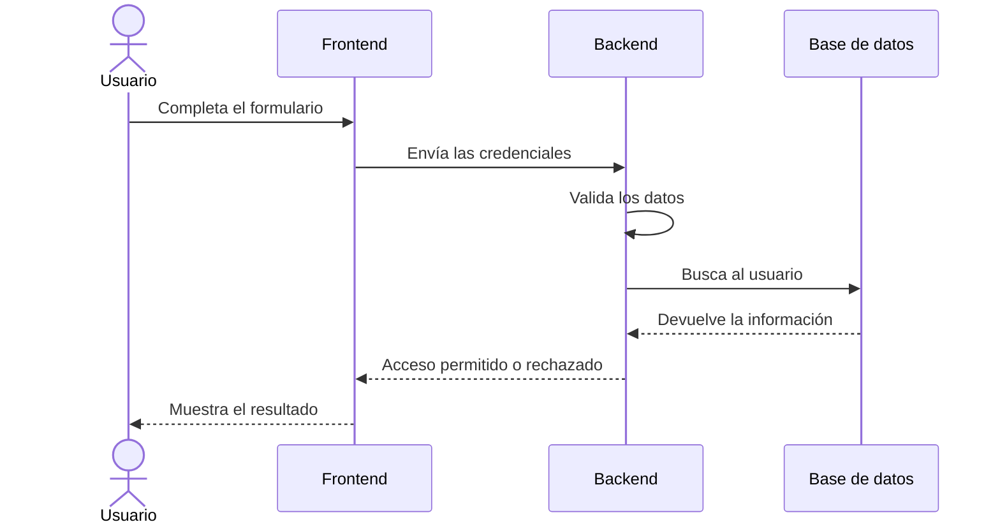
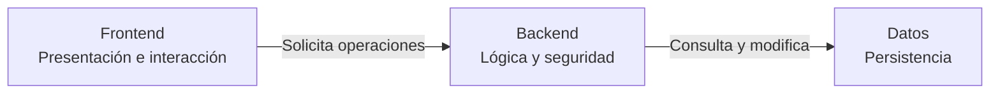

# 3. Frontend, backend y full stack

En una aplicación web podemos distinguir dos grandes ámbitos de desarrollo:

- La parte que se ejecuta en el navegador y con la que interactúa el usuario.
- La parte que se ejecuta en el servidor y se encarga de procesar la información.

Estos dos ámbitos se denominan **frontend** y **backend**.



## 3.1. Frontend

El **frontend** es la parte de una aplicación web que se ejecuta en el navegador y con la que interactúa directamente el usuario.

Incluye todos los elementos que podemos ver y utilizar:

- Textos.
- Imágenes.
- Botones.
- Formularios.
- Menús.
- Tablas.
- Animaciones.
- Mensajes.
- Elementos de navegación.

Las tecnologías fundamentales del frontend son:

| Tecnología | Función |
| --- | --- |
| HTML | Define la estructura y el contenido |
| CSS | Define la presentación y el diseño |
| JavaScript | Añade comportamiento e interacción |



### Responsabilidades del frontend

Entre las tareas habituales del frontend se encuentran:

- Mostrar la información al usuario.
- Diseñar una interfaz clara y fácil de utilizar.
- Adaptar la página a diferentes dispositivos.
- Validar inicialmente los datos de un formulario.
- Gestionar eventos como clics o pulsaciones.
- Enviar peticiones al servidor.
- Recibir y mostrar las respuestas.
- Cumplir criterios de accesibilidad y usabilidad.

### Ejemplo

En un formulario de inicio de sesión, el frontend contiene:

- Los campos de correo electrónico y contraseña.
- El botón para iniciar sesión.
- Los estilos visuales.
- La validación que comprueba si los campos están vacíos.
- El mensaje que se muestra al usuario.

!!! warning "La validación del cliente no es suficiente"
    Las comprobaciones realizadas con JavaScript mejoran la experiencia del usuario, pero pueden ser modificadas o evitadas. El servidor siempre debe volver a validar los datos recibidos.

## 3.2. Backend

El **backend** es la parte de la aplicación que se ejecuta en el servidor. El usuario no accede directamente a su código.

El backend recibe peticiones, aplica las reglas de la aplicación y genera una respuesta.

Durante este módulo utilizaremos principalmente **PHP** y, posteriormente, el framework **Laravel**.

### Responsabilidades del backend

Entre las tareas habituales del backend se encuentran:

- Recibir y validar datos.
- Aplicar la lógica de negocio.
- Identificar y autenticar usuarios.
- Gestionar sesiones y permisos.
- Consultar y modificar bases de datos.
- Procesar formularios.
- Comunicarse con otros servicios.
- Generar páginas HTML.
- Proporcionar datos mediante una API.
- Aplicar medidas de seguridad.

### Ejemplo

En el mismo formulario de inicio de sesión, el backend se encarga de:

1. Recibir el correo electrónico y la contraseña.
2. Comprobar que los datos tienen un formato válido.
3. Buscar al usuario en la base de datos.
4. Verificar la contraseña.
5. Crear una sesión si los datos son correctos.
6. Devolver una respuesta.



!!! important "El backend protege la lógica y los datos"
    El navegador no debe decidir si un usuario tiene permiso para acceder, modificar o eliminar información. Estas decisiones corresponden al servidor.

## 3.3. ¿Cómo se comunican?

El frontend y el backend se comunican mediante peticiones y respuestas HTTP.

Una petición puede contener:

- Una dirección o URL.
- Un método como `GET`, `POST`, `PUT` o `DELETE`.
- Datos introducidos por el usuario.
- Cabeceras con información adicional.
- Cookies o datos de sesión.

El backend procesa la petición y puede responder con:

- Un documento HTML.
- Datos en formato JSON.
- Un archivo.
- Un código de estado.
- Un mensaje de error.

Durante las primeras unidades, PHP generará principalmente documentos HTML. Más adelante crearemos servicios que devolverán información en formato JSON.

```text
Frontend                         Backend
────────                         ───────
Navegador     ── petición ──►    Apache + PHP
Navegador     ◄─ respuesta ──    Apache + PHP
```

## 3.4. Desarrollo full stack

Un desarrollador **full stack** trabaja tanto en el frontend como en el backend de una aplicación.

Esto no significa necesariamente que conozca todas las tecnologías existentes, sino que puede participar en las diferentes partes del desarrollo.

Un perfil full stack puede trabajar con:

- Interfaces web.
- Programación en el navegador.
- Programación en el servidor.
- Bases de datos.
- APIs.
- Control de versiones.
- Pruebas.
- Despliegue de aplicaciones.

En nuestro caso, algunas de las tecnologías del módulo y del ciclo son:

| Área | Tecnologías |
| --- | --- |
| Frontend | HTML, CSS y JavaScript |
| Backend | PHP y Laravel |
| Bases de datos | MySQL |
| Entorno | Docker y Apache |
| Editor | Visual Studio Code |
| Control de versiones | Git y GitHub |

!!! note "Full stack no significa experto en todo"
    El desarrollo web es muy amplio. Un profesional puede desenvolverse en diferentes partes de una aplicación y, al mismo tiempo, estar especializado en un área concreta.

## 3.5. Separación de responsabilidades

Separar frontend y backend ayuda a organizar el desarrollo:



Cada parte tiene una responsabilidad principal:

- El **frontend** presenta la información y recoge las acciones del usuario.
- El **backend** procesa las peticiones y aplica las reglas.
- La **base de datos** almacena la información de forma persistente.

Esta separación facilita:

- Organizar el código.
- Repartir el trabajo entre distintos profesionales.
- Modificar una parte sin rehacer toda la aplicación.
- Reutilizar el mismo backend desde diferentes clientes.
- Probar cada componente de forma independiente.
- Mejorar el mantenimiento y la seguridad.

En los siguientes apartados estudiaremos esta separación con más detalle mediante la arquitectura de tres capas y el patrón MVC.

## 3.6. Nuestro entorno de trabajo

En el entorno que estamos preparando, cada herramienta tiene una función:

| Elemento | Ámbito | Función |
| --- | --- | --- |
| Navegador | Cliente | Muestra la interfaz y ejecuta JavaScript |
| HTML y CSS | Frontend | Definen la estructura y la presentación |
| JavaScript | Frontend | Añade comportamiento en el navegador |
| Apache | Servidor | Recibe peticiones y entrega respuestas |
| PHP | Backend | Ejecuta la lógica de la aplicación |
| MySQL | Datos | Almacena la información |
| Docker | Entorno | Proporciona los servicios necesarios |
| Visual Studio Code | Desarrollo | Permite escribir y organizar el código |

Visual Studio Code y Docker son herramientas de desarrollo, pero no forman parte del frontend o del backend que recibe finalmente el usuario.

## Actividad

Indica si cada tarea corresponde principalmente al **frontend**, al **backend** o a la **base de datos**:

1. Cambiar el color de un botón.
2. Comprobar si una contraseña es correcta.
3. Guardar los datos de un cliente.
4. Adaptar el menú a una pantalla pequeña.
5. Verificar si un usuario tiene permiso para eliminar un registro.
6. Mostrar un mensaje de error junto a un formulario.
7. Consultar todos los pedidos de un usuario.
8. Animar la apertura de un menú.
9. Crear una sesión después de iniciar sesión.
10. Actualizar el precio de un producto.

Después responde:

1. ¿Por qué no debemos confiar únicamente en las validaciones realizadas con JavaScript?
2. ¿Qué tecnologías fundamentales se utilizan en el frontend?
3. ¿Qué tecnología utilizaremos principalmente en el backend?
4. ¿Qué significa que una persona tenga un perfil full stack?
5. ¿Qué ventajas proporciona separar frontend, backend y datos?