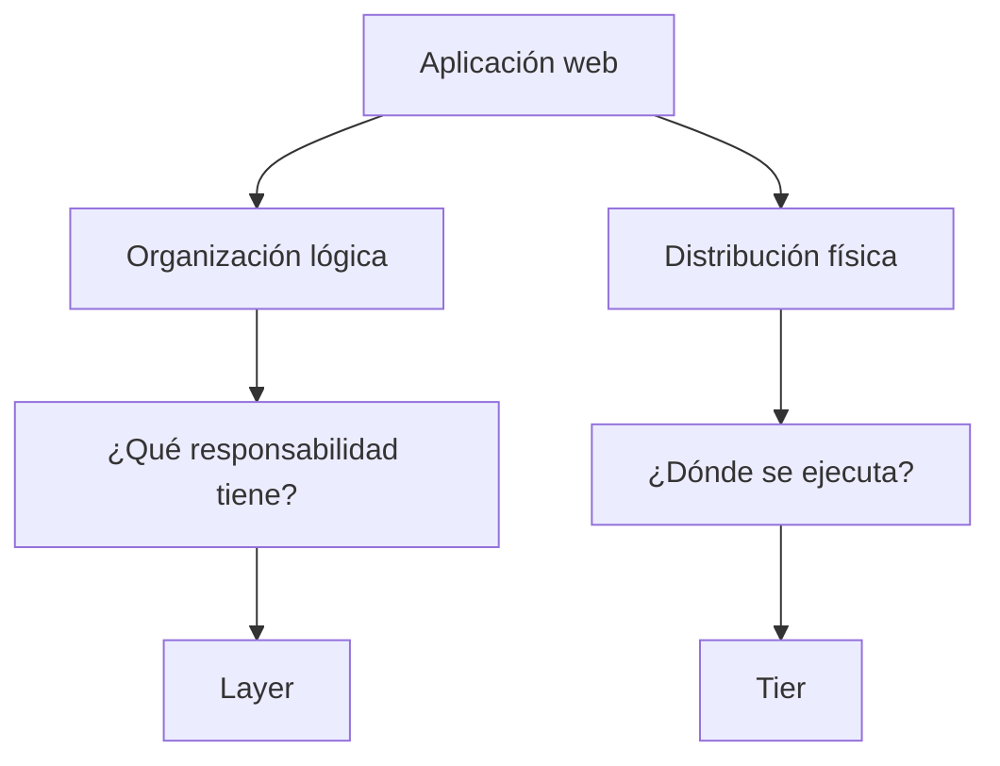
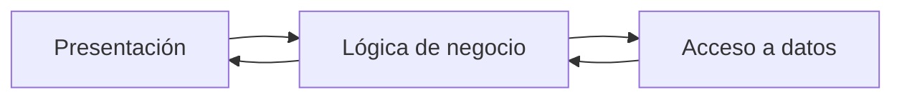
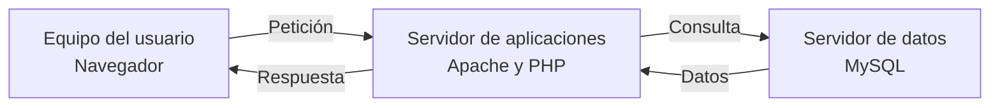
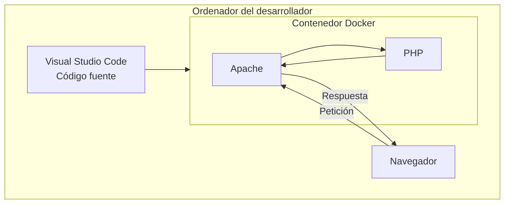
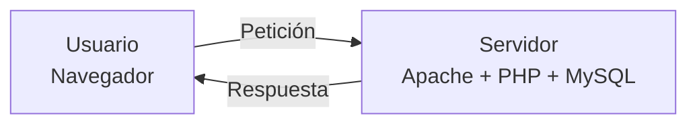
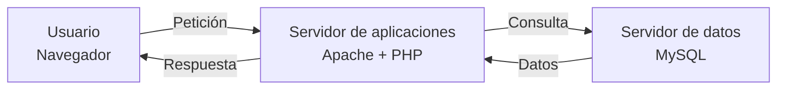
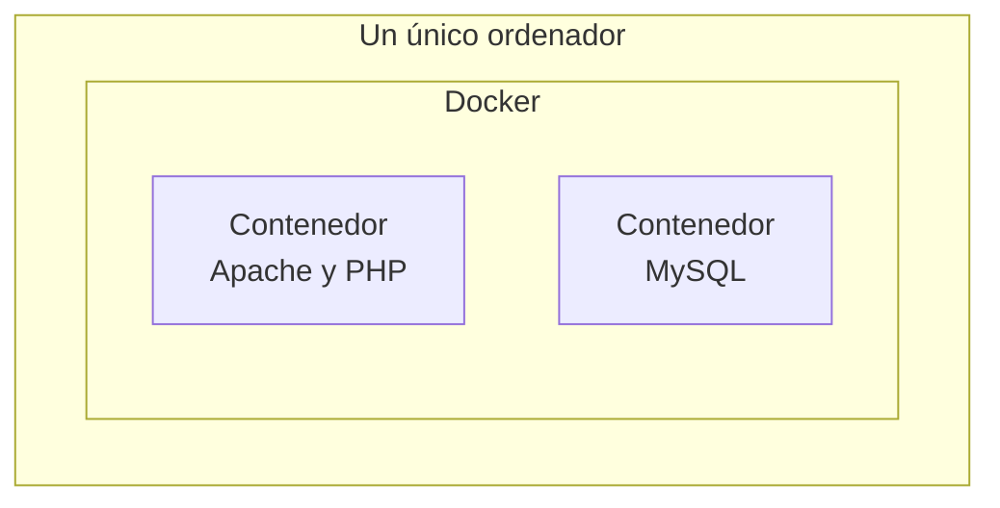
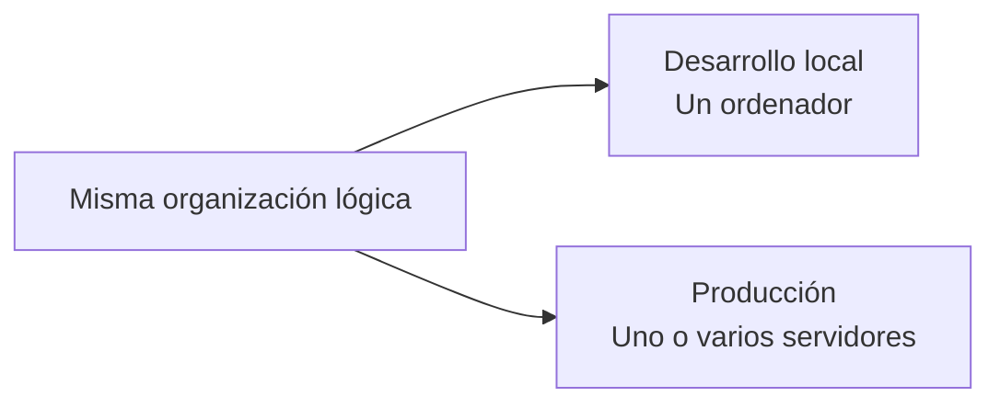

# 3. Organización lógica y distribución física

Al diseñar una aplicación web debemos tomar decisiones sobre su organización interna y sobre el entorno en el que se ejecutará.

Para comprender estas decisiones debemos distinguir dos preguntas:

1. ¿Qué responsabilidad tiene cada parte de la aplicación?
2. ¿Dónde se ejecuta cada parte?

Aunque ambas cuestiones están relacionadas, no significan lo mismo.

| Perspectiva         | Pregunta                                    | Término |
| ------------------- | ------------------------------------------- | ------- |
| Organización lógica | ¿Qué responsabilidad tiene cada componente? | `layer` |
| Distribución física | ¿Dónde se ejecuta cada componente?          | `tier`  |

## 3.1. Organización lógica: `layer`

Una **capa lógica**, o `layer`, agrupa componentes que tienen una responsabilidad semejante dentro de la aplicación.

En el apartado anterior distinguimos tres responsabilidades:

* Presentación.
* Lógica de negocio.
* Acceso a datos.

Esta separación permite organizar el código y evitar que todas las operaciones de la aplicación aparezcan mezcladas.

Las capas lógicas describen la organización del software, pero no indican cuántos ordenadores, servidores o contenedores se utilizan.

!!! example "Ejemplo"
Una aplicación puede tener el código perfectamente separado en presentación, lógica de negocio y acceso a datos, aunque todo se ejecute en un único ordenador.

## 3.2. Distribución física: `tier`

Un **nivel físico o de despliegue**, denominado `tier`, representa un entorno en el que se ejecuta una parte de la aplicación.

Este entorno puede ser:

* Un ordenador.
* Un servidor.
* Una máquina virtual.
* Un contenedor.
* Un servicio proporcionado por una plataforma externa.

La distribución física describe dónde se ejecutan los componentes y cómo se comunican los distintos entornos.

En este ejemplo existen varios entornos de ejecución:

* El navegador se ejecuta en el equipo del usuario.
* Apache y PHP se ejecutan en el servidor de aplicaciones.
* MySQL se ejecuta en el servidor de datos.

## 3.3. `Layer` y `tier` no significan lo mismo

Los términos `layer` y `tier` no deben utilizarse como si fueran equivalentes.

| `Layer`                               | `Tier`                                    |
| ------------------------------------- | ----------------------------------------- |
| Representa una responsabilidad        | Representa un entorno de ejecución        |
| Organiza el código                    | Organiza el despliegue                    |
| Es una separación lógica              | Es una distribución física                |
| No implica utilizar varios servidores | Puede implicar varios equipos o servicios |

Una aplicación puede tener tres capas lógicas y ejecutarse completamente en un único equipo.

También puede mantener esas mismas tres capas lógicas y distribuir sus componentes entre varios servidores.

!!! important "Idea fundamental"
Tener tres capas lógicas no significa necesitar tres servidores.

## 3.4. Desarrollo local

Durante el desarrollo podemos ejecutar todos los componentes necesarios en nuestro propio ordenador.

En nuestro entorno utilizaremos:

* Visual Studio Code para escribir el código.
* Docker para proporcionar el entorno de ejecución.
* Apache como servidor web.
* PHP para ejecutar la lógica del servidor.
* El navegador para utilizar y comprobar la aplicación.

Más adelante incorporaremos MySQL para almacenar la información.

Aunque intervienen distintas herramientas y responsabilidades, todo puede ejecutarse dentro del mismo equipo físico.

Esta configuración resulta adecuada durante el desarrollo porque:

* Es sencilla de preparar.
* Permite trabajar sin depender de un servidor externo.
* Facilita realizar cambios y comprobarlos inmediatamente.
* Proporciona un entorno similar para todo el alumnado.
* Permite iniciar y detener los servicios cuando sea necesario.

## 3.5. Entorno de producción

El entorno de producción es el entorno en el que la aplicación se encuentra disponible para sus usuarios reales.

En una aplicación pequeña, Apache, PHP y la base de datos podrían ejecutarse en un mismo servidor.

Cuando una aplicación necesita más seguridad, capacidad o facilidad de mantenimiento, sus componentes pueden distribuirse.

La organización lógica del código puede ser la misma en ambos casos. Lo que cambia es su distribución física.

## 3.6. ¿Por qué distribuir los componentes?

Separar físicamente algunos componentes puede resultar útil para:

* Mejorar el rendimiento.
* Aumentar la seguridad.
* Facilitar el mantenimiento.
* Asignar recursos diferentes a cada servicio.
* Permitir que un componente crezca sin modificar los demás.

Por ejemplo, la base de datos puede situarse en un servidor al que no puedan acceder directamente los usuarios. Solo el servidor de aplicaciones podrá comunicarse con ella.

!!! note "No siempre es necesario distribuir"
Utilizar más servidores también aumenta la complejidad y el mantenimiento. La distribución debe responder a una necesidad real de la aplicación.

El objetivo no es utilizar el mayor número posible de servidores, sino elegir una distribución adecuada para las necesidades del proyecto.

## 3.7. El papel de Docker

Docker permite crear entornos aislados denominados **contenedores**.

Un contenedor puede proporcionar:

* Un servidor web.
* Una versión concreta de PHP.
* Una base de datos.
* Las dependencias necesarias para ejecutar una aplicación.

Sin embargo, utilizar varios contenedores no significa necesariamente utilizar varios servidores físicos.

En este ejemplo existen dos contenedores, pero ambos se ejecutan en el mismo ordenador.

Los contenedores separan los entornos de ejecución. Los servidores físicos determinan dónde se encuentran ejecutándose realmente esos contenedores.

## 3.8. Desarrollo local y producción

La aplicación puede conservar la misma organización lógica en ambos entornos, aunque su distribución física sea diferente.

| Desarrollo local                             | Producción                                           |
| -------------------------------------------- | ---------------------------------------------------- |
| Se utiliza para crear y probar la aplicación | Se utiliza para ofrecer la aplicación a los usuarios |
| Puede ejecutarse en un único ordenador       | Puede distribuirse entre varios servidores           |
| Docker proporciona los servicios necesarios  | Los servicios se despliegan según las necesidades    |
| Los cambios se realizan continuamente        | Los cambios deben estar probados y controlados       |
| Se prioriza la facilidad de desarrollo       | Se priorizan la seguridad y la disponibilidad        |

!!! tip "La organización puede mantenerse"
El código puede conservar su separación entre presentación, lógica de negocio y acceso a datos aunque cambie el lugar donde se ejecutan sus componentes.

## Preguntas de reflexión

Reflexiona sobre las siguientes preguntas:

1. ¿Qué diferencia existe entre una capa lógica y un nivel físico?
2. ¿Tener tres capas lógicas obliga a utilizar tres servidores?
3. ¿Podemos ejecutar Apache, PHP y MySQL en un único ordenador?
4. ¿Por qué una aplicación podría utilizar un servidor diferente para la base de datos?
5. ¿Dos contenedores Docker representan necesariamente dos servidores físicos?
6. ¿Qué diferencias existen entre el entorno local y el entorno de producción?
7. ¿Qué puede cambiar al pasar una aplicación a producción?
8. ¿Qué aspectos de la organización lógica pueden mantenerse?

El objetivo es comprender que organizar el código y decidir dónde se ejecuta son decisiones diferentes, aunque estén relacionadas.
