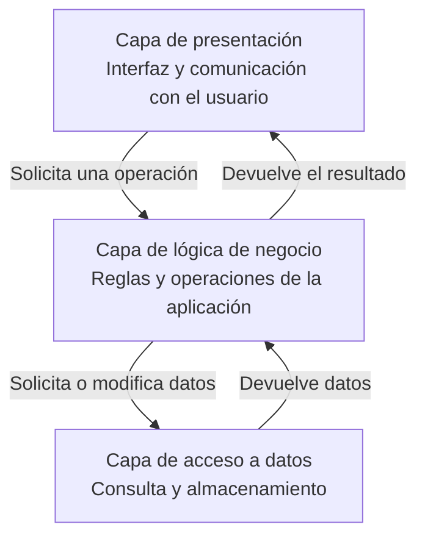
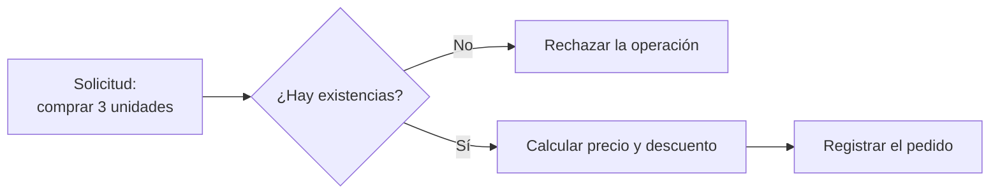
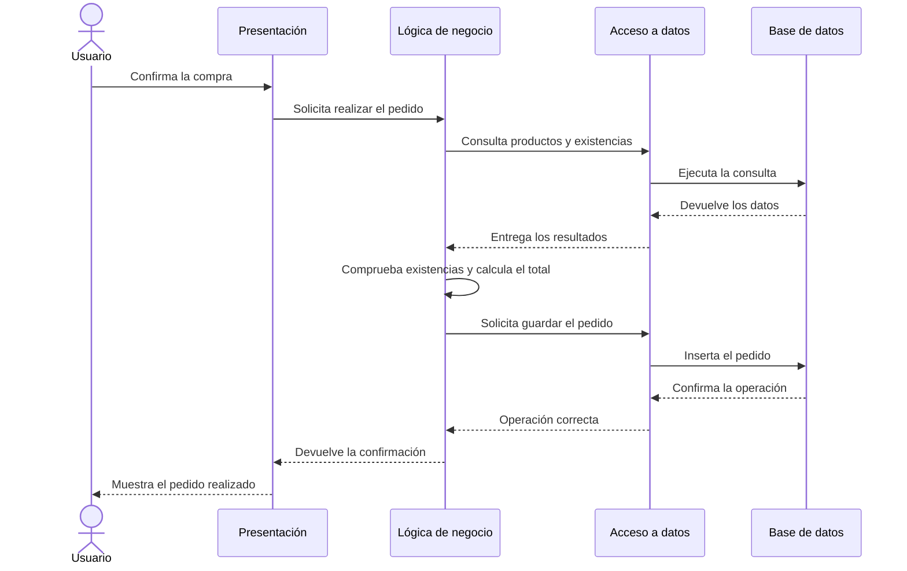
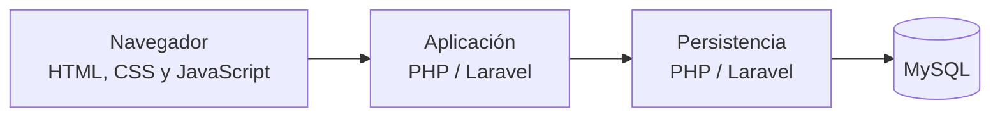

# 4. Arquitectura de tres capas

Una aplicación web puede llegar a contener miles de líneas de código. Si mezclamos en los mismos archivos la interfaz, las reglas de la aplicación y el acceso a la base de datos, el proyecto será difícil de comprender, modificar y mantener.

La **arquitectura de tres capas** organiza una aplicación separándola en tres grandes responsabilidades:

1. Capa de presentación.
2. Capa de lógica de negocio.
3. Capa de acceso a datos.



Cada capa tiene una responsabilidad principal y se comunica con las capas necesarias para realizar una operación.

## 4.1. Capa de presentación

La **capa de presentación** se encarga de la interacción con el usuario.

Sus responsabilidades principales son:

- Mostrar información.
- Recoger datos introducidos por el usuario.
- Presentar formularios.
- Mostrar mensajes y errores.
- Enviar las acciones del usuario a la aplicación.
- Representar los resultados recibidos.

En una aplicación web, esta capa puede incluir:

- Documentos HTML.
- Hojas de estilo CSS.
- Código JavaScript.
- Formularios.
- Plantillas utilizadas para generar HTML.

### Ejemplo

En una tienda en línea, la capa de presentación mostraría:

- El catálogo de productos.
- El precio de cada producto.
- El botón para añadir productos a la cesta.
- El formulario para realizar un pedido.
- Los mensajes de confirmación o error.

!!! note "Presentar no es decidir"
    La capa de presentación puede recoger una cantidad o mostrar un precio, pero no debería decidir qué descuento corresponde al cliente. Esa decisión pertenece a la lógica de negocio.

## 4.2. Capa de lógica de negocio

La **capa de lógica de negocio**, también denominada capa de aplicación o de proceso, contiene las reglas que determinan cómo debe funcionar la aplicación.

Se encarga de:

- Procesar las acciones del usuario.
- Validar los datos de acuerdo con las reglas del sistema.
- Realizar cálculos.
- Comprobar permisos.
- Coordinar operaciones.
- Solicitar datos a la capa de acceso a datos.
- Preparar los resultados para la capa de presentación.

### Ejemplos de reglas de negocio

En una tienda en línea podrían existir reglas como:

- No permitir comprar un producto sin existencias.
- Aplicar un descuento del 10 % a determinados clientes.
- No aceptar cantidades negativas.
- Permitir cancelar un pedido únicamente durante un periodo determinado.
- Ofrecer gastos de envío gratuitos a partir de cierto importe.

Estas reglas no dependen de cómo se muestre la página ni de cómo se almacenen los datos.



!!! important "La lógica de negocio define el comportamiento"
    Dos aplicaciones pueden utilizar la misma tecnología y tener interfaces similares, pero aplicar reglas de negocio completamente diferentes.

## 4.3. Capa de acceso a datos

La **capa de acceso a datos** se encarga de comunicarse con el sistema utilizado para almacenar la información.

Normalmente trabaja con una base de datos, aunque también puede utilizar:

- Archivos.
- Servicios externos.
- API.
- Sistemas de almacenamiento en la nube.
- Memoria temporal o caché.

Entre sus responsabilidades se encuentran:

- Consultar información.
- Insertar nuevos datos.
- Actualizar registros.
- Eliminar información.
- Transformar los resultados obtenidos.
- Ocultar al resto de la aplicación los detalles del almacenamiento.

### Ejemplo

Para obtener los productos de una tienda, esta capa podría ejecutar una consulta similar a:

```sql
SELECT id, nombre, precio
FROM productos
WHERE disponible = 1;
```

La capa de acceso a datos devuelve los resultados a la lógica de negocio. Después, la lógica decide qué hacer con ellos.

!!! warning "Acceder a los datos no es aplicar todas las reglas"
    La capa de datos puede recuperar el precio y las existencias de un producto, pero la lógica de negocio debe decidir si la compra está permitida o si corresponde aplicar un descuento.

## 4.4. Ejemplo completo: realizar un pedido

Veamos el recorrido seguido al realizar un pedido:



Podemos resumirlo así:

1. El usuario confirma la compra en la interfaz.
2. La capa de presentación envía la solicitud.
3. La lógica de negocio comprueba las reglas.
4. La capa de acceso a datos consulta las existencias.
5. La lógica calcula el importe y decide si la operación es válida.
6. La capa de acceso a datos guarda el pedido.
7. La presentación muestra el resultado.

## 4.5. Ventajas de separar la aplicación en capas

### Organización

Cada parte del código tiene una responsabilidad clara. Esto facilita localizar dónde debe realizarse una modificación.

### Mantenimiento

Es posible cambiar una capa reduciendo el impacto sobre las demás.

Por ejemplo, podemos modificar el diseño visual sin cambiar las reglas utilizadas para calcular un pedido.

### Reutilización

La misma lógica de negocio puede utilizarse desde diferentes interfaces:

- Una página web.
- Una aplicación móvil.
- Una API.
- Un programa de escritorio.

### Trabajo en equipo

Diferentes profesionales pueden trabajar en distintas capas de la aplicación.

### Pruebas

Las reglas de negocio pueden probarse independientemente de la interfaz y de la base de datos.

### Sustitución de tecnologías

Podríamos sustituir MySQL por otro sistema de almacenamiento sin tener que reescribir toda la interfaz.

!!! tip "Separación no significa aislamiento"
    Las capas necesitan comunicarse, pero cada una debe limitarse a las responsabilidades que le corresponden.

## 4.6. Relación con nuestro entorno

En una aplicación sencilla desarrollada durante el curso podremos encontrar:

| Capa | Posibles elementos |
| --- | --- |
| Presentación | HTML, CSS, JavaScript y plantillas |
| Lógica de negocio | Código PHP y clases de la aplicación |
| Acceso a datos | PHP, consultas SQL y componentes de persistencia |
| Almacenamiento | MySQL |



Una tecnología no siempre pertenece exclusivamente a una capa. PHP puede intervenir en la lógica de negocio, en el acceso a datos y en la generación de la presentación.

Lo importante no es solamente el lenguaje utilizado, sino la responsabilidad que cumple cada parte del código.

## 4.7. Errores habituales

### Mezclar HTML y consultas SQL sin organización

Puede funcionar en programas pequeños, pero dificulta el mantenimiento cuando la aplicación crece.

### Colocar reglas importantes únicamente en JavaScript

JavaScript se ejecuta en el navegador y puede modificarse. Las reglas importantes deben comprobarse también en el servidor.

### Repetir las mismas reglas en diferentes archivos

Si una regla cambia, habría que localizar y modificar todas sus copias.

### Permitir que la presentación acceda directamente a los datos

Esto aumenta el acoplamiento y mezcla responsabilidades.

!!! example "Una buena pregunta"
    Cuando no sepas dónde colocar una operación, pregúntate si está relacionada con mostrar información, decidir cómo funciona el sistema o almacenar y recuperar datos.

## 4.8. Tres capas no significa tres servidores

Las tres capas que hemos estudiado representan una **separación lógica de responsabilidades**.

Las tres pueden ejecutarse inicialmente en un mismo ordenador o incluso formar parte del mismo proyecto.

```text
Un único equipo
└── Aplicación
    ├── Presentación
    ├── Lógica de negocio
    └── Acceso a datos
```

También podrían distribuirse entre varios equipos físicos. Esta diferencia entre capas lógicas y capas físicas se estudiará en el siguiente apartado.

## Actividad

Indica a qué capa pertenece principalmente cada responsabilidad:

1. Mostrar el formulario de registro.
2. Comprobar si un correo electrónico ya está registrado.
3. Insertar un nuevo usuario en la base de datos.
4. Calcular el descuento de un pedido.
5. Mostrar un mensaje de confirmación.
6. Consultar los productos disponibles.
7. Comprobar si un usuario tiene permiso para borrar una noticia.
8. Modificar el diseño de una tabla.
9. Actualizar las existencias de un producto.
10. Validar que la cantidad solicitada sea mayor que cero.

### Caso práctico

Una biblioteca quiere permitir el préstamo de libros mediante una aplicación web. Explica qué responsabilidades corresponderían a:

1. La capa de presentación.
2. La capa de lógica de negocio.
3. La capa de acceso a datos.

Incluye al menos dos responsabilidades en cada capa.