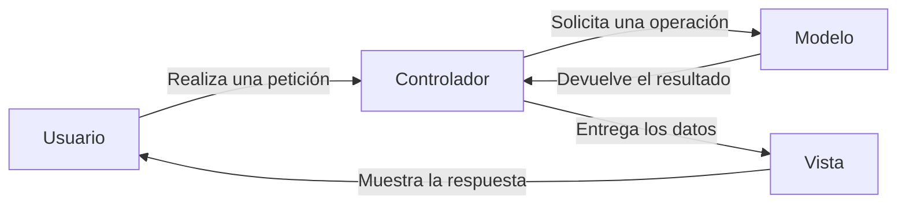
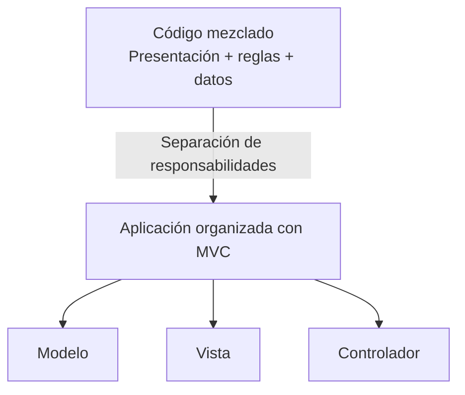
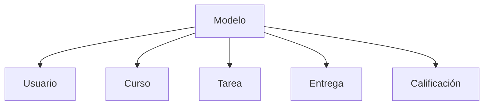
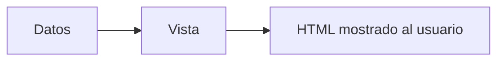
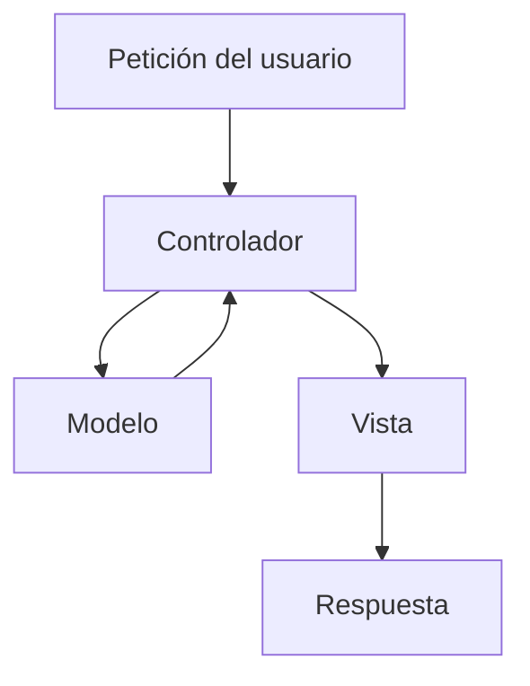
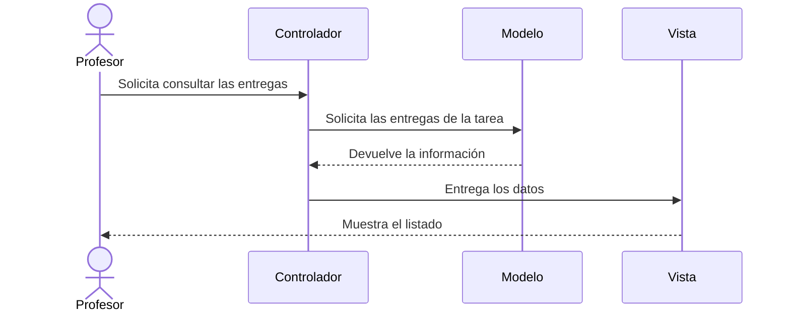

# 4. Introducción al patrón MVC

En los apartados anteriores hemos estudiado distintas formas de analizar y organizar una aplicación web:

* Frontend y backend permiten distinguir dónde se ejecuta cada parte.
* La arquitectura de tres capas separa las responsabilidades.
* `Layer` y `tier` diferencian la organización lógica de la distribución física.

El patrón **Modelo-Vista-Controlador**, conocido como **MVC**, responde a una cuestión diferente:

> ¿Cómo se organizan y colaboran los componentes de una aplicación cuando el usuario realiza una petición?

MVC es un patrón de diseño arquitectónico que propone dividir la aplicación en tres componentes principales:

* **Modelo:** gestiona la información y las operaciones de la aplicación.
* **Vista:** presenta la información al usuario.
* **Controlador:** recibe las acciones del usuario y coordina el proceso.

Muchos frameworks de desarrollo web utilizan MVC o alguna variante de este patrón. Comprenderlo nos permitirá entender posteriormente cómo se organizan las aplicaciones desarrolladas con Laravel.

## 4.1. ¿Por qué necesitamos MVC?

Una aplicación sencilla puede comenzar utilizando un único archivo que contenga:

* Código HTML.
* Acceso a datos.
* Validaciones.
* Reglas de la aplicación.
* Generación de mensajes.
* Procesamiento de formularios.

Cuando la aplicación crece, mezclar todas estas responsabilidades dificulta:

* Comprender el código.
* Localizar errores.
* Modificar la interfaz.
* Reutilizar componentes.
* Realizar pruebas.
* Trabajar en equipo.

MVC propone separar estas tareas en componentes especializados.

El objetivo no es crear más archivos sin motivo, sino conseguir que cada componente tenga una función clara.

## 4.2. El modelo

El **modelo** representa y gestiona la información con la que trabaja la aplicación.

Puede encargarse de:

* Representar entidades de la aplicación.
* Consultar información.
* Modificar datos.
* Aplicar operaciones relacionadas con esos datos.
* Comprobar determinadas reglas.
* Proporcionar resultados al controlador.

En Moodle podemos encontrar modelos relacionados con:

* Usuarios.
* Cursos.
* Tareas.
* Entregas.
* Calificaciones.
* Matrículas.

Por ejemplo, un modelo relacionado con las entregas podría permitir:

* Consultar las entregas de una tarea.
* Buscar una entrega concreta.
* Registrar una nueva entrega.
* Comprobar si se encuentra dentro del plazo.
* Modificar su estado.

!!! important "El modelo no es solo una tabla"
El modelo representa información y operaciones propias de la aplicación. Aunque puede estar relacionado con una tabla de la base de datos, ambos conceptos no son equivalentes.

En algunos frameworks, un modelo puede estar directamente asociado a una tabla. Sin embargo, el concepto de modelo dentro de MVC es más amplio que el almacenamiento de datos.

## 4.3. La vista

La **vista** se encarga de presentar la información al usuario.

Puede contener:

* Documentos HTML.
* Formularios.
* Listados.
* Tablas.
* Mensajes.
* Enlaces.
* Elementos de navegación.

En Moodle son ejemplos de vistas:

* El formulario de inicio de sesión.
* La página de un curso.
* El listado de tareas.
* La tabla de entregas.
* La página de calificaciones.

La vista recibe datos y los presenta de una forma adecuada.

La vista no debería:

* Realizar consultas directamente en la base de datos.
* Decidir si un usuario tiene permiso.
* Contener las reglas principales de la aplicación.
* Procesar por sí sola una operación completa.

!!! example "Ejemplo"
La vista puede mostrar que una entrega se encuentra fuera de plazo, pero no debería decidir por sí sola si el estudiante puede entregarla. Esa decisión corresponde a la lógica de la aplicación.

## 4.4. El controlador

El **controlador** recibe las acciones del usuario y coordina la intervención del modelo y de la vista.

Su recorrido habitual es:

1. Recibir una petición.
2. Interpretar la acción solicitada.
3. Solicitar una operación al modelo.
4. Recibir el resultado.
5. Seleccionar una vista.
6. Entregar los datos a la vista.
7. Generar la respuesta.

El controlador actúa como coordinador del proceso.

No debería acumular todas las reglas de la aplicación ni realizar directamente todas las operaciones de acceso a datos.

!!! note "Coordinar no significa hacerlo todo"
El controlador decide qué operación debe ejecutarse y qué respuesta debe generarse, pero debe delegar el trabajo en los componentes correspondientes.

## 4.5. Recorrido de una petición

Supongamos que un profesor quiere consultar las entregas de una tarea en Moodle.

El recorrido podría ser el siguiente:

1. El profesor solicita consultar las entregas.
2. El controlador recibe la petición.
3. El controlador solicita al modelo las entregas de la tarea.
4. El modelo obtiene y prepara la información.
5. El modelo devuelve el resultado al controlador.
6. El controlador entrega los datos a la vista.
7. La vista genera el listado.
8. El usuario recibe la página con las entregas.

Cada componente realiza una tarea diferente:

| Componente  | Responsabilidad                          |
| ----------- | ---------------------------------------- |
| Controlador | Recibir y coordinar la petición          |
| Modelo      | Gestionar la información de las entregas |
| Vista       | Mostrar el listado                       |
| Usuario     | Iniciar la acción y recibir el resultado |

## 4.6. Relación con la arquitectura de tres capas

MVC y la arquitectura de tres capas están relacionados porque ambos separan responsabilidades, pero no son conceptos equivalentes.

| Arquitectura de tres capas           | Patrón MVC |
| ------------------------------------ | ---------- |
| Organiza responsabilidades generales |            |
