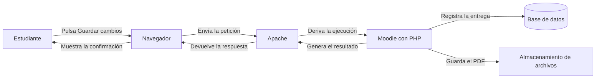
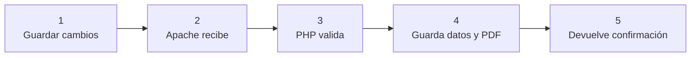
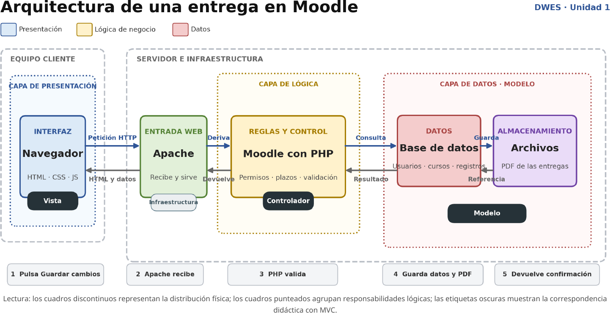
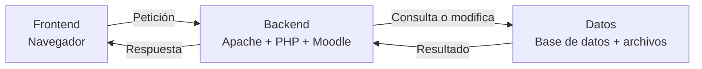
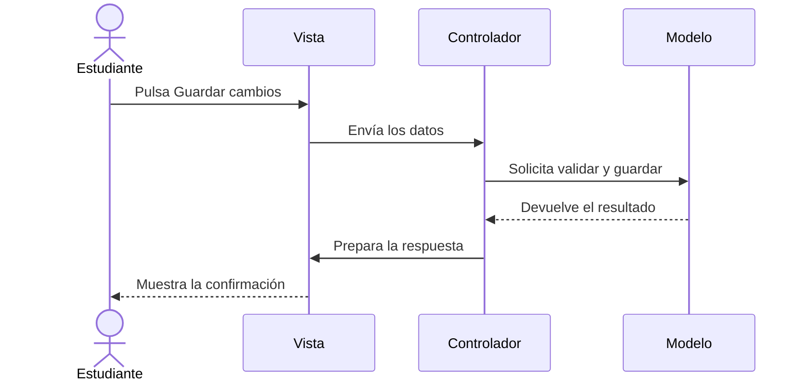
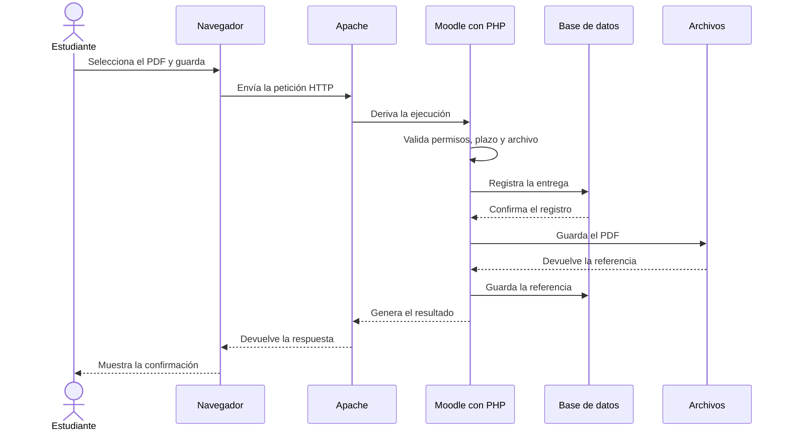

# 5. Análisis de Moodle

En los apartados anteriores hemos estudiado diferentes conceptos relacionados con la organización y el funcionamiento de una aplicación web:

* Cliente y servidor.
* Frontend y backend.
* Presentación, lógica de negocio y acceso a datos.
* Organización lógica y distribución física.
* Modelo, vista y controlador.

En este apartado aplicaremos todos estos conceptos al análisis de una aplicación web real: **Moodle**.

No introduciremos una arquitectura nueva. Observaremos la misma aplicación desde las diferentes perspectivas estudiadas.

## 5.1. El caso que vamos a analizar

Supongamos que un estudiante accede a una tarea de Moodle, selecciona un archivo PDF y pulsa el botón **Guardar cambios**.

A partir de esa acción podemos plantearnos la siguiente pregunta:

> ¿Qué sucede desde que el estudiante pulsa el botón hasta que Moodle confirma que la entrega se ha guardado?

Aunque el usuario solo observa un formulario y un mensaje de confirmación, en el proceso intervienen distintos componentes.

## 5.2. Recorrido general de la entrega

El proceso puede resumirse en cinco pasos:

1. El estudiante pulsa **Guardar cambios**.
2. Apache recibe la petición.
3. Moodle, mediante PHP, valida la operación.
4. Moodle registra los datos y guarda el archivo.
5. El navegador recibe y muestra la confirmación.

Cada paso necesita unos componentes y unas responsabilidades diferentes.

## 5.3. Arquitectura de una entrega en Moodle

El siguiente gráfico representa de forma simplificada el recorrido completo de una entrega en Moodle.

*Representación didáctica simplificada de la arquitectura de una entrega en Moodle.*

Para interpretar el gráfico debemos observar:

* Los cuadros discontinuos representan la distribución física.
* Los cuadros punteados agrupan responsabilidades lógicas.
* Los colores diferencian presentación, lógica de negocio y datos.
* Las etiquetas oscuras muestran una correspondencia didáctica con MVC.
* Las flechas azules representan el recorrido de la petición.
* Las flechas grises representan el recorrido de la respuesta.

!!! note "Representación simplificada"
Moodle es una aplicación compleja y su arquitectura real contiene muchos más componentes. El gráfico se ha simplificado para facilitar la comprensión del recorrido de la petición y de la separación de responsabilidades.

## 5.4. Frontend y backend

Podemos comenzar distinguiendo dónde se ejecuta cada parte.

### Frontend

El frontend se ejecuta en el navegador del estudiante e incluye:

* El formulario de entrega.
* El selector de archivos.
* El botón **Guardar cambios**.
* Los mensajes mostrados al usuario.
* El HTML, CSS y JavaScript de la página.

El frontend permite iniciar la operación y mostrar el resultado, pero no debe decidir por sí solo si la entrega es válida.

### Backend

El backend se ejecuta en el servidor e incluye:

* Apache.
* PHP.
* Moodle.
* El acceso a la base de datos.
* El almacenamiento de archivos.
* Las comprobaciones de seguridad.
* Las reglas relacionadas con la entrega.

## 5.5. Presentación, lógica de negocio y datos

También podemos analizar Moodle según las responsabilidades de sus componentes.

### Presentación

La presentación se encarga de:

* Mostrar el formulario.
* Permitir seleccionar el archivo.
* Recoger la acción del estudiante.
* Mostrar errores.
* Mostrar la confirmación final.

### Lógica de negocio

Antes de guardar la entrega, Moodle debe comprobar determinadas reglas:

* El usuario está identificado.
* El usuario está matriculado en el curso.
* La tarea permite realizar entregas.
* El plazo continúa abierto.
* El usuario tiene permiso para entregar.
* El archivo cumple los requisitos establecidos.
* La entrega puede modificarse en su estado actual.

Estas comprobaciones no deben depender únicamente del navegador. Deben realizarse en el servidor.

### Datos y almacenamiento

Cuando la operación es válida, Moodle debe conservar:

* El usuario que realiza la entrega.
* La tarea correspondiente.
* La fecha y hora.
* El estado de la entrega.
* La referencia al archivo.
* Otros datos necesarios para gestionar la actividad.

El archivo PDF se guarda en el sistema de almacenamiento. La base de datos conserva la información necesaria para relacionar ese archivo con el usuario, la tarea y la entrega.

!!! important "Datos y archivos"
La base de datos no necesita guardar directamente todo el contenido del PDF. Puede almacenar una referencia que permita a Moodle localizar el archivo guardado.

## 5.6. Organización lógica y distribución física

El gráfico también permite diferenciar la organización lógica de la distribución física.

### Organización lógica

Los cuadros punteados agrupan componentes según su responsabilidad:

* Presentación.
* Lógica de negocio.
* Datos.

Estas agrupaciones representan capas lógicas o `layers`.

### Distribución física

Los cuadros discontinuos muestran los entornos donde se ejecutan los componentes:

* El navegador se ejecuta en el equipo del estudiante.
* Apache, PHP y Moodle se ejecutan en el servidor.
* La base de datos y los archivos forman parte de la infraestructura del servidor.

Estas agrupaciones representan la distribución física o `tiers`.

| Organización lógica    | Distribución física          |
| ---------------------- | ---------------------------- |
| Presentación           | Equipo cliente               |
| Lógica de negocio      | Servidor                     |
| Datos y almacenamiento | Infraestructura del servidor |

La correspondencia no tiene que ser siempre exacta. En una instalación de Moodle de mayor tamaño, la aplicación, la base de datos y los archivos podrían distribuirse entre diferentes servidores.

## 5.7. Relación con MVC

Podemos utilizar MVC para describir cómo colaboran determinados componentes durante la entrega.

### Vista

La vista presenta:

* El formulario de entrega.
* El selector de archivos.
* Los mensajes.
* La confirmación final.

### Controlador

El controlador coordina la operación:

1. Recibe la petición.
2. Identifica la acción solicitada.
3. Solicita las comprobaciones necesarias.
4. Inicia el guardado de la entrega.
5. Prepara la respuesta.

### Modelo

El modelo gestiona la información y las operaciones relacionadas con:

* El usuario.
* La tarea.
* La entrega.
* El archivo.
* El estado de la actividad.

!!! warning "Correspondencia aproximada"
Las etiquetas Vista, Controlador y Modelo del gráfico representan una correspondencia didáctica. MVC y la arquitectura de tres capas están relacionados, pero no son clasificaciones equivalentes.

No debemos interpretar que:

* La vista es siempre toda la capa de presentación.
* El controlador contiene toda la lógica de negocio.
* El modelo es únicamente la base de datos.

MVC explica cómo colaboran determinados componentes. La arquitectura de tres capas explica cómo se separan las responsabilidades generales de la aplicación.

## 5.8. Recorrido detallado de la petición

Podemos reconstruir ahora el proceso completo:

1. El estudiante selecciona un archivo PDF.
2. El estudiante pulsa **Guardar cambios**.
3. El navegador prepara y envía una petición HTTP.
4. Apache recibe la petición.
5. Apache deriva la ejecución a Moodle.
6. PHP ejecuta el código correspondiente.
7. Moodle identifica al usuario y la tarea.
8. Moodle comprueba los permisos y el plazo.
9. Moodle valida el archivo recibido.
10. Se guarda la información de la entrega en la base de datos.
11. El PDF se guarda en el sistema de archivos.
12. La base de datos conserva la referencia al archivo.
13. Moodle genera el resultado de la operación.
14. Apache devuelve la respuesta HTTP.
15. El navegador muestra la confirmación al estudiante.

## 5.9. Una aplicación, varias perspectivas

La misma operación puede analizarse desde diferentes perspectivas:

| Perspectiva          | Elementos identificados              |
| -------------------- | ------------------------------------ |
| Cliente y servidor   | Navegador y servidor web             |
| Frontend y backend   | Interfaz y procesamiento             |
| Tres capas           | Presentación, lógica y datos         |
| `Layer` y `tier`     | Responsabilidad y lugar de ejecución |
| MVC                  | Vista, controlador y modelo          |
| Petición y respuesta | Envío de la entrega y confirmación   |

Ninguna de estas perspectivas sustituye a las demás. Cada una permite observar un aspecto diferente del funcionamiento de la aplicación.

## Preguntas de análisis

Utiliza el gráfico para responder y razonar las siguientes preguntas:

1. ¿Qué acción inicia el proceso?
2. ¿Qué componente actúa como cliente?
3. ¿Qué función realiza Apache?
4. ¿Dónde se ejecuta PHP?
5. ¿Qué reglas debe comprobar Moodle antes de guardar la entrega?
6. ¿Qué información se registra en la base de datos?
7. ¿Dónde se almacena el archivo PDF?
8. ¿Por qué la base de datos conserva una referencia al archivo?
9. ¿Qué elementos corresponden al frontend?
10. ¿Qué elementos corresponden al backend?
11. ¿Qué responsabilidades pertenecen a la presentación?
12. ¿Qué responsabilidades pertenecen a la lógica de negocio?
13. ¿Qué elementos intervienen en el acceso a datos?
14. ¿Qué distribución física representa el gráfico?
15. ¿Cómo intervienen la vista, el controlador y el modelo?
16. ¿Por qué la relación entre MVC y las tres capas es aproximada?
17. ¿Qué recibe finalmente el navegador?
18. ¿Qué podría cambiar si Moodle utilizara varios servidores?

El objetivo es utilizar los conceptos estudiados para explicar de forma razonada el recorrido completo de una petición en una aplicación web real.
