# 5. Capas físicas y capas lógicas

En el apartado anterior hemos organizado la aplicación en tres capas:

- Presentación.
- Lógica de negocio.
- Acceso a datos.

Estas capas representan una separación de responsabilidades dentro del software. Sin embargo, una aplicación también puede distribuirse físicamente entre diferentes equipos o servidores.

Para distinguir ambos conceptos utilizaremos los términos:

- **Layer:** capa lógica.
- **Tier:** capa física.

Aunque ambos términos suelen traducirse como *capa*, no representan exactamente lo mismo.

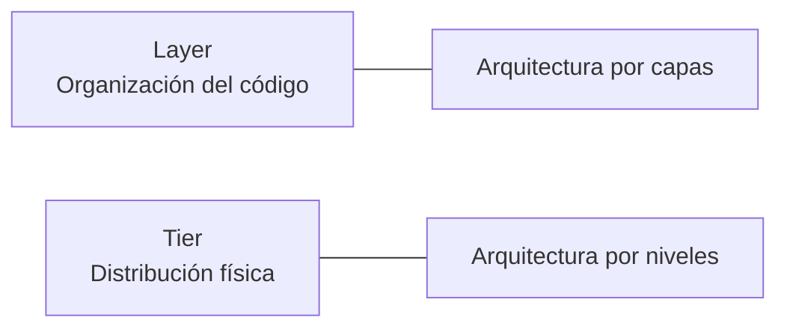

## 5.1. Capas lógicas: `layer`

Una **capa lógica** o `layer` agrupa los componentes del programa según la responsabilidad que desempeñan.

Las capas lógicas que hemos estudiado son:

1. Presentación.
2. Lógica de negocio.
3. Acceso a datos.

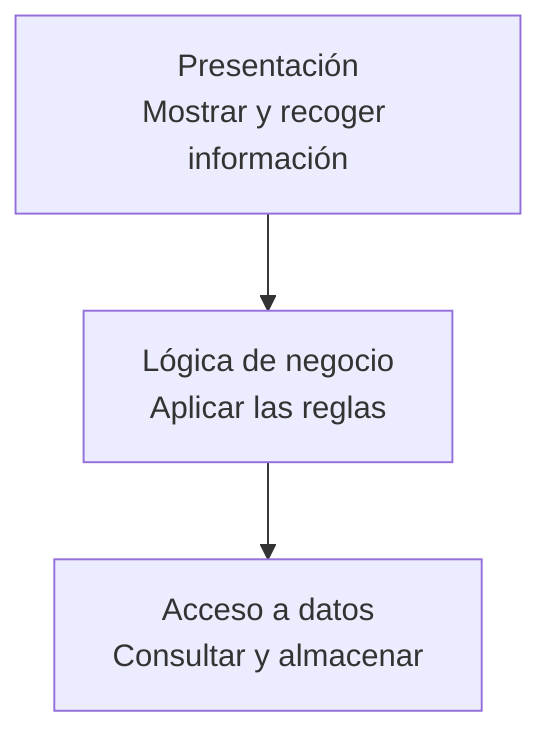

Esta separación existe en la organización del código, independientemente del número de ordenadores utilizados para ejecutar la aplicación.

Por ejemplo, un proyecto podría organizarse así:

```text
aplicacion/
├── presentacion/
│   ├── formularios
│   └── plantillas
├── negocio/
│   ├── pedidos
│   └── usuarios
└── datos/
    ├── consultas
    └── repositorios
```

Las carpetas representan responsabilidades diferentes, pero podrían ejecutarse en un mismo equipo.

!!! info "Idea principal"
    Una `layer` responde a la pregunta: **¿qué responsabilidad tiene esta parte del código?**

## 5.2. Capas físicas: `tier`

Una **capa física** o `tier` representa un entorno de ejecución separado.

Puede tratarse de:

- Un ordenador.
- Un servidor.
- Una máquina virtual.
- Un contenedor.
- Un servicio independiente.
- Una infraestructura situada en otra red.

Las capas físicas indican cómo se distribuyen los componentes cuando la aplicación está funcionando.

!!! info "Idea principal"
    Un `tier` responde a la pregunta: **¿dónde se ejecuta este componente?**

## 5.3. Arquitectura de un nivel

En una arquitectura de **un nivel** o `one-tier`, todos los componentes se ejecutan en el mismo equipo.

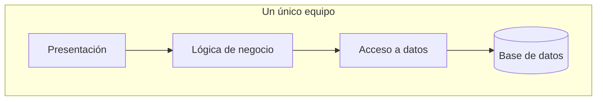

Esta organización puede aparecer en:

- Aplicaciones locales.
- Prototipos.
- Entornos de aprendizaje.
- Herramientas utilizadas por un único usuario.

### Ventajas

- Es sencilla de instalar.
- Requiere poca infraestructura.
- Resulta adecuada para proyectos pequeños o pruebas.

### Limitaciones

- Tiene una capacidad de crecimiento limitada.
- Todos los componentes dependen del mismo equipo.
- Resulta más difícil repartir la carga.
- Un fallo puede afectar a toda la aplicación.

## 5.4. Arquitectura de dos niveles

En una arquitectura de **dos niveles** o `two-tier`, el cliente se comunica directamente con un servidor de datos o con un servidor que concentra la aplicación y los datos.

Un ejemplo tradicional sería una aplicación de escritorio conectada directamente a una base de datos.

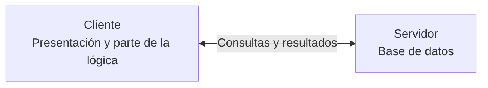

También podemos encontrar una aplicación web sencilla en la que:

- El navegador actúa como cliente.
- El servidor ejecuta la aplicación y aloja la base de datos.

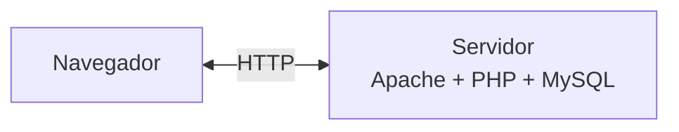

### Ventajas

- Mantiene una infraestructura relativamente sencilla.
- Centraliza los datos.
- Permite que varios clientes utilicen la aplicación.

### Limitaciones

- El servidor puede concentrar demasiadas responsabilidades.
- La capacidad de crecimiento sigue siendo limitada.
- La aplicación y la base de datos pueden competir por los mismos recursos.

## 5.5. Arquitectura de tres niveles

En una arquitectura de **tres niveles** o `three-tier`, los componentes principales se distribuyen en tres entornos físicos:

1. Cliente.
2. Servidor de aplicaciones.
3. Servidor de base de datos.

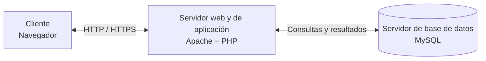

El navegador no accede directamente a la base de datos. Todas las operaciones pasan por el servidor de aplicaciones.

### Ventajas

- Separa las responsabilidades físicas.
- Permite administrar cada nivel de forma independiente.
- Facilita aumentar los recursos de la parte que lo necesite.
- La base de datos no necesita estar expuesta directamente al cliente.
- Permite aplicar diferentes medidas de seguridad en cada nivel.
- Facilita el mantenimiento y la evolución de la infraestructura.

### Limitaciones

- Requiere más configuración.
- Introduce comunicaciones entre diferentes sistemas.
- Aumenta la complejidad de administración.
- Puede necesitar mecanismos adicionales de seguridad y supervisión.

## 5.6. Diferencia entre `layer` y `tier`

| Aspecto | `Layer` | `Tier` |
| --- | --- | --- |
| Significado | Capa lógica | Capa física |
| Organiza | El código y sus responsabilidades | Los entornos de ejecución |
| Pregunta principal | ¿Qué función realiza? | ¿Dónde se ejecuta? |
| Ejemplos | Presentación, negocio y datos | Cliente, servidor de aplicación y servidor de datos |
| Implica equipos separados | No | Normalmente sí |
| Objetivo | Mejorar la organización del software | Distribuir la ejecución de la aplicación |

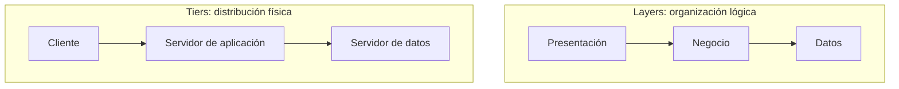

!!! warning "No son conceptos equivalentes"
    Una aplicación puede tener tres capas lógicas y ejecutarse en un único servidor. En ese caso tendría tres `layers`, pero no tres `tiers`.

## 5.7. Combinaciones posibles

Las capas lógicas no tienen por qué coincidir exactamente con las capas físicas.

### Tres capas lógicas en un único nivel físico

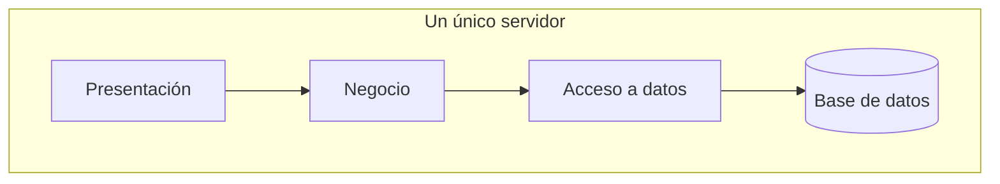

### Tres capas lógicas distribuidas en varios niveles

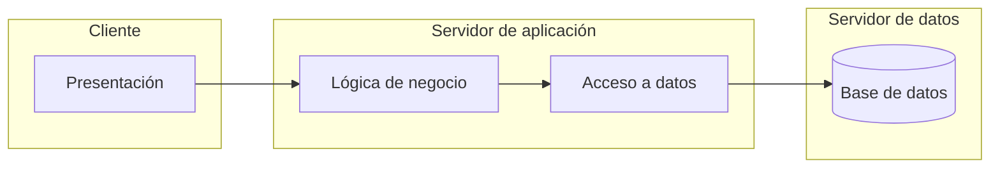

La distribución elegida dependerá de factores como:

- El tamaño de la aplicación.
- El número de usuarios.
- La seguridad necesaria.
- El presupuesto disponible.
- La cantidad de datos.
- La necesidad de escalar.
- La disponibilidad requerida.

## 5.8. Escalabilidad

La **escalabilidad** es la capacidad de una aplicación para seguir funcionando correctamente cuando aumenta el número de usuarios o la cantidad de trabajo.

Existen dos formas principales de aumentar la capacidad:

### Escalabilidad vertical

Consiste en mejorar los recursos de un mismo servidor:

- Más memoria RAM.
- Más procesadores.
- Mayor capacidad de almacenamiento.
- Componentes más rápidos.

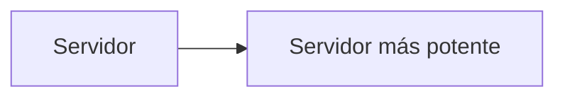

### Escalabilidad horizontal

Consiste en añadir más servidores que realicen una función similar.

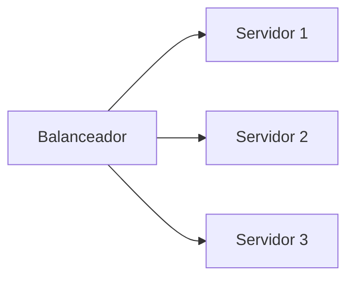

Un balanceador de carga puede distribuir las peticiones entre varios servidores.

!!! note "Más servidores no significa más capas lógicas"
    Podemos tener varios servidores ejecutando la misma capa de aplicación. El número de equipos no determina el número de responsabilidades del código.

## 5.9. Contenedores y capas físicas

Un contenedor proporciona un entorno aislado para ejecutar un servicio.

En nuestro entorno tendremos inicialmente:

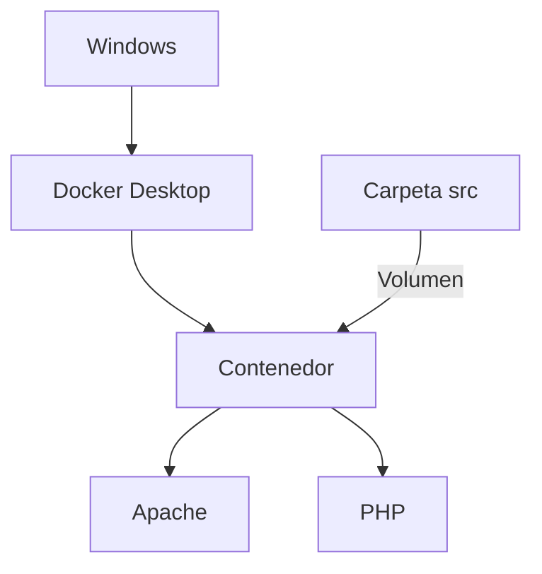

El uso de contenedores permite separar servicios sin necesitar un ordenador físico para cada uno.

Más adelante podremos utilizar diferentes contenedores para:

- Apache y PHP.
- MySQL.
- Herramientas de administración.
- Otros servicios necesarios.

!!! important "Contenedor no equivale siempre a servidor físico"
    Un mismo ordenador puede ejecutar varios contenedores. La separación es real desde el punto de vista del entorno de ejecución, pero todos pueden compartir el mismo equipo físico.

## 5.10. Nuestro entorno y un entorno de producción

Durante las primeras prácticas utilizaremos un entorno sencillo:

```text
Nuestro ordenador
├── Navegador
├── Visual Studio Code
└── Docker
    └── Contenedor con Apache y PHP
```

Este entorno resulta adecuado para aprender y desarrollar.

En una aplicación real publicada en Internet, los componentes podrían distribuirse de otra forma:

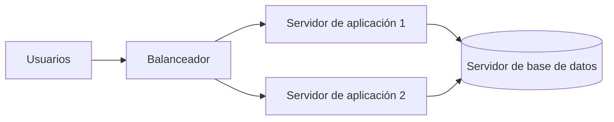

No necesitamos construir todavía una infraestructura de este tipo. Nuestro objetivo es comprender por qué una aplicación puede organizarse lógicamente y distribuirse físicamente de diferentes maneras.

## Actividad

### Clasificación

Indica si cada afirmación se refiere principalmente a una `layer` o a un `tier`:

1. Contiene las reglas utilizadas para calcular un descuento.
2. Se ejecuta en un servidor independiente.
3. Muestra la información al usuario.
4. Almacena la base de datos en otro equipo.
5. Agrupa el código encargado de realizar consultas.
6. Indica dónde se ejecuta Apache.
7. Organiza el código según sus responsabilidades.
8. Permite distribuir la aplicación entre varias máquinas.

### Razonamiento

Responde:

1. ¿Puede una aplicación tener tres capas lógicas y ejecutarse en un solo equipo?
2. ¿Por qué el navegador no debería conectarse directamente a la base de datos?
3. ¿Qué diferencia existe entre escalabilidad vertical y horizontal?
4. ¿Añadir tres servidores de aplicaciones crea tres nuevas capas lógicas?
5. ¿Qué ventajas aporta separar la base de datos del servidor de aplicaciones?
6. ¿Qué diferencia existe entre un contenedor y un servidor físico?