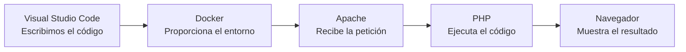
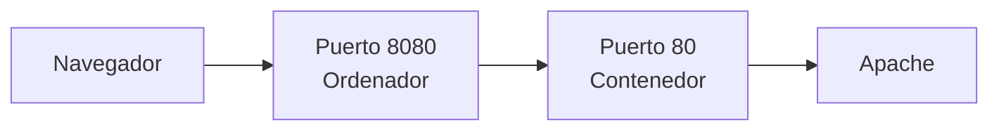
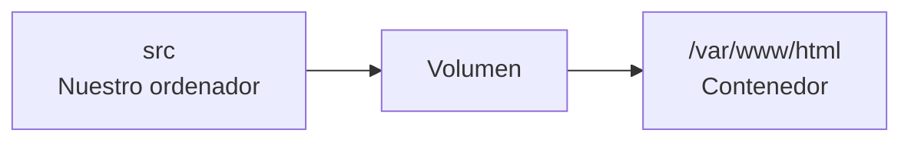
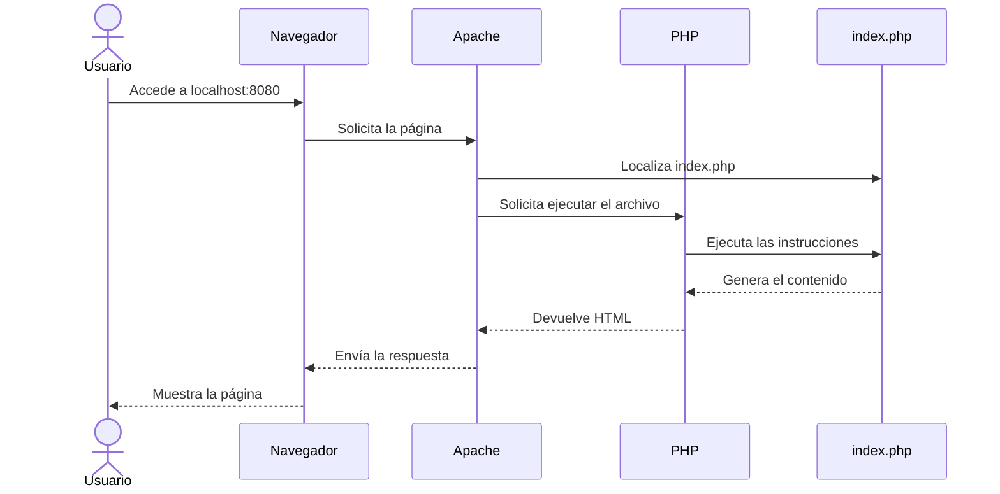
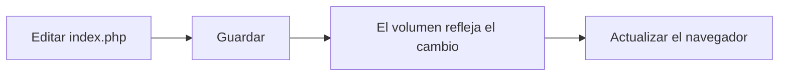

# 6. Entorno y primer proyecto PHP

En los apartados anteriores hemos estudiado cómo funciona una aplicación web y cómo se organizan sus componentes.

Ahora vamos a comprobarlo de forma práctica preparando el entorno de desarrollo y ejecutando nuestro primer proyecto PHP.

Al finalizar este apartado seremos capaces de:

* Crear la estructura de un proyecto web.
* Configurar un servidor Apache con PHP.
* Iniciar el entorno mediante Docker Compose.
* Ejecutar código PHP.
* Acceder a la aplicación desde el navegador.
* Modificar el código y comprobar el resultado.
* Consultar el estado y los registros del servidor.
* Detener correctamente el entorno.



## 6.1. Herramientas necesarias

Utilizaremos las siguientes herramientas:

| Herramienta        | Función                                                   |
| ------------------ | --------------------------------------------------------- |
| WSL 2              | Proporciona la base Linux utilizada por Docker en Windows |
| Docker Desktop     | Permite crear y gestionar contenedores                    |
| Docker Compose     | Define e inicia los servicios del proyecto                |
| Visual Studio Code | Permite escribir y organizar el código                    |
| Apache             | Recibe las peticiones del navegador                       |
| PHP                | Ejecuta el código en el servidor                          |
| Navegador          | Solicita la aplicación y muestra el resultado             |

No todas estas herramientas forman parte de la aplicación final.

Visual Studio Code y Docker nos ayudan a desarrollar y ejecutar el proyecto. Apache y PHP intervienen directamente cuando el navegador solicita una página.

## 6.2. Comprobar el entorno

Antes de crear el proyecto, debemos comprobar que las herramientas principales están instaladas y funcionando.

Abre PowerShell y ejecuta:

```powershell
wsl --version
```

Este comando muestra la versión de WSL instalada.

También podemos comprobar su estado:

```powershell
wsl --status
```

Comprueba Docker:

```powershell
docker --version
```

Comprueba Docker Compose:

```powershell
docker compose version
```

Comprueba Visual Studio Code:

```powershell
code --version
```

!!! note "Comprobación de Visual Studio Code"
Si el comando `code` no se reconoce, pero Visual Studio Code se abre correctamente desde Windows, podremos continuar abriendo la carpeta del proyecto desde el propio editor.

Si alguno de los componentes no funciona, consulta las guías de instalación:

* [Guía de instalación de WSL 2, Docker, PHP y Apache](../recursos/guia-wsl-docker-php-apache.pdf).
* [Guía de instalación y configuración de Visual Studio Code](../recursos/guia-visual-studio-code.pdf).

!!! important "Docker Desktop debe estar iniciado"
Antes de ejecutar comandos de Docker, comprueba que Docker Desktop está abierto y que el motor se encuentra en funcionamiento.

## 6.3. Crear la carpeta del proyecto

Crea una carpeta llamada:

```text
primer-proyecto-php
```

Puedes crearla desde el explorador de archivos o desde PowerShell:

```powershell
mkdir primer-proyecto-php
cd primer-proyecto-php
```

Dentro del proyecto, crea una carpeta llamada `src`:

```powershell
mkdir src
```

Abre el proyecto con Visual Studio Code:

```powershell
code .
```

Si el comando anterior no funciona:

1. Abre Visual Studio Code.
2. Selecciona **Archivo → Abrir carpeta**.
3. Selecciona `primer-proyecto-php`.

La estructura inicial será:

```text
primer-proyecto-php/
└── src/
```

## 6.4. Estructura del proyecto

Nuestro proyecto contendrá dos elementos principales:

```text
primer-proyecto-php/
├── src/
│   └── index.php
└── compose.yaml
```

Cada elemento tiene una función:

| Elemento        | Función                                       |
| --------------- | --------------------------------------------- |
| `compose.yaml`  | Define el entorno con Apache y PHP            |
| `src`           | Contiene el código fuente                     |
| `src/index.php` | Contiene la página principal de la aplicación |

El código permanecerá en nuestro ordenador dentro de `src`. Docker proporcionará el entorno necesario para ejecutarlo.

## 6.5. Crear `compose.yaml`

En la raíz del proyecto, crea un archivo llamado:

```text
compose.yaml
```

Escribe el siguiente contenido:

```yaml
services:
  apache_php:
    image: php:8.4-apache
    ports:
      - "8080:80"
    volumes:
      - ./src:/var/www/html
```

La indentación del archivo YAML es importante. Debemos utilizar espacios y mantener correctamente la estructura.

### Servicios

```yaml
services:
```

Esta sección contiene los servicios necesarios para ejecutar el proyecto.

En este primer proyecto utilizaremos un único servicio.

### Nombre del servicio

```yaml
apache_php:
```

`apache_php` es el nombre que hemos asignado al servicio.

Utilizaremos este nombre posteriormente para consultar el estado, los registros o ejecutar comandos dentro del contenedor.

### Imagen

```yaml
image: php:8.4-apache
```

La imagen `php:8.4-apache` proporciona un entorno que ya contiene:

* Apache.
* PHP 8.4.
* La configuración necesaria para que Apache pueda ejecutar archivos PHP.

No necesitamos instalar manualmente Apache y PHP dentro del proyecto.

### Puertos

```yaml
ports:
  - "8080:80"
```

Esta configuración conecta dos puertos:

| Puerto | Ubicación         | Función                           |
| -----: | ----------------- | --------------------------------- |
| `8080` | Nuestro ordenador | Puerto utilizado por el navegador |
|   `80` | Contenedor        | Puerto en el que escucha Apache   |

Cuando accedamos a:

```text
http://localhost:8080
```

Docker enviará la petición al puerto `80` del contenedor, donde se encuentra Apache.



### Volumen

```yaml
volumes:
  - ./src:/var/www/html
```

El volumen relaciona dos carpetas:

| Ruta            | Ubicación         |
| --------------- | ----------------- |
| `./src`         | Nuestro ordenador |
| `/var/www/html` | Contenedor        |

Apache publica los archivos situados en `/var/www/html`.

Gracias al volumen, los archivos de `src` estarán disponibles dentro del contenedor.



Cuando modifiquemos un archivo de `src`, el cambio estará disponible inmediatamente en el contenedor. No será necesario reconstruirlo.

## 6.6. Validar la configuración

Antes de iniciar el entorno, comprueba que `compose.yaml` es válido:

```powershell
docker compose config
```

Este comando interpreta la configuración y muestra el resultado.

Si existe un problema de indentación o sintaxis, Docker mostrará un mensaje de error.

!!! tip "Validar antes de iniciar"
Ejecutar `docker compose config` permite detectar errores de configuración antes de crear el contenedor.

## 6.7. Crear `index.php`

Dentro de `src`, crea un archivo llamado:

```text
index.php
```

Escribe el siguiente código:

```php
<?php

date_default_timezone_set("Europe/Madrid");

$modulo = "Desarrollo Web en Entorno Servidor";
$curso = "2.º DAW";
$mensaje = "Nuestro primer proyecto PHP está funcionando.";
$fecha = date("d/m/Y");
$hora = date("H:i:s");
$versionPhp = phpversion();

?>
<!DOCTYPE html>
<html lang="es">
<head>
    <meta charset="UTF-8">
    <meta name="viewport" content="width=device-width, initial-scale=1.0">
    <title>Primer proyecto PHP</title>
</head>
<body>
    <header>
        <h1>Primer proyecto PHP</h1>
    </header>

    <main>
        <h2><?php echo $modulo; ?></h2>

        <p>Curso: <?php echo $curso; ?></p>
        <p><?php echo $mensaje; ?></p>

        <h2>Información generada en el servidor</h2>

        <ul>
            <li>Fecha: <?php echo $fecha; ?></li>
            <li>Hora: <?php echo $hora; ?></li>
            <li>Versión de PHP: <?php echo $versionPhp; ?></li>
        </ul>
    </main>
</body>
</html>
```

Este archivo combina HTML y PHP.

Las instrucciones situadas entre:

```php
<?php
```

y:

```php
?>
```

son ejecutadas por PHP en el servidor.

Por ejemplo:

```php
$fecha = date("d/m/Y");
```

obtiene la fecha actual.

Cuando escribimos:

```php
<?php echo $fecha; ?>
```

PHP incorpora el valor de la variable al documento HTML generado.

!!! important "El navegador no recibe el código PHP"
El navegador recibe el HTML generado después de ejecutar las instrucciones. El código PHP permanece en el servidor.

## 6.8. Iniciar el entorno

Desde la carpeta del proyecto, ejecuta:

```powershell
docker compose up -d
```

Este comando:

1. Lee `compose.yaml`.
2. Descarga la imagen si todavía no está disponible.
3. Crea el contenedor.
4. Conecta el puerto y el volumen.
5. Inicia Apache y PHP.

La opción `-d` inicia el contenedor en segundo plano y permite seguir utilizando la terminal.

La primera ejecución puede tardar más porque Docker debe descargar la imagen.

## 6.9. Comprobar el contenedor

Ejecuta:

```powershell
docker compose ps
```

El servicio `apache_php` debe aparecer en ejecución.

También puedes ejecutar:

```powershell
docker ps
```

La diferencia es:

* `docker compose ps` muestra los servicios del proyecto actual.
* `docker ps` muestra todos los contenedores que están en ejecución.

## 6.10. Abrir la aplicación

Abre el navegador y accede a:

```text
http://localhost:8080
```

Deberás ver:

* El título del proyecto.
* El nombre del módulo.
* El curso.
* El mensaje generado.
* La fecha y la hora.
* La versión de PHP.

Esto permite comprobar que:

1. El navegador puede comunicarse con Apache.
2. Apache encuentra `index.php`.
3. PHP ejecuta el código.
4. El volumen conecta `src` con el contenedor.
5. El servidor devuelve una respuesta HTML.

## 6.11. Recorrido de la petición

Cuando accedemos a `http://localhost:8080`, se produce el siguiente recorrido:



Este recorrido pone en práctica lo estudiado en el primer apartado de la unidad:

* El navegador actúa como cliente.
* Apache actúa como servidor web.
* PHP se ejecuta en el servidor.
* `index.php` genera contenido dinámico.
* El navegador recibe HTML.

## 6.12. Modificar el proyecto

En `index.php`, cambia el valor de:

```php
$mensaje = "Nuestro primer proyecto PHP está funcionando.";
```

Por ejemplo:

```php
$mensaje = "Estamos aprendiendo desarrollo web en el servidor.";
```

Guarda el archivo y actualiza el navegador.

El nuevo mensaje aparecerá inmediatamente.



No es necesario detener ni reconstruir el contenedor porque `src` está conectado mediante un volumen.

Realiza también estas modificaciones:

1. Añade tu nombre.
2. Añade el nombre del centro.
3. Incorpora una lista con las herramientas utilizadas.
4. Añade un enlace a la documentación oficial de PHP.
5. Comprueba que la hora cambia al actualizar la página.

## 6.13. Ejecutar PHP dentro del contenedor

Podemos comprobar directamente la versión de PHP instalada en el contenedor:

```powershell
docker compose exec apache_php php -v
```

También podemos comprobar la versión de Apache:

```powershell
docker compose exec apache_php apache2ctl -v
```

Para mostrar los archivos publicados:

```powershell
docker compose exec apache_php ls -la /var/www/html
```

En el resultado debe aparecer `index.php`.

Estos comandos se ejecutan dentro del contenedor, aunque los escribamos desde PowerShell.

## 6.14. Consultar los registros

Para mostrar los registros del servicio, ejecuta:

```powershell
docker compose logs
```

Los registros pueden ayudarnos a identificar:

* Peticiones recibidas.
* Problemas de inicio.
* Errores de Apache.
* Errores durante la ejecución de PHP.

Para seguir los registros en tiempo real:

```powershell
docker compose logs -f
```

Pulsa `Ctrl + C` para dejar de seguirlos.

Esto no detiene el contenedor.

## 6.15. Provocar y localizar un error

Vamos a provocar un error de sintaxis para aprender a localizarlo y corregirlo.

En `index.php`, modifica temporalmente estas instrucciones:

```php
$curso = "2.º DAW";
$mensaje = "Nuestro primer proyecto PHP está funcionando.";
```

Elimina el punto y coma de la primera instrucción:

```php
$curso = "2.º DAW"
$mensaje = "Nuestro primer proyecto PHP está funcionando.";
```

Guarda el archivo.

!!! warning "El archivo debe estar guardado"
    Si Visual Studio Code todavía muestra el indicador de cambios pendientes, guarda el archivo antes de realizar la comprobación.

### Comprobar la sintaxis de PHP

Ejecuta:

```powershell
docker compose exec apache_php php -l /var/www/html/index.php
```

La opción `-l` solicita a PHP que compruebe la sintaxis del archivo sin ejecutar la aplicación.

El resultado mostrará un mensaje parecido al siguiente:

```text
Parse error: syntax error, unexpected variable "$mensaje" in /var/www/html/index.php on line 7
Errors parsing /var/www/html/index.php
```

El mensaje proporciona información útil:

- `Parse error` indica un error de sintaxis.
- `unexpected variable "$mensaje"` indica dónde PHP ha detectado el problema.
- `line 7` señala la línea en la que la ejecución deja de ser válida.
- `/var/www/html/index.php` identifica el archivo analizado.

!!! note "La línea indicada no siempre contiene la causa"
    PHP muestra la línea en la que detecta que la sintaxis ya no es válida. La causa puede encontrarse en la línea anterior, como sucede en este ejemplo al faltar el punto y coma.

### Consultar los registros

También podemos consultar los registros del contenedor:

```powershell
docker compose logs
```

Dependiendo de la configuración de Apache y PHP, el error puede aparecer en los registros o mostrarse únicamente mediante la comprobación de sintaxis.

Por este motivo, `php -l` es la forma más directa de comprobar errores sintácticos.

### Corregir el error

Añade nuevamente el punto y coma:

```php
$curso = "2.º DAW";
$mensaje = "Nuestro primer proyecto PHP está funcionando.";
```

Guarda el archivo y vuelve a comprobarlo:

```powershell
docker compose exec apache_php php -l /var/www/html/index.php
```

Ahora deberá aparecer:

```text
No syntax errors detected in /var/www/html/index.php
```

Finalmente, actualiza el navegador y comprueba que la aplicación vuelve a funcionar.

!!! tip "Un método de diagnóstico"
    Ante un error en una aplicación PHP, podemos seguir este proceso:

    1. Leer el mensaje mostrado.
    2. Comprobar la sintaxis con `php -l`.
    3. Revisar la línea indicada y las anteriores.
    4. Consultar los registros.
    5. Corregir el código.
    6. Volver a comprobar la sintaxis.

## 6.16. Detener el entorno

Cuando terminemos de trabajar, ejecutamos:

```powershell
docker compose down
```

Este comando:

* Detiene el contenedor.
* Elimina el contenedor creado para el proyecto.
* Conserva la imagen descargada.
* Conserva los archivos de `src`.

El código no se pierde porque permanece almacenado en nuestro ordenador.

Para volver a iniciar el entorno:

```powershell
docker compose up -d
```

## 6.17. Comandos básicos

| Comando                                 | Función                                |
| --------------------------------------- | -------------------------------------- |
| `docker compose config`                 | Valida `compose.yaml`                  |
| `docker compose up -d`                  | Crea e inicia el entorno               |
| `docker compose ps`                     | Muestra los servicios del proyecto     |
| `docker compose logs`                   | Muestra los registros                  |
| `docker compose logs -f`                | Sigue los registros en tiempo real     |
| `docker compose exec apache_php php -v` | Muestra la versión de PHP              |
| `docker compose down`                   | Detiene y elimina el contenedor        |
| `docker ps`                             | Muestra todos los contenedores activos |

## 6.18. Comprobación final

Antes de finalizar, comprueba:

* [ ] WSL 2 funciona.
* [ ] Docker Desktop está iniciado.
* [ ] Docker Compose funciona.
* [ ] La carpeta del proyecto está abierta en Visual Studio Code.
* [ ] Existe `compose.yaml`.
* [ ] Existe `src/index.php`.
* [ ] `docker compose config` no muestra errores.
* [ ] `docker compose up -d` inicia el entorno.
* [ ] `docker compose ps` muestra el servicio activo.
* [ ] La aplicación se abre en `http://localhost:8080`.
* [ ] PHP genera la fecha, la hora y su versión.
* [ ] Los cambios aparecen al actualizar el navegador.
* [ ] Puedes consultar los registros.
* [ ] Puedes detener el entorno con `docker compose down`.

## Preguntas de reflexión

1. ¿Qué función tiene `compose.yaml`?
2. ¿Qué contiene la imagen `php:8.4-apache`?
3. ¿Qué significa la relación `"8080:80"`?
4. ¿Para qué sirve el volumen?
5. ¿Dónde se encuentra almacenado el código fuente?
6. ¿Dónde se ejecuta PHP?
7. ¿Qué función realiza Apache?
8. ¿Qué recibe finalmente el navegador?
9. ¿Por qué no es necesario reconstruir el contenedor al modificar `index.php`?
10. ¿Para qué sirven los registros?
11. ¿Qué diferencia existe entre `docker compose up -d` y `docker compose down`?
12. ¿Por qué los archivos de `src` no se eliminan al detener el entorno?

El objetivo es comprender cómo se relacionan el código, el entorno de ejecución y el recorrido de una petición hasta obtener una aplicación PHP funcional.
