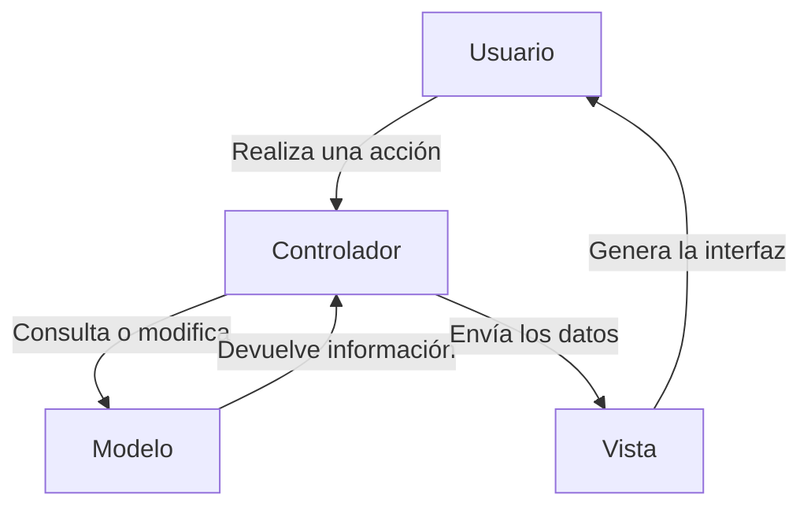
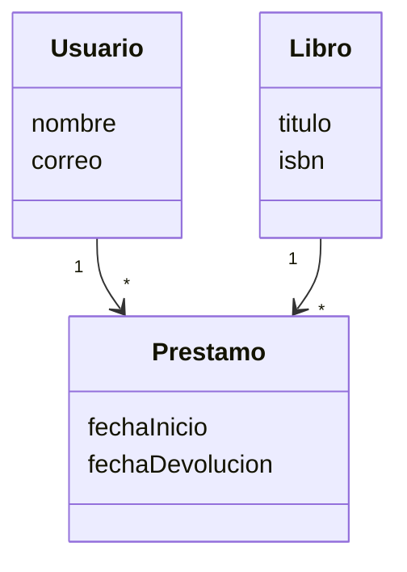
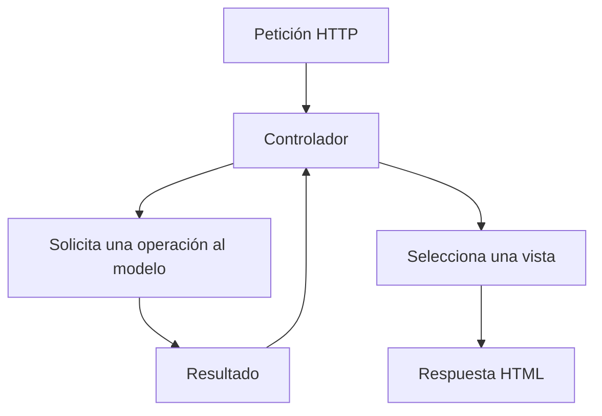
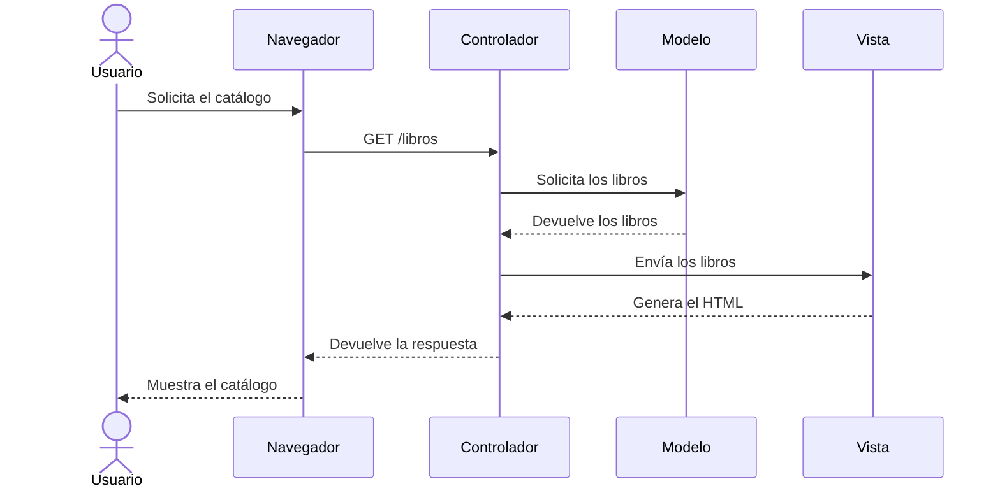
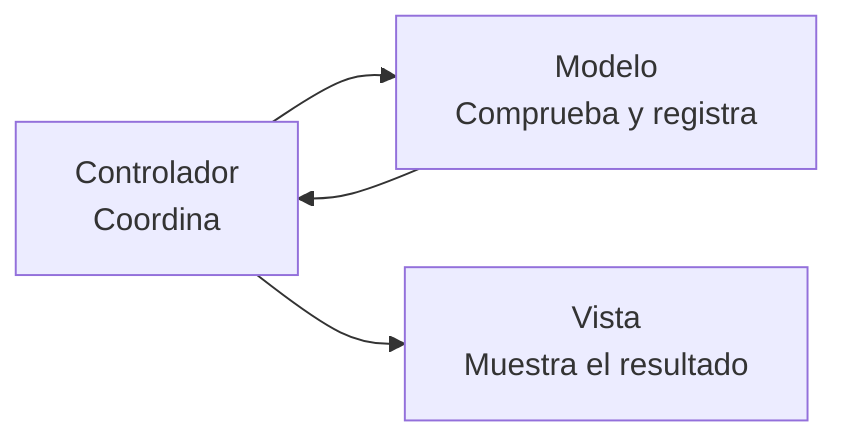
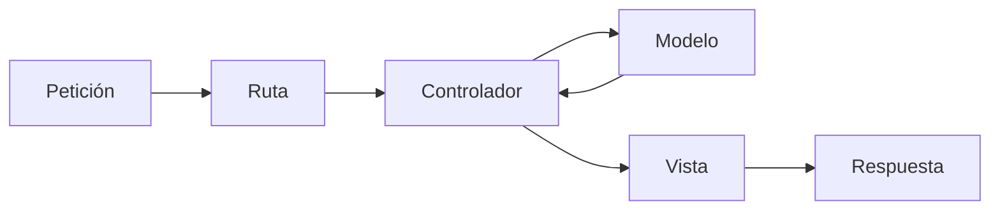

# 6. Introducción al patrón MVC

A medida que una aplicación crece, resulta necesario organizar el código para evitar que la presentación, las reglas y el acceso a los datos terminen mezclados en los mismos archivos.

El patrón **Modelo-Vista-Controlador**, conocido como **MVC**, propone dividir la aplicación en tres tipos principales de componentes:

- Modelo.
- Vista.
- Controlador.



MVC no es un lenguaje de programación ni una herramienta concreta. Es una forma de organizar el software separando responsabilidades.

## 6.1. El modelo

El **modelo** representa la información y el comportamiento relacionado con el dominio de la aplicación.

Puede encargarse de:

- Representar los datos.
- Consultar información.
- Crear, actualizar o eliminar datos.
- Aplicar reglas relacionadas con esos datos.
- Comprobar estados y restricciones.
- Comunicarse con la capa de persistencia.

En una aplicación de biblioteca podrían existir modelos como:

- Usuario.
- Libro.
- Ejemplar.
- Préstamo.
- Autor.



### Ejemplo

Un modelo `Prestamo` podría encargarse de:

- Representar un préstamo.
- Conocer su fecha de inicio.
- Conocer cuándo debe devolverse.
- Comprobar si está retrasado.
- Relacionar un usuario con un libro.

!!! warning "El modelo no es simplemente la base de datos"
    La base de datos almacena información. El modelo representa y gestiona los elementos importantes de la aplicación y puede contener comportamiento relacionado con ellos.

## 6.2. La vista

La **vista** es la parte encargada de presentar la información al usuario.

En una aplicación web, una vista suele generar contenido HTML y puede incluir:

- Títulos.
- Tablas.
- Formularios.
- Botones.
- Enlaces.
- Mensajes.
- Datos preparados por el controlador.

Una vista de la biblioteca podría mostrar una tabla como esta:

| Título | Autor | Disponible |
| --- | --- | --- |
| El nombre de la rosa | Umberto Eco | Sí |
| 1984 | George Orwell | No |
| Rayuela | Julio Cortázar | Sí |

La vista debe centrarse en cómo se presenta la información, evitando contener reglas complejas de la aplicación.

!!! example "Responsabilidad de la vista"
    La vista puede mostrar el texto «Préstamo retrasado», pero no debería calcular por sí sola si el préstamo está retrasado.

## 6.3. El controlador

El **controlador** recibe las acciones o peticiones del usuario y coordina la respuesta de la aplicación.

Normalmente se encarga de:

1. Recibir la petición.
2. Obtener los datos enviados.
3. Realizar comprobaciones iniciales.
4. Solicitar una operación al modelo.
5. Recoger el resultado.
6. Seleccionar una vista.
7. Enviar los datos necesarios a la vista.



En la aplicación de biblioteca podríamos tener controladores como:

- `LibroController`.
- `UsuarioController`.
- `PrestamoController`.

Un `PrestamoController` podría recibir una petición para prestar un libro y coordinar las operaciones necesarias.

!!! warning "El controlador no debe hacerlo todo"
    El controlador coordina la operación, pero no debería acumular todas las reglas de negocio ni escribir directamente toda la presentación.

## 6.4. Recorrido de una petición

Supongamos que el usuario quiere consultar el catálogo de libros.



El recorrido es:

1. El usuario solicita `/libros`.
2. La aplicación dirige la petición al controlador adecuado.
3. El controlador solicita los datos al modelo.
4. El modelo obtiene y devuelve la información.
5. El controlador entrega los datos a una vista.
6. La vista genera la representación.
7. El servidor devuelve la respuesta al navegador.

## 6.5. Ejemplo: registrar un préstamo

Para registrar el préstamo de un libro:

### Controlador

- Recibe el identificador del usuario.
- Recibe el identificador del libro.
- Solicita al modelo que realice el préstamo.
- Selecciona la vista que mostrará el resultado.

### Modelo

- Comprueba si el libro está disponible.
- Comprueba si el usuario puede realizar préstamos.
- Crea el préstamo.
- Actualiza la disponibilidad del ejemplar.
- Guarda los cambios.

### Vista

- Muestra la confirmación del préstamo.
- Muestra los datos del libro.
- Muestra la fecha prevista de devolución.
- Muestra un mensaje de error si la operación no se pudo realizar.



## 6.6. Ventajas de MVC

### Separación de responsabilidades

Cada componente tiene una función concreta:

- El modelo gestiona la información y su comportamiento.
- La vista presenta el resultado.
- El controlador coordina la petición.

### Mantenimiento

Podemos modificar la interfaz sin cambiar necesariamente el modelo.

### Reutilización

Un mismo modelo puede utilizarse desde distintas vistas.

Por ejemplo, los mismos datos podrían mostrarse mediante:

- Una página web.
- Un documento PDF.
- Una respuesta JSON.
- Una aplicación móvil.

### Trabajo en equipo

Diferentes desarrolladores pueden trabajar en modelos, vistas y controladores.

### Pruebas

La separación facilita comprobar el funcionamiento de los componentes de forma independiente.

### Organización

MVC proporciona una estructura conocida y utilizada por numerosos frameworks.

## 6.7. MVC y arquitectura de tres capas

MVC y la arquitectura de tres capas están relacionados, pero no son exactamente lo mismo.

| MVC | Arquitectura de tres capas |
| --- | --- |
| Organiza la interacción dentro de la aplicación | Organiza responsabilidades generales |
| Modelo, vista y controlador | Presentación, negocio y datos |
| El controlador coordina peticiones | La lógica de negocio aplica las reglas |
| La vista genera la presentación | La capa de presentación interactúa con el usuario |
| El modelo representa datos y comportamiento | La capa de datos gestiona la persistencia |

No debemos establecer una equivalencia rígida como:

```text
Vista = presentación
Controlador = negocio
Modelo = base de datos
```

Esta comparación es demasiado simple.

Por ejemplo:

- Un controlador puede formar parte de la entrada a la capa de aplicación.
- Una vista pertenece claramente a la presentación.
- Un modelo puede representar datos y comportamiento del dominio.
- El acceso a la base de datos puede realizarse mediante componentes específicos de persistencia.

!!! important "Dos formas de observar la aplicación"
    La arquitectura de tres capas separa responsabilidades generales. MVC organiza la interacción entre los componentes que atienden una petición.

## 6.8. MVC en Laravel

Laravel utiliza una organización basada en MVC y añade otros elementos importantes:

- Rutas.
- Middleware.
- Controladores.
- Modelos.
- Vistas.
- Migraciones.
- Validadores.
- Servicios.

Una petición sencilla en Laravel seguirá aproximadamente este recorrido:



### Ruta

Determina qué controlador debe atender una dirección.

### Controlador

Coordina la operación solicitada.

### Modelo

Representa y gestiona la información de la aplicación.

### Vista

Genera la respuesta que se mostrará al usuario.

Estudiaremos estos elementos detalladamente cuando comencemos a trabajar con Laravel.

## 6.9. Errores habituales

### Incluir consultas en las vistas

La vista no debería consultar directamente la base de datos.

### Generar todo el HTML en el controlador

El controlador debería seleccionar una vista y proporcionarle los datos.

### Colocar todas las reglas en el controlador

Esto produce controladores demasiado extensos y difíciles de mantener.

### Considerar que el modelo es solo una tabla

El modelo representa un concepto de la aplicación, no únicamente una tabla de la base de datos.

### Duplicar las mismas reglas

Las reglas importantes deberían encontrarse en componentes reutilizables y no repetirse en diferentes controladores.

## Actividad

### Clasificación

Indica si cada responsabilidad corresponde principalmente al modelo, a la vista o al controlador:

1. Mostrar una tabla de productos.
2. Recibir una petición para eliminar un producto.
3. Comprobar si un libro está disponible.
4. Seleccionar la pantalla de confirmación.
5. Calcular si un préstamo está retrasado.
6. Mostrar un mensaje de error.
7. Coordinar el registro de un nuevo usuario.
8. Representar los datos de un pedido.
9. Recibir los datos enviados por un formulario.
10. Generar el HTML que recibirá el navegador.

### Caso práctico

Una tienda en línea necesita mostrar el detalle de un producto.

Explica qué tarea realizaría cada componente:

1. El controlador.
2. El modelo.
3. La vista.

### Reflexión

Responde:

1. ¿Por qué la vista no debería acceder directamente a la base de datos?
2. ¿Por qué no conviene incluir todas las reglas en el controlador?
3. ¿Qué ventajas proporciona separar modelo, vista y controlador?
4. ¿Son equivalentes MVC y la arquitectura de tres capas?
5. ¿Qué elemento de Laravel decide qué controlador atiende una dirección?