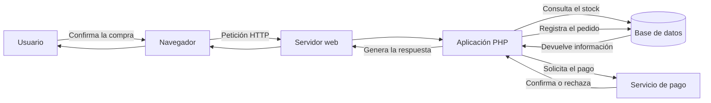

# 7. Actividad final de la unidad

## Arquitecturas web y primer proyecto PHP

Esta actividad permitirá comprobar que sabes:

- Preparar un entorno de desarrollo con Docker.
- Configurar Apache y PHP.
- Crear y ejecutar una aplicación PHP.
- Utilizar variables y funciones internas de PHP.
- Analizar la arquitectura de una aplicación web real.

La actividad es **individual** y está dividida en dos partes:

1. Creación de un currículum web con PHP: **6 puntos**.
2. Análisis de la arquitectura de una tienda online: **4 puntos**.

## Parte A. Currículum web con PHP

Crea desde cero una aplicación PHP que muestre un currículum académico y profesional.

Los datos del currículum deberán almacenarse en variables PHP y mostrarse posteriormente dentro del HTML.

### A.1. Nombre y estructura del proyecto

El proyecto se llamará:

```text
apellido-nombre-ud01
```

Sustituye `apellido` y `nombre` por tus datos, utilizando minúsculas, sin espacios ni tildes.

La estructura será:

```text
apellido-nombre-ud01/
├── src/
│   └── index.php
└── compose.yaml
```

### A.2. Configuración de Docker

El archivo `compose.yaml` deberá:

- Definir un servicio llamado `apache_php`.
- Utilizar la imagen `php:8.4-apache`.
- Conectar el puerto `8080` del ordenador con el puerto `80` del contenedor.
- Montar la carpeta `src` en `/var/www/html`.

!!! important "Trabajo autónomo"
    No se proporciona el archivo completo. Debes crearlo a partir de lo trabajado durante la unidad.

### A.3. Contenido del currículum

La página deberá incluir como mínimo:

- Nombre y apellidos y perfil profesional.
- Breve presentación personal.
- Formación académica.
- Experiencia, prácticas o proyectos realizados.
- Conocimientos técnicos, habilidades e idiomas.
- Ciudad o provincia y una dirección de correo electrónico.
- Fecha de generación del currículum y versión de PHP.

Si todavía no tienes experiencia profesional, puedes describir proyectos académicos, prácticas, aplicaciones desarrolladas o tecnologías que estés aprendiendo.

!!! warning "Protección de datos personales"
    No incluyas DNI, dirección postal, teléfono personal, fecha de nacimiento, contraseñas ni otros datos sensibles. Puedes utilizar un correo ficticio o académico. La fotografía no es obligatoria.

### A.4. Variables PHP

Los datos personales, académicos y profesionales deberán definirse en variables PHP al comienzo de `index.php`.

Por ejemplo:

```php
$nombreCompleto = "Nombre y apellidos";
$perfilProfesional = "Desarrollador web";
```

Posteriormente, el contenido se mostrará dentro del HTML mediante PHP:

```php
<h1><?php echo $nombreCompleto; ?></h1>
```

Los títulos generales de las secciones, como `Formación`, `Experiencia` o `Habilidades`, sí pueden escribirse directamente en el HTML.

!!! important "Separación entre datos y presentación"
    La información del currículum debe proceder de las variables PHP. No escribas directamente en el HTML los datos que deberían estar almacenados en esas variables.

### A.5. Funciones internas de PHP

La aplicación deberá utilizar como mínimo **tres funciones internas de PHP**.

Puedes utilizar, entre otras:

| Función | Utilidad posible |
|---|---|
| `date()` | Obtener la fecha o la hora |
| `phpversion()` | Mostrar la versión de PHP |
| `strlen()` | Calcular la longitud de un texto |
| `strtoupper()` | Convertir un texto a mayúsculas |
| `ucwords()` | Convertir las iniciales en mayúsculas |
| `trim()` | Eliminar espacios iniciales y finales |

También puedes configurar la zona horaria:

```php
date_default_timezone_set("Europe/Madrid");
```

### A.6. Presentación y requisitos técnicos

La página deberá contener:

- Una estructura HTML5 válida.
- Cabecera, contenido principal, secciones y pie de página.
- Títulos, párrafos y listas organizados de forma clara.
- Al menos un enlace.
- Contenido legible y ordenado.
- Todos los datos del currículum generados a partir de variables PHP.

Puedes añadir CSS para mejorar la presentación, pero no es necesario realizar un diseño complejo. El objetivo principal es comprobar el funcionamiento de PHP.

### A.7. Comprobaciones

Ejecuta y comprueba estos comandos desde la carpeta del proyecto:

```powershell
docker compose config
docker compose up -d
docker compose ps
docker compose exec apache_php php -l /var/www/html/index.php
docker compose logs
docker compose down
```

El resultado correcto de la comprobación de sintaxis será:

```text
No syntax errors detected in /var/www/html/index.php
```

### A.8. Evidencias de la parte práctica

Incluye exactamente estas tres capturas en el PDF:

1. **Visual Studio Code:** estructura del proyecto, `compose.yaml` y `src/index.php`.
2. **Terminal:** resultados de `docker compose ps` y de la comprobación mediante `php -l`.
3. **Navegador:** currículum completo funcionando en `http://localhost:8080`.

## Parte B. Análisis de una tienda online

Lee el caso, responde de forma razonada a las diez preguntas y elabora un diagrama propio.

No es necesario escribir respuestas extensas. Se valorará la precisión y el uso correcto de los conceptos.

### B.1. Situación

Un usuario accede a una tienda online, busca un producto, consulta su ficha, lo añade a la cesta y pulsa **Confirmar compra**.

El sistema:

1. Identifica al usuario.
2. Comprueba el stock disponible.
3. Calcula el precio total.
4. Aplica los gastos de envío.
5. Solicita el pago a un servicio externo.
6. Comprueba si el pago ha sido aceptado.
7. Registra el pedido.
8. Descuenta las existencias.
9. Devuelve una confirmación al usuario.



### B.2. Preguntas

1. ¿Por qué la tienda online es una aplicación web dinámica?
2. Identifica los principales elementos del frontend y las operaciones que debe realizar el backend.
3. ¿Qué información debería almacenar la aplicación en la base de datos?
4. Identifica las responsabilidades de presentación, lógica de negocio y acceso a datos.
5. Indica tres reglas de negocio necesarias para procesar la compra.
6. Explica la diferencia entre la organización lógica y la distribución física en este caso.
7. Identifica qué podrían representar el modelo, la vista y el controlador.
8. Describe el recorrido desde que el usuario pulsa **Confirmar compra** hasta que recibe la confirmación.
9. ¿Qué debería hacer la aplicación si el servicio de pago rechaza la operación?
10. ¿Qué debería suceder si se agota el stock antes de confirmar el pedido?

### B.3. Diagrama

Elabora un diagrama propio que represente el recorrido de la compra.

Deberá incluir como mínimo:

- Usuario y navegador.
- Servidor web y aplicación PHP.
- Base de datos y servicio de pago.
- Petición y respuesta.
- Consulta del stock.
- Solicitud del pago.
- Registro del pedido.

Puedes utilizar la herramienta que prefieras. Se valorará que el diagrama sea claro y represente correctamente el recorrido.

## Entrega

Entrega en Moodle estos dos archivos:

```text
apellido-nombre-ud01.zip
apellido-nombre-ud01.pdf
```

### Contenido del archivo ZIP

El ZIP contendrá únicamente el proyecto:

```text
apellido-nombre-ud01/
├── src/
│   └── index.php
└── compose.yaml
```

Antes de comprimirlo:

1. Ejecuta `docker compose down`.
2. Comprueba que los archivos se encuentran en las carpetas correctas.
3. Revisa que no contiene datos sensibles.
4. No incluyas archivos innecesarios.

### Contenido del PDF

El PDF deberá contener:

- Nombre y apellidos.
- Las tres capturas de la parte práctica.
- Las respuestas a las diez preguntas de la tienda online.
- El diagrama de la arquitectura de la tienda.

## Criterios de valoración

| Aspecto | Puntuación |
|---|---:|
| Configuración y estructura del proyecto | 1,5 puntos |
| Funcionamiento de Docker, Apache y PHP | 1,5 puntos |
| Currículum generado con variables y funciones PHP | 2 puntos |
| Presentación del proyecto y evidencias | 1 punto |
| Análisis de la tienda online | 3 puntos |
| Diagrama | 1 punto |
| **Total** | **10 puntos** |

## Requisitos mínimos

- [ ] El proyecto tiene la estructura solicitada.
- [ ] `compose.yaml` es válido y el contenedor puede iniciarse.
- [ ] Apache responde en `http://localhost:8080`.
- [ ] PHP ejecuta `index.php` sin errores de sintaxis.
- [ ] El currículum utiliza variables y al menos tres funciones internas de PHP.
- [ ] Las tres capturas permiten comprobar el trabajo realizado.
- [ ] Las respuestas del caso están razonadas.
- [ ] El diagrama representa el recorrido básico de la compra.

!!! important "Incidencias técnicas"
    Un problema de instalación no implica automáticamente suspender la actividad. Se valorarán el proyecto presentado, las comprobaciones realizadas, la comprensión del proceso y la capacidad para identificar y comunicar la incidencia.
