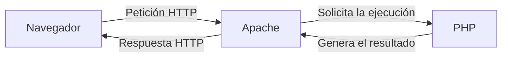
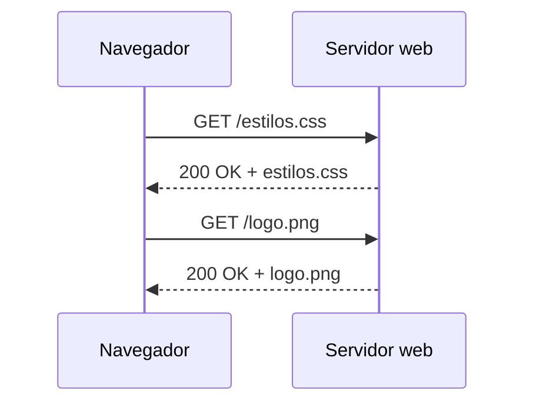
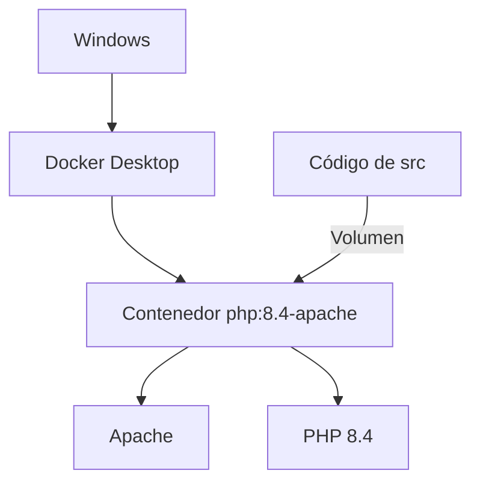
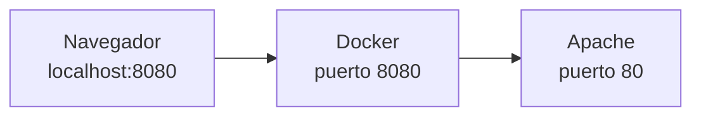
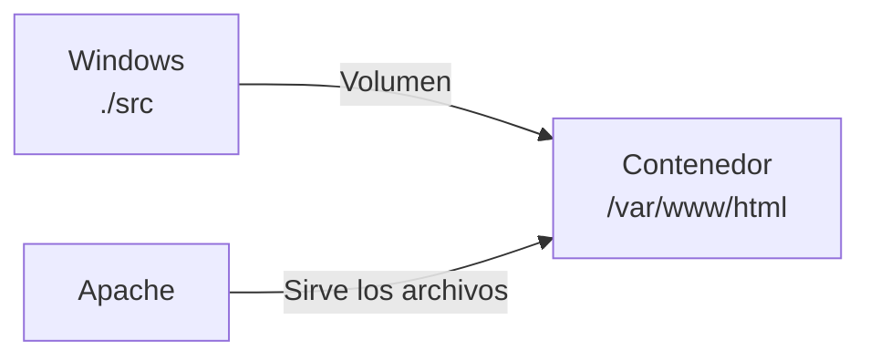
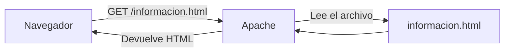
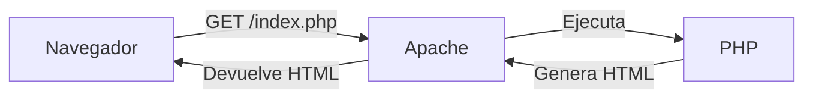
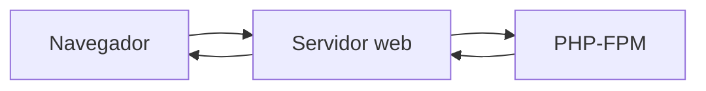
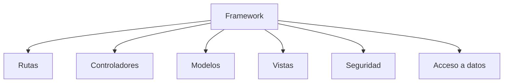
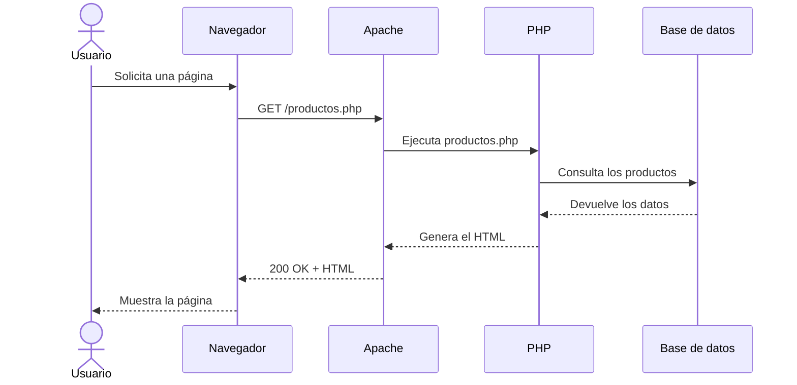

# 7. Servidores web y tecnologías de servidor

Para ejecutar una aplicación web necesitamos diferentes programas capaces de recibir peticiones, procesarlas y devolver una respuesta.

En nuestro entorno utilizaremos principalmente:

- Apache como servidor web.
- PHP como lenguaje ejecutado en el servidor.
- Docker para proporcionar el entorno de ejecución.
- El navegador como cliente.



## 7.1. Servidor: equipo y programa

La palabra **servidor** puede utilizarse con dos significados.

### Servidor como equipo

Es el ordenador físico o virtual que proporciona recursos o servicios a otros equipos.

Puede encontrarse:

- En el propio ordenador del desarrollador.
- En la red de una empresa.
- En un centro de datos.
- En un proveedor de servicios en la nube.

### Servidor como programa

Es el software que permanece a la espera de peticiones y responde a ellas.

Algunos ejemplos son:

- Un servidor web.
- Un servidor de base de datos.
- Un servidor de correo.
- Un servidor de archivos.

!!! info "El contexto determina el significado"
    Cuando decimos «Apache es un servidor web», hablamos de un programa. Cuando decimos «la aplicación está instalada en un servidor», normalmente hablamos del equipo o entorno donde se ejecuta.

## 7.2. Servidor web

Un **servidor web** es un programa que recibe peticiones HTTP y devuelve respuestas HTTP.

Puede entregar recursos como:

- Documentos HTML.
- Hojas de estilo CSS.
- Archivos JavaScript.
- Imágenes.
- Vídeos.
- Documentos PDF.
- Datos en formato JSON.
- Contenido generado por una aplicación.



Entre sus responsabilidades se encuentran:

- Escuchar peticiones en un puerto.
- Localizar los recursos solicitados.
- Entregar archivos estáticos.
- Colaborar con otros programas para generar contenido.
- Aplicar configuraciones de acceso.
- Registrar las peticiones y los errores.
- Gestionar conexiones seguras mediante HTTPS.
- Devolver códigos de estado.

## 7.3. Apache HTTP Server

**Apache HTTP Server** es un servidor web libre, multiplataforma y modular.

Fue publicado inicialmente en 1995 y continúa siendo utilizado en numerosos servidores y aplicaciones.

Entre sus características se encuentran:

- Es software libre.
- Funciona en diferentes sistemas operativos.
- Permite ampliar sus funciones mediante módulos.
- Puede servir archivos estáticos.
- Puede integrarse con diferentes lenguajes.
- Permite configurar sitios y directorios.
- Genera registros de acceso y de errores.
- Admite reescritura de direcciones.
- Puede utilizar HTTPS.

En nuestro entorno, Apache se ejecutará dentro de un contenedor Docker.



## 7.4. Puertos

Un **puerto** permite identificar el servicio al que queremos conectarnos dentro de un equipo.

Algunos puertos habituales son:

| Puerto | Servicio habitual |
| ---: | --- |
| 80 | HTTP |
| 443 | HTTPS |
| 3306 | MySQL |
| 22 | SSH |

En nuestro proyecto utilizaremos esta configuración:

```yaml
ports:
  - "8080:80"
```

Esto relaciona:

```text
Puerto 8080 del ordenador → puerto 80 del contenedor
```

Por eso accederemos mediante:

```text
http://localhost:8080
```



!!! note "¿Por qué no utilizamos directamente el puerto 80?"
    Utilizar el puerto 8080 evita conflictos con otros servidores que puedan estar usando el puerto 80 del ordenador y permite identificar fácilmente nuestro entorno de desarrollo.

## 7.5. Documento raíz

El **documento raíz** o `document root` es la carpeta desde la que el servidor web publica los archivos.

En la imagen de Docker que utilizaremos, Apache sirve el contenido de:

```text
/var/www/html
```

Nuestro archivo `compose.yaml` relacionará esa carpeta con `src`:

```yaml
volumes:
  - ./src:/var/www/html
```



Cuando creemos:

```text
src/index.php
```

Apache encontrará dentro del contenedor:

```text
/var/www/html/index.php
```

## 7.6. Recursos estáticos y dinámicos

Apache puede entregar directamente un archivo estático:



Cuando se solicita un archivo PHP, el código debe ejecutarse antes de generar la respuesta:



El navegador no recibe:

```php
<?php echo "Hola"; ?>
```

Recibe el resultado generado:

```html
Hola
```

## 7.7. PHP en el servidor

PHP es un lenguaje de programación de propósito general especialmente orientado al desarrollo web en el servidor.

El nombre actual procede de:

```text
PHP: Hypertext Preprocessor
```

Algunas de sus características son:

- Es software libre.
- Está diseñado para integrarse con el desarrollo web.
- Puede generar contenido HTML.
- Permite procesar formularios.
- Puede trabajar con sesiones y cookies.
- Se comunica con bases de datos.
- Dispone de numerosas extensiones.
- Tiene un amplio ecosistema de librerías y frameworks.
- Puede utilizar programación orientada a objetos.
- Cuenta con herramientas de gestión de dependencias como Composer.

El código PHP se escribe entre etiquetas:

```php
<?php

echo "Hola desde PHP";
```

Cuando el archivo contiene únicamente PHP, es habitual omitir la etiqueta de cierre `?>`.

## 7.8. Cómo se ejecuta PHP

PHP necesita un intérprete capaz de leer y ejecutar sus instrucciones.

Existen diferentes formas de integrar PHP con un servidor web.

### PHP como módulo de Apache

Apache carga PHP como uno de sus módulos. Cuando recibe una petición de un archivo PHP, solicita su ejecución al intérprete.

La imagen que utilizaremos:

```text
php:8.4-apache
```

proporciona Apache y PHP ya preparados para trabajar juntos.

### PHP-FPM

PHP-FPM ejecuta PHP como un servicio separado. El servidor web le envía las peticiones que necesitan ejecutar código PHP.

Esta configuración se utiliza frecuentemente junto con servidores como Nginx y también puede utilizarse con Apache.



No necesitaremos configurar PHP-FPM en nuestro primer entorno, pero es importante saber que el servidor web y el intérprete PHP pueden ejecutarse como componentes separados.

## 7.9. Servidor de aplicaciones

El término **servidor de aplicaciones** se utiliza para describir software o entornos que ejecutan aplicaciones y ofrecen servicios adicionales.

Dependiendo de la tecnología, puede proporcionar:

- Ejecución de la lógica de la aplicación.
- Gestión de conexiones.
- Seguridad.
- Transacciones.
- Sesiones.
- Acceso a datos.
- Comunicación entre componentes.
- Distribución de carga.
- Integración con otros sistemas.

Algunos ejemplos relacionados con diferentes tecnologías son:

- Apache Tomcat para aplicaciones Java.
- Entornos ASP.NET para aplicaciones desarrolladas con .NET.
- Servidores integrados en frameworks y plataformas.
- Procesos PHP ejecutados mediante PHP-FPM.

!!! note "La terminología depende de la tecnología"
    La separación entre servidor web y servidor de aplicaciones no siempre es idéntica en todos los entornos. Lo importante es distinguir entre recibir peticiones HTTP y ejecutar la lógica de la aplicación.

## 7.10. Servidor web y servidor de aplicaciones

| Servidor web | Servidor de aplicaciones |
| --- | --- |
| Recibe peticiones HTTP | Ejecuta la lógica de la aplicación |
| Entrega archivos estáticos | Procesa operaciones |
| Devuelve respuestas HTTP | Puede gestionar servicios adicionales |
| Ejemplos: Apache y Nginx | Ejemplos: Tomcat y entornos de aplicación |

En aplicaciones sencillas, ambas funciones pueden encontrarse muy integradas.

En nuestro contenedor:

- Apache recibe las peticiones.
- PHP ejecuta el código.
- Ambos componentes colaboran para generar la respuesta.

## 7.11. Otras tecnologías de servidor

PHP no es la única tecnología utilizada en el backend.

| Tecnología | Algunos frameworks o plataformas |
| --- | --- |
| PHP | Laravel, Symfony |
| Java | Spring, Jakarta EE |
| JavaScript y TypeScript | Node.js, Express, NestJS |
| Python | Django, Flask, FastAPI |
| C# | ASP.NET Core |
| Ruby | Ruby on Rails |
| Go | Gin, Echo |

La elección depende de factores como:

- Los conocimientos del equipo.
- El tipo de proyecto.
- El ecosistema disponible.
- El rendimiento necesario.
- El mantenimiento.
- La infraestructura.
- Las tecnologías utilizadas por las empresas.

Durante este módulo utilizaremos PHP y Laravel. Esto nos permitirá estudiar los fundamentos del desarrollo web en servidor y trabajar posteriormente con un framework profesional.

## 7.12. Frameworks de servidor

Un **framework** proporciona una estructura y un conjunto de herramientas para desarrollar aplicaciones.

Puede ofrecer:

- Organización MVC.
- Sistema de rutas.
- Acceso a bases de datos.
- Validación.
- Autenticación.
- Gestión de sesiones.
- Generación de plantillas.
- Seguridad.
- Pruebas.
- Herramientas de consola.



Utilizar un framework evita tener que construir desde cero muchas funcionalidades comunes.

!!! warning "Framework no significa que todo esté resuelto"
    El desarrollador sigue siendo responsable de comprender la aplicación, escribir código correcto, validar los datos y aplicar medidas de seguridad.

## 7.13. Registros del servidor

Los servidores generan archivos de registro, conocidos como **logs**, que permiten conocer qué está sucediendo.

Podemos encontrar:

- Registros de acceso.
- Errores del servidor.
- Errores de PHP.
- Mensajes generados por la aplicación.

Con Docker Compose podremos consultar los mensajes mediante:

```bash
docker compose logs
```

Para seguir los mensajes en tiempo real:

```bash
docker compose logs -f
```

Los registros resultan fundamentales para detectar y resolver problemas.

## 7.14. Recorrido completo de una petición PHP



El proceso puede resumirse así:

1. El usuario realiza una acción.
2. El navegador envía una petición HTTP.
3. Apache recibe la petición.
4. PHP ejecuta el programa.
5. El programa puede consultar una base de datos.
6. PHP genera el resultado.
7. Apache devuelve una respuesta HTTP.
8. El navegador muestra el contenido.

## Actividad

### Relaciona

Relaciona cada elemento con su función principal:

| Elemento | Función |
| --- | --- |
| Navegador | |
| Apache | |
| PHP | |
| MySQL | |
| Docker | |
| Laravel | |

Funciones disponibles:

- Almacenar información.
- Ejecutar código en el servidor.
- Mostrar la interfaz al usuario.
- Recibir peticiones HTTP.
- Proporcionar el entorno de ejecución.
- Organizar el desarrollo de la aplicación.

### Preguntas

1. ¿Qué diferencia existe entre un servidor como equipo y un servidor como programa?
2. ¿Qué función realiza Apache?
3. ¿Por qué el navegador no puede ejecutar directamente PHP?
4. ¿Qué relación existe entre `src` y `/var/www/html`?
5. ¿Qué significa la configuración `"8080:80"`?
6. ¿Qué diferencia general existe entre un servidor web y un servidor de aplicaciones?
7. ¿Qué ventajas aporta utilizar un framework?
8. ¿Para qué sirven los registros o logs?
9. ¿Qué herramientas contendrá la imagen `php:8.4-apache`?
10. ¿Qué recibe el navegador después de ejecutar un archivo PHP?