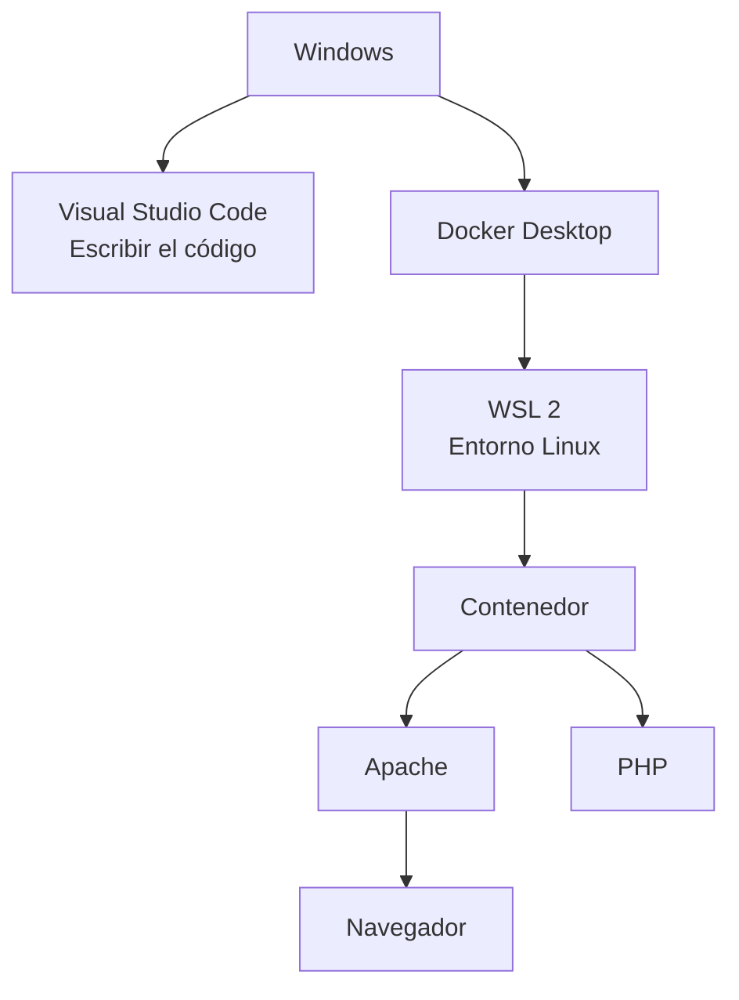
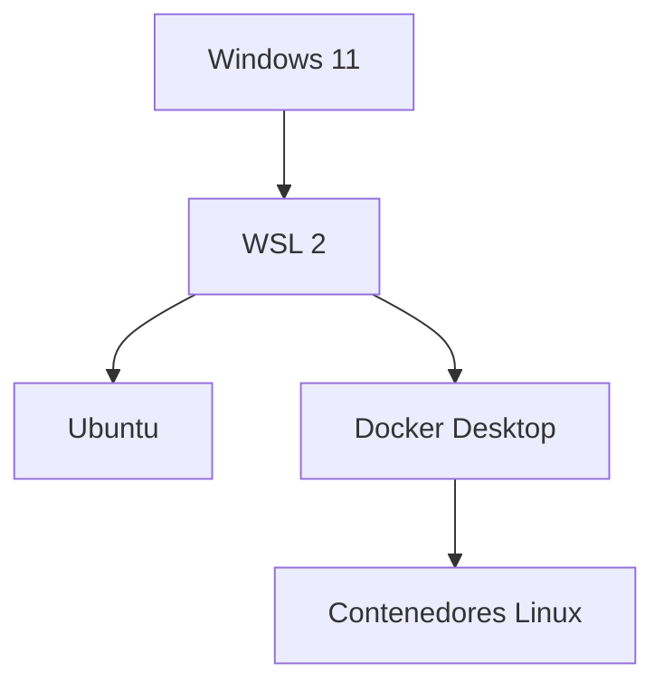
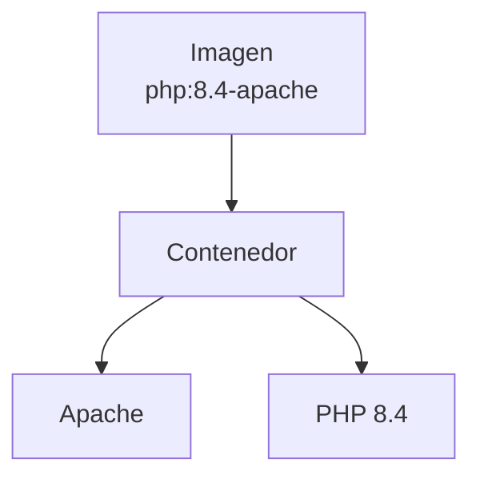
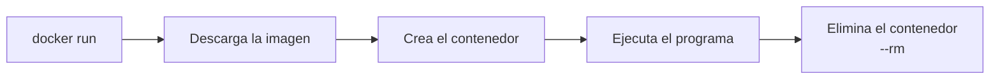
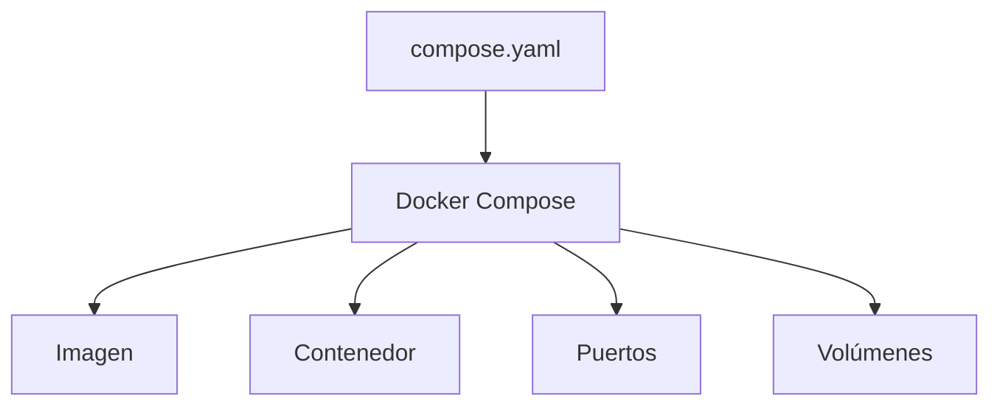
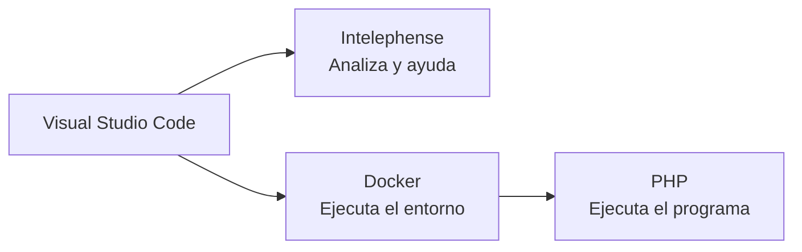

# 8. Preparación del entorno de desarrollo

Un **entorno de desarrollo** es el conjunto de herramientas que utilizamos para escribir, ejecutar, comprobar y depurar nuestras aplicaciones.

Durante el módulo utilizaremos:

- Windows como sistema operativo principal.
- WSL 2 para proporcionar un entorno Linux.
- Docker Desktop para gestionar contenedores.
- Apache como servidor web.
- PHP como lenguaje de servidor.
- Visual Studio Code como editor.
- El navegador para comprobar el resultado.



## 8.1. Objetivo

Al finalizar la preparación debemos poder confirmar que:

- WSL 2 está instalado.
- Ubuntu utiliza WSL 2.
- Docker Desktop está funcionando.
- Docker Compose está disponible.
- Visual Studio Code está instalado.
- PHP Intelephense está instalado.
- La extensión Docker está instalada.
- Podemos ejecutar comandos desde la terminal de VS Code.

!!! important "No instalaremos Apache ni PHP directamente en Windows"
    Apache y PHP estarán dentro de un contenedor Docker. De esta forma, todos trabajaremos con un entorno similar y evitaremos instalaciones diferentes en cada equipo.

## 8.2. ¿Qué es WSL 2?

**Windows Subsystem for Linux 2**, o WSL 2, permite ejecutar un entorno Linux dentro de Windows.

WSL 2 proporciona:

- Un núcleo Linux.
- Una terminal Linux.
- Compatibilidad con herramientas de Linux.
- Integración con el sistema de archivos de Windows.
- La base utilizada por Docker Desktop para ejecutar contenedores Linux.



WSL no sustituye a Windows. Ambos entornos conviven en el mismo ordenador.

## 8.3. Comprobar WSL

Abre PowerShell y ejecuta:

```powershell
wsl --status
```

También puedes consultar la versión instalada:

```powershell
wsl --version
```

Para mostrar las distribuciones de Linux:

```powershell
wsl -l -v
```

Debemos obtener una distribución, normalmente Ubuntu, que utilice la versión 2:

```text
NAME       STATE      VERSION
Ubuntu     Stopped    2
```

El estado `Stopped` es normal cuando Ubuntu no se está utilizando.

!!! warning "Versión de WSL"
    En la columna `VERSION` debe aparecer `2`. No debemos confundirla con la versión de Ubuntu ni con el estado de la distribución.

## 8.4. Instalar WSL

Este paso solo es necesario si WSL no está instalado.

Abre PowerShell como administrador y ejecuta:

```powershell
wsl --install
```

El comando activa los componentes necesarios e instala normalmente Ubuntu como distribución predeterminada.

Después:

1. Reinicia el equipo si Windows lo solicita.
2. Abre Ubuntu.
3. Crea un usuario de Linux.
4. Crea una contraseña.
5. Comprueba nuevamente el estado.

```powershell
wsl --status
wsl -l -v
```

El usuario y la contraseña de Ubuntu no tienen que coincidir con los utilizados en Windows.

## 8.5. Actualizar WSL

Para actualizar WSL:

```powershell
wsl --update
```

Después podemos consultar la versión:

```powershell
wsl --version
```

Si una distribución utiliza WSL 1, puede cambiarse a WSL 2 mediante:

```powershell
wsl --set-version Ubuntu 2
```

El nombre `Ubuntu` debe coincidir con el mostrado por:

```powershell
wsl -l -v
```

!!! danger "No ejecutes comandos de reparación sin comprobar el problema"
    La mayoría de los equipos solo necesitan `wsl --install` o `wsl --update`. Los procedimientos de reparación deben utilizarse únicamente cuando exista un error concreto.

## 8.6. ¿Qué es Docker?

Docker permite crear y ejecutar aplicaciones dentro de **contenedores**.

Un contenedor incluye el software y la configuración necesarios para ejecutar un servicio.

En nuestro caso utilizaremos un contenedor que incluirá:

- Apache.
- PHP.
- La configuración necesaria para ejecutarlos.



### Imagen

Una imagen es una plantilla preparada para crear contenedores.

### Contenedor

Un contenedor es una instancia en ejecución creada a partir de una imagen.

```text
Imagen → crear → Contenedor
```

Podemos crear varios contenedores a partir de una misma imagen.

## 8.7. Docker Desktop

**Docker Desktop** proporciona en Windows:

- El motor de Docker.
- Docker Compose.
- Una interfaz gráfica.
- Integración con WSL 2.
- Gestión de imágenes, contenedores, volúmenes y redes.

Para instalarlo:

1. Descarga Docker Desktop desde la web oficial.
2. Ejecuta el instalador.
3. Utiliza WSL 2 como backend.
4. Abre Docker Desktop.
5. Espera hasta que el motor esté funcionando.

Docker Desktop debe estar iniciado antes de ejecutar comandos de Docker.

!!! note "Licencia"
    Docker Desktop puede utilizarse gratuitamente con fines educativos, personales y en determinadas organizaciones pequeñas. Su uso en otras organizaciones puede estar sujeto a las condiciones de licencia de Docker.

## 8.8. Comprobar Docker

En PowerShell ejecuta:

```powershell
docker --version
```

Después comprueba Docker Compose:

```powershell
docker compose version
```

Utilizaremos el comando actual:

```text
docker compose
```

No utilizaremos la forma antigua:

```text
docker-compose
```

Para verificar que Docker puede crear y ejecutar un contenedor:

```powershell
docker run --rm hello-world
```

La primera ejecución puede tardar porque Docker debe descargar la imagen.

Si aparece el mensaje de bienvenida de Docker, el motor funciona correctamente.



## 8.9. ¿Qué es Docker Compose?

Docker Compose permite definir y gestionar los servicios de un proyecto mediante un archivo YAML.

En lugar de escribir un comando extenso cada vez, describiremos el entorno en:

```text
compose.yaml
```

Docker Compose se encargará de:

- Leer la configuración.
- Descargar las imágenes.
- Crear los contenedores.
- Configurar los puertos.
- Montar las carpetas.
- Iniciar y detener los servicios.



Crearemos nuestro primer archivo `compose.yaml` en el siguiente apartado.

## 8.10. Visual Studio Code

Visual Studio Code será el editor utilizado durante el módulo.

Nos permitirá:

- Crear y organizar archivos.
- Escribir código.
- Instalar extensiones.
- Utilizar una terminal integrada.
- Trabajar con Docker.
- Detectar determinados errores.
- Navegar por el código.
- Utilizar Git más adelante.

Después de instalarlo, abre una carpeta mediante:

```text
Archivo → Abrir carpeta
```

Atajo de teclado:

```text
Ctrl + K, Ctrl + O
```

## 8.11. Terminal integrada

Podemos abrir la terminal desde:

```text
Terminal → Nueva terminal
```

En teclados españoles también suele utilizarse:

```text
Ctrl + ñ
```

Antes de ejecutar un comando debemos comprobar la carpeta actual.

Por ejemplo:

```text
PS C:\dwes\hola-mundo>
```

!!! warning "La carpeta actual importa"
    Si ejecutamos un comando desde otra carpeta, es posible que el programa no encuentre `compose.yaml` o los archivos del proyecto.

## 8.12. Extensiones de Visual Studio Code

Abre el panel de extensiones mediante:

```text
Ctrl + Shift + X
```

### PHP Intelephense

Busca e instala:

```text
PHP Intelephense
```

Esta extensión proporciona:

- Autocompletado.
- Información sobre funciones.
- Navegación por el código.
- Detección de determinados errores.
- Ayuda al escribir PHP.
- Análisis estático del código.

PHP Intelephense ayuda a escribir y analizar el código, pero no lo ejecuta.



!!! important "Intelephense no sustituye a PHP"
    La extensión puede analizar el código sin ejecutar el programa. La ejecución real se realizará mediante PHP dentro del contenedor.

### Docker

Busca e instala la extensión oficial de Docker publicada por Microsoft.

La extensión permite consultar y gestionar desde Visual Studio Code:

- Contenedores.
- Imágenes.
- Volúmenes.
- Redes.
- Registros.

La extensión no instala el motor de Docker y no sustituye a Docker Desktop.

### Spanish Language Pack

Opcionalmente, podemos instalar:

```text
Spanish Language Pack for Visual Studio Code
```

Esta extensión traduce la interfaz de Visual Studio Code al español.

## 8.13. Comprobar PHP Intelephense

Crea temporalmente un archivo llamado:

```text
comprobacion.php
```

Escribe:

```php
<?php

$mensaje = "Entorno preparado";

echo $mensaje;

```

Comprueba que:

- El código PHP aparece coloreado.
- Al situar el cursor sobre `echo` o una función aparece información.
- La extensión propone autocompletado.
- Un nombre de variable incorrecto puede generar un aviso.

Después podremos eliminar este archivo, ya que crearemos el proyecto definitivo en el apartado siguiente.

## 8.14. Configuración básica de VS Code

Cada proyecto podrá incluir una carpeta:

```text
.vscode
```

Dentro podremos crear:

```text
settings.json
```

Con una configuración básica:

```json
{
    "editor.wordWrap": "on",
    "editor.tabSize": 4,
    "editor.insertSpaces": true
}
```

Esta configuración:

- Ajusta las líneas largas al ancho del editor.
- Establece una tabulación visual de cuatro espacios.
- Inserta espacios cuando utilizamos la tecla Tab.

La configuración se aplicará únicamente al proyecto que contiene la carpeta `.vscode`.

## 8.15. Comprobación final

Antes de comenzar el primer proyecto, comprueba:

- [ ] WSL está instalado.
- [ ] Ubuntu utiliza WSL 2.
- [ ] `wsl --status` funciona.
- [ ] Docker Desktop está instalado.
- [ ] Docker Desktop está iniciado.
- [ ] `docker --version` funciona.
- [ ] `docker compose version` funciona.
- [ ] `docker run --rm hello-world` termina correctamente.
- [ ] Visual Studio Code está instalado.
- [ ] Puedes abrir una carpeta con VS Code.
- [ ] Puedes abrir la terminal integrada.
- [ ] PHP Intelephense está instalado.
- [ ] La extensión Docker está instalada.
- [ ] Intelephense reconoce un archivo `.php`.

Si todas las comprobaciones son correctas, el equipo está preparado para crear el primer proyecto PHP.

## 8.16. Materiales de apoyo

Para realizar la instalación paso a paso puedes consultar:

- [Guía de instalación de WSL 2, Docker, PHP y Apache](../recursos/guia-wsl-docker-php-apache.pdf).
- [Guía de instalación y configuración de Visual Studio Code](../recursos/guia-visual-studio-code.pdf).

## Referencias

- [Instalación oficial de WSL](https://learn.microsoft.com/windows/wsl/install).
- [Instalación oficial de Docker Desktop en Windows](https://docs.docker.com/desktop/setup/install/windows-install/).
- [Descarga de Visual Studio Code](https://code.visualstudio.com/download).
- [PHP Intelephense](https://marketplace.visualstudio.com/items?itemName=bmewburn.vscode-intelephense-client).
- [Extensión Docker para Visual Studio Code](https://marketplace.visualstudio.com/items?itemName=ms-azuretools.vscode-docker).

## Actividad

Realiza las comprobaciones del apartado anterior y completa esta tabla:

| Comprobación | Resultado | Observaciones |
| --- | --- | --- |
| `wsl --status` | | |
| `wsl -l -v` | | |
| `docker --version` | | |
| `docker compose version` | | |
| `docker run --rm hello-world` | | |
| PHP Intelephense | | |
| Extensión Docker | | |

Finalmente, responde:

1. ¿Qué función realiza WSL 2?
2. ¿Qué diferencia existe entre una imagen y un contenedor?
3. ¿Qué herramientas proporciona Docker Desktop?
4. ¿Para qué sirve Docker Compose?
5. ¿PHP Intelephense ejecuta el código PHP?
6. ¿Por qué no instalaremos Apache y PHP directamente en Windows?