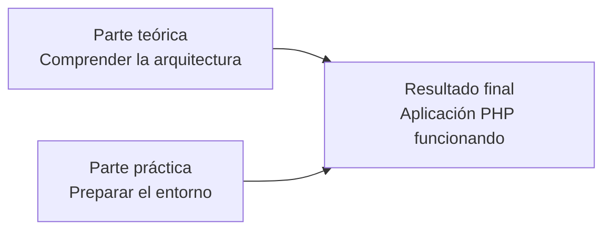
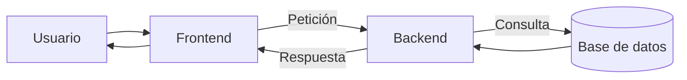

# 9. Actividad final y comprobación de la unidad

Esta actividad permitirá comprobar que comprendes los fundamentos de las aplicaciones web y que has preparado correctamente el entorno de desarrollo que utilizaremos durante el módulo.

La actividad tiene dos partes:

1. Análisis de una aplicación web.
2. Creación y comprobación de un proyecto con Apache y PHP.



## 9.1. Objetivos

Al completar la actividad deberás ser capaz de:

- Explicar el funcionamiento cliente-servidor.
- Diferenciar una página estática de una dinámica.
- Identificar frontend, backend y base de datos.
- Reconocer las tres capas de una aplicación.
- Diferenciar `layer` y `tier`.
- Identificar modelo, vista y controlador.
- Explicar la función de Apache y PHP.
- Utilizar WSL 2 y Docker Desktop.
- Crear un proyecto con Docker Compose.
- Ejecutar y modificar una aplicación PHP.
- Consultar el estado y los registros del contenedor.

## 9.2. Parte A: análisis de una aplicación web

Elige una aplicación web que utilices habitualmente.

Algunos ejemplos:

- Moodle.
- Una tienda en línea.
- Una plataforma de vídeo.
- Una aplicación bancaria.
- Una red social.
- Un servicio de reservas.

Responde razonadamente a las siguientes preguntas:

1. ¿Qué aplicación has elegido?
2. ¿Qué programa actúa como cliente?
3. ¿Qué acciones del usuario provocan peticiones al servidor?
4. ¿Qué información muestra el frontend?
5. ¿Qué operaciones debe realizar el backend?
6. ¿Qué información podría almacenarse en una base de datos?
7. ¿Qué partes podrían considerarse capa de presentación?
8. ¿Qué reglas pertenecerían a la lógica de negocio?
9. ¿Qué operaciones corresponderían al acceso a datos?
10. Identifica un posible modelo, una vista y un controlador.
11. ¿Consideras que la aplicación genera contenido dinámico? Justifica la respuesta.
12. Propón un posible recorrido completo desde una acción del usuario hasta la respuesta.

Puedes acompañar la explicación con un esquema propio.



## 9.3. Parte B: crear el proyecto

Crea un proyecto llamado:

```text
apellido-nombre-ud01
```

Sustituye `apellido` y `nombre` por tus datos y utiliza minúsculas, sin espacios ni tildes.

Ejemplo:

```text
garcia-joaquin-ud01
```

La estructura deberá ser:

```text
apellido-nombre-ud01/
├── .vscode/
│   └── settings.json
├── src/
│   └── index.php
└── compose.yaml
```

No debes copiar directamente la carpeta completa de otro compañero. Debes crear y comprender tu propio proyecto.

## 9.4. Configuración de Docker

El archivo `compose.yaml` debe definir:

- Un servicio llamado `apache_php`.
- La imagen `php:8.4-apache`.
- El puerto `8080` del ordenador conectado al puerto `80` del contenedor.
- La carpeta `src` conectada con `/var/www/html`.

Antes de iniciar el proyecto, valida la configuración:

```powershell
docker compose config
```

Inicia el entorno:

```powershell
docker compose up -d
```

Comprueba el servicio:

```powershell
docker compose ps
```

## 9.5. Aplicación PHP

El archivo `index.php` debe generar una página HTML válida y contener código PHP.

La página deberá mostrar:

- Nombre y apellidos del alumno.
- Nombre del módulo.
- Curso.
- Fecha actual generada mediante PHP.
- Hora actual generada mediante PHP.
- Lista de herramientas utilizadas.
- Versión de PHP.
- Un mensaje diferente según la hora.

### Mensaje según la hora

El programa mostrará:

- `Buenos días` antes de las 12:00.
- `Buenas tardes` desde las 12:00 hasta las 20:00.
- `Buenas noches` a partir de las 20:00.

!!! tip "No es necesario conocer todavía todo PHP"
    Puedes consultar la documentación y utilizar las explicaciones proporcionadas. Lo importante es comprender qué instrucciones se ejecutan en el servidor.

## 9.6. Presentación de la página

La página debe contener como mínimo:

- Una estructura HTML5 válida.
- Un título principal.
- Varios párrafos.
- Una lista.
- Un enlace.
- Una organización clara del contenido.

Puedes añadir CSS para mejorar el aspecto, aunque no será necesario utilizar un diseño complejo.

!!! note "CSS es opcional"
    Se valorará que la página sea legible y esté ordenada. El objetivo principal de esta unidad no es evaluar el diseño visual.

## 9.7. Comprobaciones obligatorias

Realiza las siguientes comprobaciones:

### Configuración

```powershell
docker compose config
```

### Estado del servicio

```powershell
docker compose ps
```

### Aplicación

Abre:

```text
http://localhost:8080
```

### Versión de PHP

Accede al contenedor:

```powershell
docker compose exec apache_php bash
```

Dentro del contenedor:

```bash
php -v
```

Después sal:

```bash
exit
```

### Registros

```powershell
docker compose logs
```

### Detención

```powershell
docker compose down
```

## 9.8. Explicación del proyecto

Incluye en la entrega una breve explicación respondiendo:

1. ¿Qué función cumple `compose.yaml`?
2. ¿Qué contiene la imagen `php:8.4-apache`?
3. ¿Qué significa `"8080:80"`?
4. ¿Para qué sirve el volumen?
5. ¿Dónde está almacenado el código fuente?
6. ¿Dónde se ejecuta PHP?
7. ¿Qué función realiza Apache?
8. ¿Qué recibe finalmente el navegador?
9. ¿Qué diferencia existe entre `docker compose up -d` y `docker compose down`?
10. ¿Cómo comprobarías un error producido durante la ejecución?

## 9.9. Evidencias

Incluye tres capturas:

### Captura 1: Visual Studio Code

Debe mostrar:

- El proyecto abierto.
- La estructura de carpetas.
- `compose.yaml`.
- `src/index.php`.
- `.vscode/settings.json`.

### Captura 2: Docker

Debe mostrar el resultado de:

```powershell
docker compose ps
```

El servicio debe aparecer en ejecución.

### Captura 3: Navegador

Debe mostrar:

```text
http://localhost:8080
```

y el contenido generado por la aplicación.

!!! warning "Protección de datos"
    Revisa las capturas antes de entregarlas. No deben mostrar contraseñas, datos privados ni información ajena a la actividad.

## 9.10. Preparar la entrega

Antes de comprimir el proyecto:

1. Elimina `info.php` si todavía existe.
2. Detén el entorno mediante `docker compose down`.
3. Comprueba que el proyecto conserva los archivos necesarios.
4. No incluyas contraseñas ni información privada.
5. No incluyas archivos innecesarios.

Comprime la carpeta completa como:

```text
apellido-nombre-ud01.zip
```

Prepara un documento PDF denominado:

```text
apellido-nombre-ud01.pdf
```

El PDF debe contener:

- Nombre y apellidos.
- Respuestas de la parte A.
- Explicación del proyecto.
- Las tres capturas solicitadas.

## 9.11. Entrega en Moodle

Entrega en la tarea correspondiente:

```text
apellido-nombre-ud01.zip
apellido-nombre-ud01.pdf
```

Antes de confirmar la entrega, abre ambos archivos y comprueba que funcionan.

No es necesario utilizar Git ni GitHub para realizar esta actividad.

## 9.12. Criterios de valoración

| Aspecto | Puntuación |
| --- | ---: |
| Comprensión de la arquitectura web | 2 puntos |
| Identificación de frontend, backend, capas y MVC | 2 puntos |
| Configuración y funcionamiento de Docker | 2 puntos |
| Aplicación PHP y requisitos solicitados | 2 puntos |
| Explicación, evidencias y presentación | 1 punto |
| Autonomía y resolución de incidencias | 1 punto |
| **Total** | **10 puntos** |

### Para superar la actividad es imprescindible

- Que `compose.yaml` sea válido.
- Que el contenedor se inicie.
- Que Apache responda en `localhost:8080`.
- Que PHP ejecute código.
- Que el alumno pueda explicar de forma básica el funcionamiento del entorno.

!!! important "Las incidencias técnicas se valorarán de forma razonable"
    Un problema de instalación no implica automáticamente suspender la actividad. Se valorará la comprensión, el trabajo realizado y la capacidad para localizar y comunicar el problema.

## 9.13. Lista de comprobación del alumno

### Teoría

- [ ] Sé explicar el modelo cliente-servidor.
- [ ] Distingo una página estática de una dinámica.
- [ ] Diferencio frontend y backend.
- [ ] Identifico las tres capas de una aplicación.
- [ ] Distingo entre `layer` y `tier`.
- [ ] Reconozco modelo, vista y controlador.
- [ ] Comprendo la función de Apache y PHP.

### Entorno

- [ ] WSL 2 funciona.
- [ ] Docker Desktop funciona.
- [ ] Docker Compose funciona.
- [ ] Visual Studio Code está configurado.
- [ ] PHP Intelephense está instalado.
- [ ] La extensión Docker está instalada.

### Proyecto

- [ ] Existe `compose.yaml`.
- [ ] Existe `.vscode/settings.json`.
- [ ] Existe `src/index.php`.
- [ ] `docker compose config` no muestra errores.
- [ ] `docker compose up -d` funciona.
- [ ] `docker compose ps` muestra el servicio.
- [ ] La aplicación se abre en `localhost:8080`.
- [ ] PHP genera contenido dinámico.
- [ ] He eliminado `info.php`.
- [ ] Puedo detener el entorno.

### Entrega

- [ ] El ZIP contiene el proyecto completo.
- [ ] El PDF contiene las respuestas.
- [ ] El PDF contiene las tres capturas.
- [ ] Los nombres de los archivos son correctos.
- [ ] He comprobado ambos archivos antes de entregarlos.

## 10.14. Reflexión final

Responde brevemente:

1. ¿Qué concepto de la unidad te ha resultado más importante?
2. ¿Qué parte de la instalación te ha resultado más difícil?
3. ¿Qué diferencia encuentras entre escribir código y ejecutarlo?
4. ¿Qué utilidad crees que tendrá Docker durante el curso?
5. ¿Qué aspecto necesitas practicar antes de comenzar PHP?