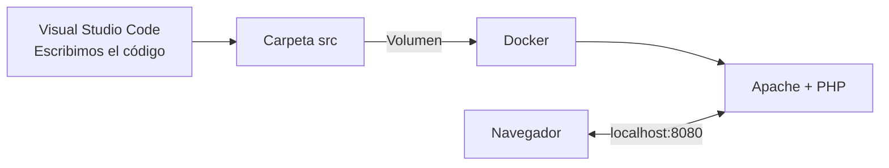
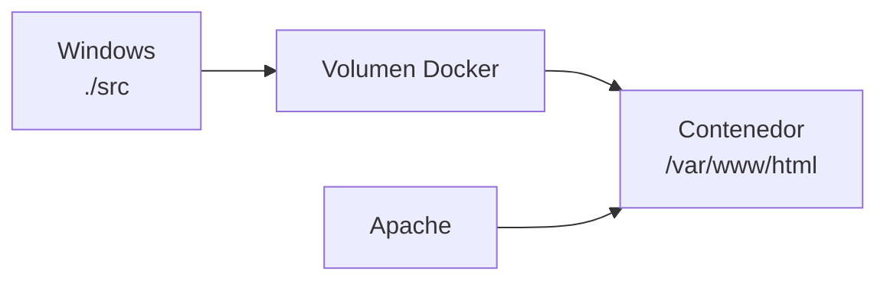
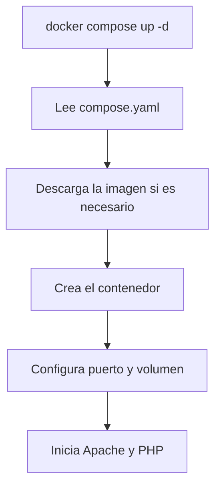
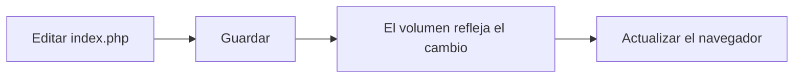
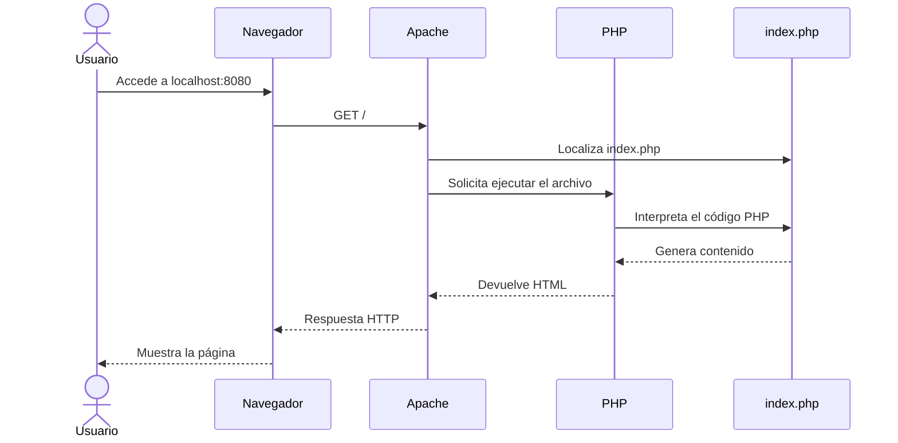

# 9. Primer proyecto con Apache y PHP

En este apartado crearemos nuestro primer proyecto PHP utilizando el entorno que hemos preparado.

Al finalizar tendremos:

- Una carpeta de proyecto.
- Un archivo de configuración de Docker Compose.
- Un contenedor con Apache y PHP 8.4.
- Una carpeta para el código fuente.
- Una configuración básica de Visual Studio Code.
- Una aplicación disponible en `http://localhost:8080`.



## 9.1. Crear la carpeta del proyecto

Crea una carpeta llamada:

```text
hola-mundo
```

Puedes guardarla, por ejemplo, en:

```text
C:\dwes\hola-mundo
```

Abre Visual Studio Code y selecciona:

```text
Archivo → Abrir carpeta
```

Selecciona `hola-mundo`.

!!! important "Abrir la carpeta completa"
    No debemos abrir únicamente un archivo. Visual Studio Code debe trabajar con la carpeta raíz del proyecto.

## 9.2. Estructura del proyecto

Crearemos esta estructura:

```text
hola-mundo/
├── .vscode/
│   └── settings.json
├── src/
│   ├── index.php
│   └── info.php
└── compose.yaml
```

Cada elemento tendrá una función:

| Elemento | Función |
| --- | --- |
| `compose.yaml` | Define el entorno Docker |
| `.vscode/` | Contiene la configuración del editor |
| `settings.json` | Establece los ajustes del proyecto |
| `src/` | Contiene el código de la aplicación |
| `index.php` | Página principal |
| `info.php` | Muestra temporalmente la configuración de PHP |

## 9.3. Crear `compose.yaml`

En la carpeta principal del proyecto crea:

```text
compose.yaml
```

Escribe:

```yaml
services:
  apache_php:
    image: php:8.4-apache
    ports:
      - "8080:80"
    volumes:
      - ./src:/var/www/html
```

!!! warning "La indentación es importante"
    YAML utiliza espacios para representar la estructura. No debemos utilizar tabulaciones ni eliminar la indentación.

## 9.4. Entender `compose.yaml`

### Servicios

```yaml
services:
```

Indica que vamos a definir los servicios que forman el proyecto.

### Nombre del servicio

```yaml
apache_php:
```

Es el nombre que utilizaremos para identificar el servicio mediante Docker Compose.

### Imagen

```yaml
image: php:8.4-apache
```

Indica que utilizaremos una imagen que ya contiene:

- Apache.
- PHP 8.4.
- La integración necesaria entre ambos.

### Puertos

```yaml
ports:
  - "8080:80"
```

Relaciona el puerto del ordenador con el puerto del contenedor:

```text
Ordenador              Contenedor
localhost:8080   →     Apache:80
```

### Volumen

```yaml
volumes:
  - ./src:/var/www/html
```

Relaciona dos carpetas:

```text
Proyecto                         Contenedor
./src                    →       /var/www/html
```

Los cambios realizados en `src` estarán disponibles inmediatamente dentro del contenedor.



## 9.5. Validar la configuración

Abre la terminal integrada de Visual Studio Code:

```text
Terminal → Nueva terminal
```

Comprueba que estás dentro de la carpeta del proyecto:

```text
PS C:\dwes\hola-mundo>
```

Ejecuta:

```powershell
docker compose config
```

Este comando comprueba la sintaxis y muestra la configuración interpretada por Docker Compose.

Si existe un error de indentación o sintaxis, debemos corregirlo antes de continuar.

## 9.6. Crear `index.php`

Dentro de `src`, crea:

```text
index.php
```

Escribe:

```php
<?php

$modulo = "Desarrollo Web en Entorno Servidor";
$curso = "2.º DAW";
$fecha = date("d/m/Y");

?>
<!DOCTYPE html>
<html lang="es">
<head>
    <meta charset="UTF-8">
    <meta name="viewport" content="width=device-width, initial-scale=1.0">
    <title>Primer proyecto PHP</title>
</head>
<body>
    <h1>Primer proyecto PHP</h1>

    <p>Módulo: <?php echo $modulo; ?></p>
    <p>Curso: <?php echo $curso; ?></p>
    <p>Fecha de ejecución: <?php echo $fecha; ?></p>
</body>
</html>
```

Este documento combina HTML y PHP.

PHP ejecutará:

```php
<?php echo $modulo; ?>
```

y sustituirá esa instrucción por el valor correspondiente antes de enviar la respuesta.

## 9.7. Crear la configuración de VS Code

Dentro del proyecto crea:

```text
.vscode
```

Dentro de esa carpeta crea:

```text
settings.json
```

Escribe:

```json
{
    "editor.wordWrap": "on",
    "editor.tabSize": 4,
    "editor.insertSpaces": true
}
```

Esta configuración solo se aplicará al proyecto `hola-mundo`.

## 9.8. Iniciar el entorno

Antes de continuar, comprueba que Docker Desktop está funcionando.

Desde la carpeta del proyecto ejecuta:

```powershell
docker compose up -d
```

La opción `-d` hace que los servicios se ejecuten en segundo plano.

La primera vez, Docker deberá:

1. Descargar la imagen `php:8.4-apache`.
2. Crear el contenedor.
3. Configurar el puerto.
4. Montar la carpeta `src`.
5. Iniciar Apache.



## 9.9. Comprobar el contenedor

Ejecuta:

```powershell
docker compose ps
```

Debes encontrar el servicio `apache_php` en ejecución.

También puedes utilizar:

```powershell
docker ps
```

La diferencia es:

- `docker compose ps` muestra los servicios del proyecto actual.
- `docker ps` muestra todos los contenedores que se están ejecutando.

## 9.10. Abrir la aplicación

Abre el navegador y accede a:

```text
http://localhost:8080
```

Deberás ver:

- El título del proyecto.
- El nombre del módulo.
- El curso.
- La fecha generada por PHP.

Esto confirma que:

1. El navegador puede comunicarse con Apache.
2. Apache encuentra `index.php`.
3. PHP ejecuta el código.
4. El volumen conecta `src` con el contenedor.
5. El servidor devuelve la respuesta al navegador.

## 9.11. Comprobar los cambios en tiempo real

Modifica en `index.php`:

```php
$modulo = "DWES";
```

Guarda el archivo y actualiza el navegador.

No es necesario reconstruir el contenedor porque `src` está montada como volumen.



!!! note "Código e infraestructura"
    El contenedor proporciona la infraestructura. El código permanece en nuestra carpeta `src`, donde podemos modificarlo desde Visual Studio Code.

## 9.12. Crear `info.php`

Dentro de `src`, crea:

```text
info.php
```

Escribe:

```php
<?php

phpinfo();
```

Accede desde el navegador:

```text
http://localhost:8080/info.php
```

Busca los siguientes datos:

- Versión de PHP.
- `Server API`.
- `Loaded Configuration File`.
- `Configuration File (php.ini) Path`.
- `DOCUMENT_ROOT`.
- `memory_limit`.
- `max_execution_time`.

!!! danger "Eliminar `info.php`"
    `phpinfo()` muestra información detallada sobre el servidor. Puede resultar útil durante el desarrollo, pero no debe permanecer accesible en una aplicación publicada. Elimina `info.php` al terminar la actividad.

## 9.13. Acceder al contenedor

Para abrir una terminal dentro del contenedor:

```powershell
docker compose exec apache_php bash
```

El prompt cambiará y mostrará algo parecido a:

```text
root@a1b2c3d4:/var/www/html#
```

Ahora los comandos se ejecutan dentro del contenedor.

Comprueba la versión de PHP:

```bash
php -v
```

Comprueba la versión de Apache:

```bash
apache2ctl -v
```

Muestra los archivos publicados:

```bash
ls -la /var/www/html
```

Debes encontrar `index.php` e `info.php`.

Para salir:

```bash
exit
```

!!! warning "Comprueba en qué terminal estás"
    Antes de ejecutar un comando, observa el prompt. No es lo mismo trabajar en PowerShell que dentro del contenedor Linux.

## 9.14. Consultar la configuración de PHP

Dentro del contenedor podemos ejecutar:

```bash
php --ini
```

Este comando muestra:

- La ruta de configuración.
- El archivo `php.ini` cargado.
- Los directorios de configuración adicional.

También podemos consultar valores concretos:

```bash
php -i | grep memory_limit
```

```bash
php -i | grep max_execution_time
```

```bash
php -i | grep file_uploads
```

No modificaremos todavía la configuración. El objetivo es aprender a localizarla y consultarla.

## 9.15. Consultar los registros

Para mostrar los registros del servicio:

```powershell
docker compose logs
```

Para seguirlos en tiempo real:

```powershell
docker compose logs -f
```

Pulsa `Ctrl + C` para dejar de seguir los registros. Esto no detiene el contenedor.

Los registros pueden ayudarnos a detectar:

- Errores de Apache.
- Problemas de inicio.
- Peticiones recibidas.
- Fallos durante la ejecución.

## 9.16. Provocar y localizar un error

Modifica temporalmente `index.php` y elimina el punto y coma de una instrucción:

```php
$curso = "2.º DAW"
```

Actualiza el navegador y observa el resultado.

Consulta los registros:

```powershell
docker compose logs
```

Después corrige el error:

```php
$curso = "2.º DAW";
```

Guarda y actualiza nuevamente el navegador.

!!! tip "Equivocarse forma parte del desarrollo"
    Lo importante no es evitar todos los errores, sino aprender a interpretar los mensajes y localizar su causa.

## 9.17. Detener el entorno

Cuando terminemos de trabajar:

```powershell
docker compose down
```

Este comando:

- Detiene los contenedores.
- Elimina los contenedores creados por el proyecto.
- Conserva nuestros archivos de `src`.
- Conserva la imagen descargada.

Para volver a iniciar el entorno:

```powershell
docker compose up -d
```

## 9.18. Comandos básicos

| Comando | Función |
| --- | --- |
| `docker compose config` | Valida la configuración |
| `docker compose up -d` | Crea e inicia el entorno |
| `docker compose ps` | Muestra los servicios del proyecto |
| `docker compose logs` | Muestra los registros |
| `docker compose logs -f` | Sigue los registros en tiempo real |
| `docker compose exec apache_php bash` | Abre una terminal en el contenedor |
| `docker compose down` | Detiene y elimina los contenedores |
| `docker ps` | Muestra todos los contenedores activos |

## 9.19. Recorrido completo



## 9.20. Comprobación final

Antes de finalizar, comprueba:

- [ ] La carpeta del proyecto está abierta en VS Code.
- [ ] Existe `compose.yaml`.
- [ ] Existe `.vscode/settings.json`.
- [ ] Existe `src/index.php`.
- [ ] `docker compose config` no muestra errores.
- [ ] `docker compose up -d` inicia el entorno.
- [ ] `docker compose ps` muestra el servicio activo.
- [ ] `http://localhost:8080` muestra la aplicación.
- [ ] PHP genera la fecha.
- [ ] Los cambios en `index.php` aparecen al actualizar.
- [ ] Puedes acceder al interior del contenedor.
- [ ] Puedes consultar los registros.
- [ ] Has eliminado `info.php`.
- [ ] Puedes detener el entorno con `docker compose down`.

## Actividad

Realiza las siguientes modificaciones:

1. Añade tu nombre al programa.
2. Muestra la hora de ejecución mediante PHP.
3. Añade una lista con las herramientas utilizadas.
4. Incluye un título personalizado en la pestaña del navegador.
5. Añade un enlace a la documentación oficial de PHP.
6. Comprueba que Intelephense reconoce las funciones utilizadas.

Finalmente, responde:

1. ¿Qué función tiene `compose.yaml`?
2. ¿Qué contiene la imagen `php:8.4-apache`?
3. ¿Qué significa la relación `"8080:80"`?
4. ¿Para qué sirve el volumen?
5. ¿Dónde se ejecuta el código PHP?
6. ¿Qué recibe finalmente el navegador?
7. ¿Qué diferencia existe entre `docker compose logs` y `docker compose logs -f`?
8. ¿Qué sucede con `src` cuando ejecutamos `docker compose down`?