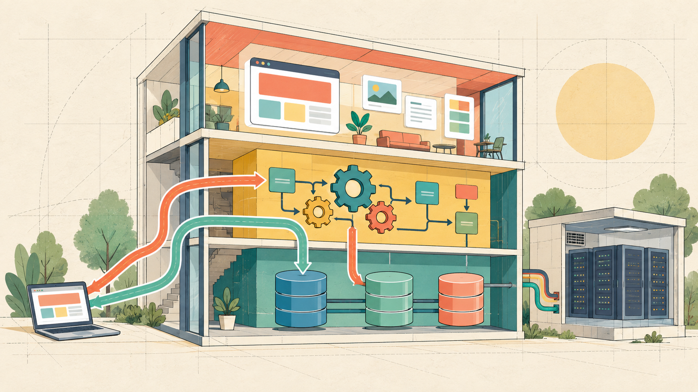
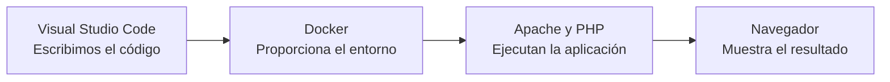
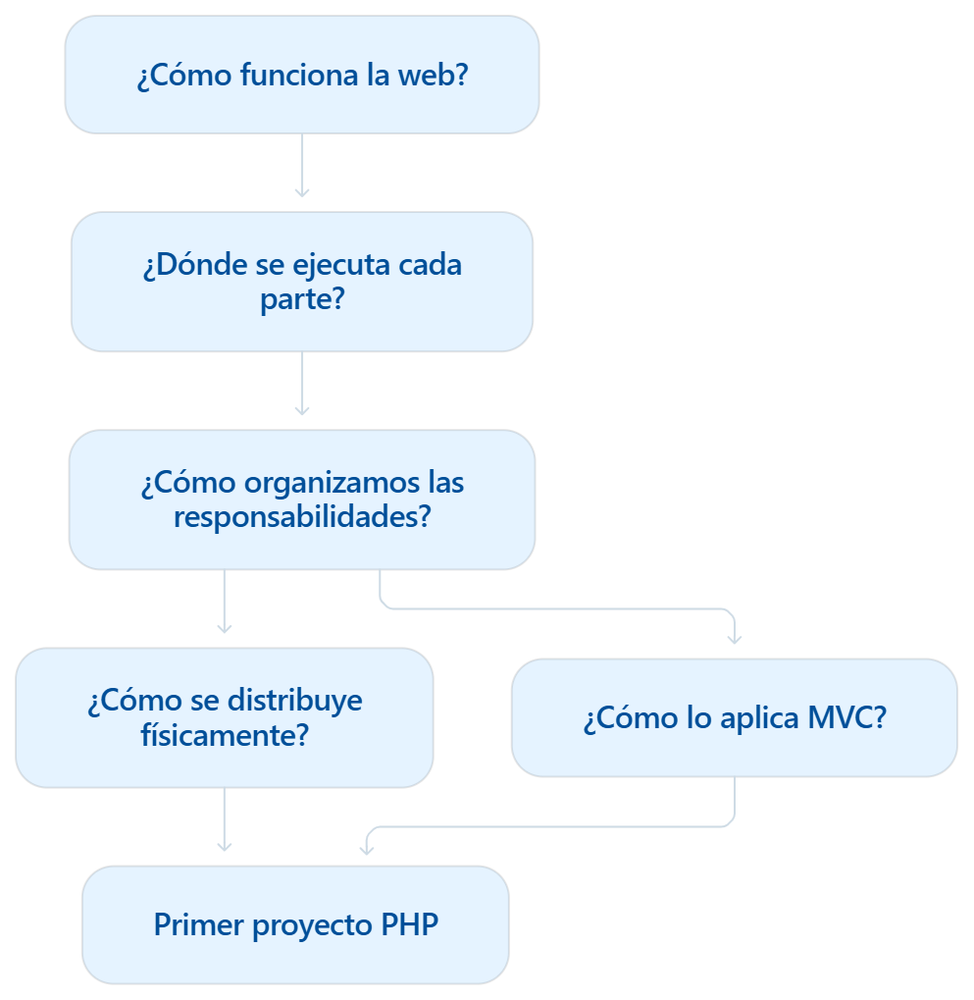

# Unidad 1. Arquitecturas web y entorno de desarrollo

## Presentación

Cuando utilizamos una aplicación web intervienen distintos elementos: un navegador, una red, un servidor web y, en muchas ocasiones, un programa que genera una respuesta utilizando datos almacenados en una base de datos.

En esta unidad estudiaremos cómo se comunican estos elementos, cómo se organizan las distintas partes de una aplicación web y qué responsabilidades tiene cada una.

También prepararemos el entorno de desarrollo que utilizaremos durante el módulo. Al finalizar la unidad, tendremos un servidor Apache con PHP ejecutándose dentro de un contenedor Docker y escribiremos nuestro código mediante Visual Studio Code.

!!! question "Pregunta inicial"
Cuando escribimos una dirección en el navegador y pulsamos Intro, ¿qué sucede hasta que aparece la página?

## Objetivos de aprendizaje

Al terminar la unidad serás capaz de:

* Explicar el funcionamiento básico de una aplicación web cliente-servidor.
* Diferenciar una página web estática de una página web dinámica.
* Distinguir entre frontend, backend y desarrollo full stack.
* Identificar las capas de presentación, lógica de negocio y acceso a datos.
* Diferenciar entre capas lógicas y capas físicas.
* Comprender de forma introductoria el patrón Modelo-Vista-Controlador.
* Reconocer la función del navegador, Apache, PHP, Docker y Visual Studio Code.
* Analizar la organización de una aplicación web real.
* Crear y ejecutar un primer proyecto PHP mediante Docker Compose.

## ¿Qué vamos a aprender?

La unidad seguirá un recorrido progresivo: comenzaremos comprendiendo cómo funciona una aplicación web, estudiaremos cómo se organizan sus componentes y terminaremos preparando el entorno y ejecutando nuestro primer proyecto PHP.

### 1. Funcionamiento de una aplicación web

* Cliente, servidor y HTTP.
* Páginas estáticas y dinámicas.
* Ejecución de PHP en el servidor.

### 2. Organización de una aplicación

* Frontend y backend.
* Presentación, lógica de negocio y acceso a datos.
* Separación de responsabilidades.

### 3. Capas lógicas y físicas

* Diferencia entre `layer` y `tier`.
* Desarrollo local y entorno de producción.

### 4. Introducción a MVC

* Modelo, vista y controlador.
* Recorrido de una petición.
* Relación con la arquitectura de tres capas.

### 5. Análisis de Moodle

* Aplicación de los conceptos anteriores a una aplicación web real.
* Representación del recorrido de una petición.
* Identificación de componentes, capas y responsabilidades.

### 6. Entorno y primer proyecto PHP

* WSL 2, Docker y Visual Studio Code.
* Apache y PHP.
* Creación y ejecución de un primer proyecto funcional.

## Recorrido de la unidad

El siguiente esquema resume el camino que seguiremos desde el funcionamiento básico de la web hasta la creación de nuestro primer proyecto PHP.

    

## Autoría y licencia

Material elaborado por **Joaquín García** para el módulo de **Desarrollo Web en Entorno Servidor** de 2.º DAW del **IES Portada Alta**.

Este material adapta y amplía contenidos de *Desarrollo Web en Entorno Servidor*, elaborados por **Aitor Medrano** y **Luis Alemañ** y publicados bajo licencia **Creative Commons Reconocimiento-NoComercial-CompartirIgual**.

Esta adaptación se distribuye bajo licencia **Creative Commons Reconocimiento-NoComercial-CompartirIgual (CC BY-NC-SA)**.
