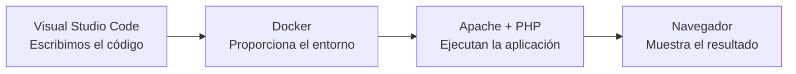

# Unidad 1. Arquitecturas web y entorno de desarrollo

## Presentación

Cuando utilizamos una aplicación web intervienen distintos elementos: un navegador, una red, un servidor web y, en muchas ocasiones, un programa que genera una respuesta utilizando datos almacenados en una base de datos.

En esta unidad estudiaremos cómo se comunican estos elementos y prepararemos el entorno de desarrollo que utilizaremos durante el módulo. Al finalizar, tendremos un servidor Apache con PHP ejecutándose dentro de un contenedor Docker y escribiremos nuestro código con Visual Studio Code.

!!! question "Pregunta inicial"
    Cuando escribimos una dirección en el navegador y pulsamos Intro, ¿qué sucede hasta que aparece la página?

## Objetivos de aprendizaje

Al terminar la unidad serás capaz de:

- Explicar el funcionamiento básico de una aplicación web cliente-servidor.
- Diferenciar una página estática de una página dinámica.
- Distinguir entre frontend, backend y desarrollo full stack.
- Identificar las capas de presentación, lógica de negocio y acceso a datos.
- Comprender de forma introductoria el patrón Modelo-Vista-Controlador.
- Reconocer la función del navegador, Apache, PHP, Docker y Visual Studio Code.
- Crear y ejecutar un primer proyecto PHP mediante Docker Compose.

## Contenidos

1. [Cómo funciona una aplicación web](01-funcionamiento-web.md).
2. Páginas web estáticas y dinámicas.
3. Frontend, backend y full stack.
4. Arquitectura de tres capas.
5. Capas físicas y capas lógicas.
6. Introducción al patrón MVC.
7. Servidores web y tecnologías de servidor.
8. Preparación del entorno de desarrollo.
9. Primer proyecto con Apache y PHP.
10. Actividades y comprobación final.

## Temporalización

La unidad se desarrollará durante siete horas, distribuidas en tres sesiones de dos horas y una sesión de una hora.

| Sesión | Duración | Contenido principal |
| --- | ---: | --- |
| 1 | 2 horas | Funcionamiento de una aplicación web, arquitectura cliente-servidor y páginas estáticas y dinámicas |
| 2 | 2 horas | Frontend, backend, arquitectura de tres capas, MVC y tecnologías de servidor |
| 3 | 2 horas | Instalación y comprobación de WSL 2, Docker Desktop, Apache y PHP |
| 4 | 1 hora | Visual Studio Code, extensiones, primer programa PHP y comprobación final |

---

## Autoría y licencia

Material elaborado por Joaquín García para el módulo Desarrollo Web en Entorno Servidor del IES Portada Alta.

Este material adapta y amplía contenidos de *Desarrollo Web en Entorno Servidor* de Aitor Medrano y Luis Alemañ, publicados bajo licencia CC BY-NC-SA.

Esta adaptación se distribuye bajo licencia **Creative Commons Reconocimiento-NoComercial-CompartirIgual (CC BY-NC-SA)**.
