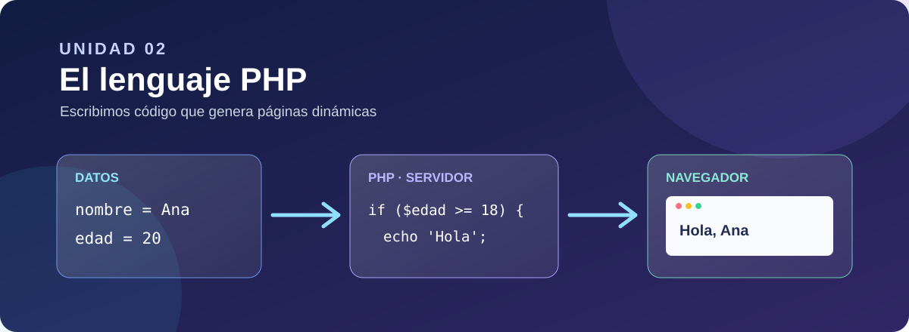
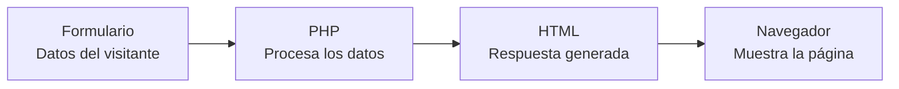

# Unidad 2. El lenguaje PHP

## Presentación

En la unidad anterior pusimos en marcha Apache y PHP en Docker y comprobamos que el servidor ejecuta el código antes de enviar una página al navegador. Ahora aprenderemos a escribir ese código: empezaremos por las instrucciones y los datos básicos y avanzaremos hasta programas que reciben formularios, toman decisiones y organizan la información mediante arrays y funciones.

Trabajaremos con ejemplos pequeños que podremos ejecutar y modificar. Después resolveremos actividades por bloques, guardando cada solución en su archivo PHP y entregándolas en Moodle según las indicaciones de clase.

!!! question "Pregunta inicial"
    Si dos personas envían datos distintos al mismo archivo `.php`, ¿puede el servidor devolverles páginas diferentes? ¿Qué instrucciones necesitaríamos para hacerlo?

## Objetivos de aprendizaje

Al terminar la unidad serás capaz de:

* Integrar instrucciones PHP en una página HTML y distinguir el código ejecutado en el servidor del resultado recibido por el navegador.
* Utilizar variables, tipos de datos, operadores y expresiones para realizar cálculos y generar contenido.
* Recoger datos enviados mediante formularios `GET` y `POST`, comprobarlos en el servidor y escapar los textos al mostrarlos en HTML.
* Tomar decisiones con `if`, `elseif`, `else`, `switch` y `match`.
* Repetir instrucciones con `while`, `do...while`, `for` y `foreach`.
* Crear, consultar y recorrer arrays indexados, asociativos y anidados.
* Definir y reutilizar funciones con parámetros y valores de retorno, y organizar código en varios archivos.
* Utilizar funciones predefinidas de PHP para trabajar con cadenas, números y tipos de datos.

## ¿Qué vamos a aprender?

Seguiremos una secuencia progresiva: primero escribiremos instrucciones sencillas; después responderemos a los datos de un formulario; por último, organizaremos programas más completos con arrays y funciones.

### 1. Fundamentos de PHP

* Etiquetas PHP, salida con `echo`, `print` y `<?= ... ?>`.
* Variables, tipos de datos, constantes y operadores.
* Código PHP integrado en HTML.

### 2. Primeros formularios con PHP

* Envíos mediante `GET` y `POST`.
* Acceso a `$_GET` y `$_POST`.
* Comprobación de datos y salida segura con `htmlspecialchars()`.

### 3. Condiciones en PHP

* Decisiones con `if`, `elseif` y `else`.
* Comparaciones, operadores lógicos, `switch` y `match`.

### 4. Bucles

* Repetición con `while`, `do...while` y `for`.
* Contadores, acumuladores, bucles anidados, `break` y `continue`.

### 5. Arrays

* Listas indexadas, claves asociativas y arrays de varios niveles.
* Recorridos con `foreach`, operaciones habituales y tablas HTML a partir de datos.

### 6. Funciones

* Definición, llamadas, parámetros, `return` y tipos.
* Valores por defecto, ámbito y paso por referencia.
* Reutilización de funciones y fragmentos HTML en otros archivos.

### 7. Funciones predefinidas de PHP

* Funciones habituales para trabajar con cadenas y números.
* Comprobación y conversión de tipos.
* Consulta de la documentación oficial para elegir y utilizar funciones.

## Actividades de la unidad

Los ejercicios están organizados en bloques que siguen los contenidos. Consulta la [relación de actividades](actividades.md) para ver los enunciados y las indicaciones de entrega. Al terminar los apartados prepararemos una práctica final de integración.

## Autoría y licencia

Material elaborado por **Joaquín García** para el módulo de **Desarrollo Web en Entorno Servidor** de 2.º DAW del **IES Portada Alta**.

Este material adapta y amplía contenidos de *Desarrollo Web en Entorno Servidor*, elaborados por **Aitor Medrano** y **Luis Alemañ** y publicados bajo licencia **Creative Commons Reconocimiento-NoComercial-CompartirIgual**.

Esta adaptación se distribuye bajo licencia **Creative Commons Reconocimiento-NoComercial-CompartirIgual (CC BY-NC-SA)**.
